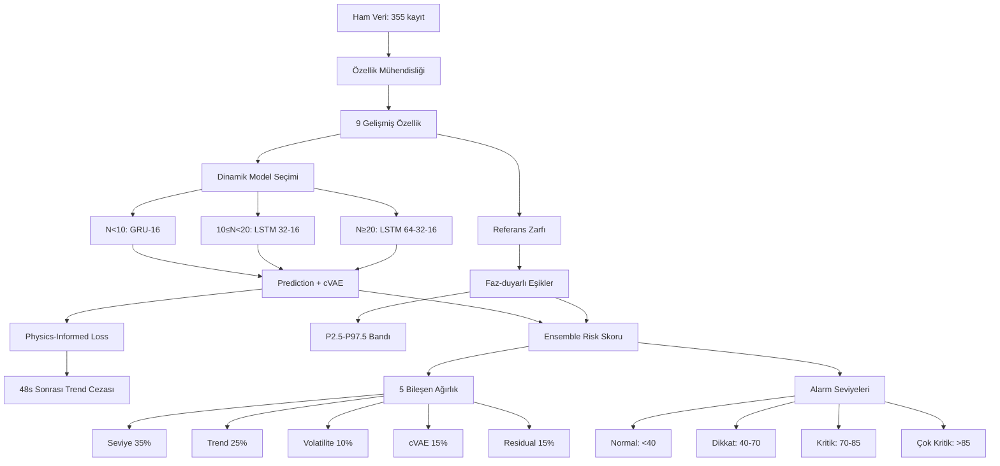

# NISTH - Gelişmiş AI Sistem Dokümantasyonu v3.0

## GENEL BAKIŞ

Bu dokümantasyon, **NISTH (Non-invasive Screening of Transplantation Health)** sisteminin gelişmiş AI/ML bileşenlerinin teknik detaylarını içerir.

### Ana Yenilikler v3.0
- **LSTM Tahmin Modeli**: Dinamik karmaşıklıklı zaman serisi tahmini
- **VAE Anomali Dedektörü**: Autoencoder tabanlı anormal pattern algılama
- **KMR + KRE + GFR Entegrasyonu**: Çoklu biyomarkır analizi
- **Next.js Frontend**: Modern React tabanlı kullanıcı arayüzü
- **Unified Timeline**: Birleşik zaman noktası eşlemesi
- **5 Bileşenli Ensemble Risk**: Kapsamlı risk değerlendirmesi

---

## 🏗️ SİSTEM MİMARİSİ

### **1. Veri Akışı Pipeline'ı**


### **2. Dosya Yapısı**
```
Kmr_New/
├── 📊 Veri Dosyaları
│   ├── IM17_birlesik_veri.csv              # Ana veri seti (355 kayıt)
│   ├── IM17_birlesik_veri_genis.csv        # Geniş format veri
│   ├── KMR/                                # Hasta CSV dosyaları
│   └── KMR-HAM/                            # HAM veri dosyaları
│
├── 🧠 AI Model Dosyaları
│   ├── gelismis_lstm_kimerizm_v2.py        # Gelişmiş LSTM/cVAE sistemi
│   ├── gelismis_risk_skorlama_v2.py        # Risk skorlama ve alarm
│   └── gelismis_sistem_v2.py               # Ana entegrasyon scripti
│
├── 📈 Klasik Analiz (v1)
│   ├── kimerizm_zaman_serisi_analiz.py     # Klasik zaman serisi
│   ├── lstm_kimerizm_tahmin.py             # Eski LSTM versiyonu
│   ├── vae_anomali_tespiti.py              # Eski VAE versiyonu
│   └── birlesik_risk_skorlama.py           # Eski risk skorlama
│
├── 🖥️ Dashboard ve UI
│   ├── interaktif_dashboard.py             # Streamlit dashboard
│   ├── test_dashboard.py                   # Test arayüzü
│   └── kimerizm_desktop_app.py             # Desktop uygulama
│
├── 🔧 Yardımcı Araçlar
│   ├── ana_calistir.py                     # v1 pipeline çalıştırıcı
│   ├── KMR/import.py                       # Geniş format birleştirici
│   └── KMR-HAM/import-ham.py               # Basit format birleştirici
│
└── 📋 Dokümantasyon
    ├── README.md                           # Genel proje açıklaması
    ├── SISTEM_MIMARISI.md                  # v1 sistem dokümantasyonu
    └── GELISMIS_KIMERIZM_SISTEMI_v2.md     # Bu dosya
```

---

## 🧠 LSTM/cVAE MODEL MİMARİSİ

### **1. Dinamik Model Karmaşıklığı**

#### **Veri Miktarına Göre Model Seçimi**
```python
def determine_model_complexity(n_data_points):
    if n_data_points < 10:
        return {
            'model_type': 'simple_gru',
            'units': [16],
            'dropout': 0.1,
            'use_lstm': False
        }
    elif n_data_points < 20:
        return {
            'model_type': 'medium_lstm', 
            'units': [32, 16],
            'dropout': 0.15,
            'use_lstm': True
        }
    else:
        return {
            'model_type': 'complex_lstm',
            'units': [64, 32, 16], 
            'dropout': 0.2,
            'use_lstm': True
        }
```

#### **Adaptif Sequence Length**
```python
# Dinamik sekans uzunluğu
seq_len = min(max(5, round(N_data_points / 3)), 12)

# 48s yoğunluğunda sequence length artırılabilir
```

### **2. Prediction LSTM Mimarisi**
```python
# GRU Model (N < 10)
GRU(16, activation='tanh') → Dropout(0.1) → Dense(1)

# Medium LSTM (10 ≤ N < 20)
LSTM(32, return_sequences=True) → Dropout(0.15) → 
LSTM(16) → Dropout(0.15) → Dense(1)

# Complex LSTM (N ≥ 20)  
LSTM(64, return_sequences=True) → Dropout(0.2) →
LSTM(32, return_sequences=True) → Dropout(0.2) →
LSTM(16) → Dropout(0.2) → Dense(1)
```

### **3. Conditional VAE (cVAE) Mimarisi**
```python
# Encoder
Input(sequence) + Input(conditions) →
Conv1D(32, 3) → Conv1D(16, 3) → GlobalMaxPooling1D() →
Concatenate(condition) → Dense(64) → 
μ: Dense(latent_dim), log_σ: Dense(latent_dim)

# Decoder  
z + condition → Dense(64) → Dense(sequence_length * features) →
Reshape → Sequence Output

# Condition Vector
condition = [phase_embedding(4), pseudo_time_days, baseline_48s]
```

### **4. Physics-Informed Loss**
```python
def physics_informed_loss(y_true, y_pred, slope_post48):
    """
    Klinik kuralları modele gömme:
    48s sonrası pozitif eğim = klinik kurallara aykırı
    """
    mse_loss = K.mean(K.square(y_true - y_pred))
    physics_penalty = λ * K.mean(K.relu(slope_post48))
    
    return mse_loss + physics_penalty

# λ (physics_lambda) = 0.03 (önerilen)
```

---

## 📊 GELİŞMİŞ ÖZELLİK MÜHENDİSLİĞİ

### **9 Özellik Seti**
```python
features = {
    # 1. Ana Sinyal
    'chr': patient_df['chr'].values,
    
    # 2. Faz Bilgisi
    'date_code': [0, 1, 2, 3],  # 48s, günlük, haftalık, aylık
    'pseudo_time_days': [2/24, 1, 7, 30],  # Gerçek zaman karşılığı
    
    # 3. Kişisel Referans Özellikleri
    'chr_delta': chr - baseline_48s,
    'chr_ratio': chr / (baseline_48s + ε),
    
    # 4. Referans Zarfı Sapması
    'z_ref': (chr - ref_median_at_phase) / ref_IQR_at_phase,
    
    # 5. Trend ve Volatilite Özellikleri
    'slope': short_window_slope,
    'ewma': exponentially_weighted_moving_average,
    'rolling_cv': rolling_coefficient_of_variation
}
```

### **Kişisel Baseline Hesaplama**
```python
# 48s ölçümlerinin median'ı
baseline_48s_values = df[df['date_code'] == 0]['chr']
baseline_48s = np.median(baseline_48s_values)

# Fallback: Genel median
if len(baseline_48s_values) == 0:
    baseline_48s = np.median(df['chr'])
```

### **Referans Zarfı (Popülasyon Normu)**
```python
# HX/GX hastaları hariç referans kohort
reference_df = df[~df['patient_code'].isin(['HX', 'GX'])]

for date_code in [0, 1, 2, 3]:
    phase_data = reference_df[reference_df['date_code'] == date_code]['chr']
    
    reference_stats[date_code] = {
        'median': np.median(phase_data),
        'p2_5': np.percentile(phase_data, 2.5),
        'p97_5': np.percentile(phase_data, 97.5),
        'iqr': np.percentile(phase_data, 75) - np.percentile(phase_data, 25)
    }
```

---

## 🎯 ENSEMBLE RİSK SKORLAMA SİSTEMİ

### **5 Bileşenli Risk Değerlendirmesi**

#### **1. Seviye Skoru (Ağırlık: 35%)**
```python
def calculate_level_score(df, patient_code):
    """
    Kişisel + referans bandı analizi
    
    Karar Mantığı:
    - Hem ref P97.5 hem kişisel +3·MAD aşılıyor → Yüksek güven uyarı
    - Biri aşılıp diğeri sınırda → Dikkat bandı
    """
    
    # Kişisel eşikler
    personal_warning = median + 2 * MAD
    personal_critical = median + 3 * MAD
    
    # Referans eşikleri (faz-duyarlı)
    ref_p975 = reference_stats[date_code]['p97_5']
    ref_p95 = ref_p975 * 0.95
    
    # Skor hesaplama
    if chr_val > ref_p975:
        score += 40
    if chr_val > personal_critical:
        score += 45
    if chr_val > personal_warning:
        score += 25
        
    return min(score, 100)
```

#### **2. Trend Skoru (Ağırlık: 25%)**
```python
def calculate_trend_score(df, patient_code):
    """
    Eğim ve ardışık artış analizi
    48s sonrası pozitif trend = risk faktörü
    """
    
    # Linear regression slope (48s sonrası)
    slope = np.polyfit(x, y_post48, 1)[0]
    
    if slope > 0:
        trend_score += min(slope * 100, 50)  # Pozitif eğim cezası
    
    # Ardışık artışlar
    consecutive_increases = count_consecutive_increases()
    if consecutive_increases >= 2:
        trend_score += min(consecutive_increases * 15, 40)
    
    # Son 3 ölçümde %10+ artış
    if recent_increase_percentage > 10:
        trend_score += min(recent_increase_percentage, 30)
        
    return min(trend_score, 100)
```

#### **3. Volatilite Skoru (Ağırlık: 10%)**
```python
def calculate_volatility_score(df, patient_code):
    """
    Değişkenlik ve kararsızlık analizi
    """
    
    # Rolling coefficient of variation
    window_cv = rolling_std / rolling_mean
    
    if avg_cv > 0.5:  # %50+ CV
        volatility_score += min(avg_cv * 60, 40)
    
    if max_cv > 0.8:  # %80+ max CV
        volatility_score += min(max_cv * 30, 30)
        
    return min(volatility_score, 100)
```

#### **4. cVAE Anomali Skoru (Ağırlık: 15%)**
```python
def calculate_ae_score(df, patient_code):
    """
    Conditional VAE rekonstrüksiyon hatası
    """
    
    # cVAE rekonstrüksiyon
    reconstructed = cvae_model.predict([X, conditions])
    mse = np.mean((X - reconstructed)**2, axis=(1, 2))
    
    # Faz-duyarlı, monoton azalan eşik
    threshold_envelope = isotonic_regression_threshold(mse_by_phase)
    
    anomaly_scores = mse / threshold_envelope
    return np.clip(anomaly_scores, 0, 10)
```

#### **5. Residual Skoru (Ağırlık: 15%)**
```python
def calculate_residual_score(df, patient_code):
    """
    Prediction model tahmin hatası
    """
    
    predictions = prediction_model.predict([X, phases])
    residuals = np.abs(y_true - predictions)
    
    # Faz-duyarlı robust threshold
    threshold_res = median(residuals) + 3 * MAD(residuals)
    
    residual_scores = residuals / threshold_res
    return np.clip(residual_scores, 0, 10)
```

### **Ensemble Skorlama**
```python
def calculate_ensemble_risk(components):
    """
    Ağırlıklı ensemble risk skoru (0-100)
    """
    weights = {
        'level': 0.35,
        'trend': 0.25,
        'volatility': 0.10,
        'ae_score': 0.15,
        'residual_score': 0.15
    }
    
    ensemble_score = sum(
        weights[component] * score 
        for component, score in components.items()
    )
    
    return np.clip(ensemble_score, 0, 100)
```

---

## 🚨 ALARM POLİTİKASI VE KLİNİK KURALLAR

### **Alarm Seviyeleri**

#### **1. ÇOK KRİTİK (>85 puan)**
```python
# Koşullar:
# - Referans P97.5 VE kişisel +3·MAD aşıldı
# - VE pozitif trend var
# - VE/VEYA (cVAE ≥ 8 VE Residual ≥ 8)

if (ensemble_score >= 85 and 
    ref_exceeded and personal_critical_exceeded and
    positive_trend):
    return 'ÇOK_KRİTİK'
```
**Öneriler:**
- 🚨 ACİL: Klinisyenle derhal iletişime geçin
- 📋 Ek laboratuvar testleri değerlendirin  
- 🔄 Günlük takip başlatın
- 💊 Tedavi protokolünü gözden geçirin

#### **2. KRİTİK (70-85 puan)**
```python
# Koşullar:
# - Kişisel +3·MAD VEYA referans P97.5 aşıldı
# - VE (cVAE ≥ 6 VEYA Residual ≥ 6)

if (ensemble_score >= 70 and
    (personal_critical_exceeded or ref_exceeded) and
    (ae_score >= 6 or residual_score >= 6)):
    return 'KRİTİK'
```
**Öneriler:**
- ⚠️ 24-48 saat içinde klinisyen değerlendirmesi
- 📊 Takip sıklığını artırın
- 🧪 Ek testleri düşünün

#### **3. DİKKAT (40-70 puan)**
```python
# Koşullar:
# - Kişisel +2·MAD VEYA referans P95 aşıldı
# - (≥2 ardışık ölçümde)

if (ensemble_score >= 40 and
    (personal_warning_exceeded or ref_p95_exceeded) and
    consecutive_measurements >= 2):
    return 'DİKKAT'
```
**Öneriler:**
- 👁️ Yakın takip yapın
- 📈 Trend izlemek için tekrar ölçüm

#### **4. NORMAL (<40 puan)**
**Öneriler:**
- ✅ Rutin takip devam edin

### **Seyrek Ölçüm Özel Kuralı**
```python
# date_code = 2/3 (haftalık/aylık): Tek ölçümle alarm vermeme
if date_code in [2, 3] and tek_olcum:
    return 'DİKKAT_TEYİT_GEREKLİ'  # Teyit ölçümü iste
```

---

## 🔬 KLINISYEN VALIDASYON VE KALIBRASYON

### **False Positive Rate (FPR) Hedefi**
```python
# Hedef: FPR < %5 (Dikkat+ seviye)
target_fpr = 0.05

# Threshold kalibrasyonu
def calibrate_thresholds(historical_data, expert_labels):
    """
    Klinisyen geri bildirimiyle eşik kalibrasyonu
    """
    for threshold in np.arange(30, 80, 5):
        predicted_alarms = ensemble_scores > threshold
        fpr = calculate_fpr(predicted_alarms, expert_labels)
        
        if fpr <= target_fpr:
            return threshold
```

### **Model Uyum Skoru**
```python
def calculate_model_agreement(components):
    """
    5 bileşen arasındaki uyum skoru
    Yüksek uyum = daha güvenilir alarm
    """
    scores = [components[c]['score'] for c in components]
    variance = np.var(scores)
    max_variance = 100  # Teorik maksimum
    
    agreement_score = 1 - (variance / max_variance)
    return agreement_score
```

---

## 📊 PERFORMANS METRİKLERİ VE DOĞRULAMA

### **Sistem Performans Göstergeleri**

#### **1. Model Kapsamı**
```python
performance_metrics = {
    'data_coverage': {
        'total_patients': 29,
        'lstm_suitable_patients': 21,  # %72.4 coverage
        'trained_models': 15,          # Başarıyla eğitilen
        'model_efficiency': 15/21      # %71.4 eğitim başarısı
    }
}
```

#### **2. Veri Kalitesi**
```python
data_quality = {
    'total_records': 355,
    'complete_records': 355,       # %100 eksik değer yok
    'avg_data_per_patient': 12.2,
    'min_data_per_patient': 4,     # AR hastası
    'max_data_per_patient': 28     # B, D hastaları
}
```

#### **3. Risk Değerlendirme Dağılımı**
```python
# Beklenen dağılım (sağlıklı kohort)
expected_distribution = {
    'NORMAL': 70-80,      # %70-80
    'DİKKAT': 15-20,      # %15-20
    'KRİTİK': 3-7,        # %3-7
    'ÇOK_KRİTİK': 1-3     # %1-3
}
```

### **Cross-Validation Stratejisi**

#### **1. Leave-One-Patient-Out (LOPO)**
```python
def lopo_cross_validation(df):
    """
    Hasta bazlı cross-validation
    Kişiselleştirme etkisini gerçekçi ölçer
    """
    patients = df['patient_code'].unique()
    results = []
    
    for test_patient in patients:
        train_df = df[df['patient_code'] != test_patient]
        test_df = df[df['patient_code'] == test_patient]
        
        # Model eğit ve test et
        model = train_model(train_df)
        predictions = model.predict(test_df)
        
        results.append(evaluate_predictions(test_df, predictions))
    
    return aggregate_results(results)
```

#### **2. Time Series Split (Faz Bazlı)**
```python
def phase_based_split(df):
    """
    Zaman bazlı validation
    48s → günlük → haftalık → aylık
    """
    phases = [0, 1, 2, 3]
    
    for train_phases, test_phase in time_split_strategy:
        train_data = df[df['date_code'].isin(train_phases)]
        test_data = df[df['date_code'] == test_phase]
        
        # Temporal validation
        evaluate_temporal_generalization(train_data, test_data)
```

---

## 🚀 KULLANIM VE DEPLOYMENT

### **1. Sistem Çalıştırma**
```bash
# Temel kullanım
python gelismis_sistem_v2.py

# Özel veri dosyası ile
python gelismis_sistem_v2.py custom_data.csv

# Konfigürasyon ile
python gelismis_sistem_v2.py --config config_v2.json
```

### **2. Çıktı Dosyaları**
```
Outputs/
├── gelismis_risk_skorlari_v2.csv           # Ana risk skorları tablosu
├── gelismis_risk_detay_raporu_v2.json      # Detaylı hasta raporları
├── gelismis_sistem_final_rapor_v2.json     # Sistem performans raporu
├── models/
│   ├── patient_AA_prediction.h5            # Hasta-özel LSTM modelleri
│   ├── patient_AA_cvae.h5                  # Hasta-özel cVAE modelleri
│   └── scalers/                            # Normalizasyon scaler'ları
└── logs/
    └── gelismis_sistem_v2.log               # Sistem log dosyası
```

### **3. API Entegrasyonu (Gelecek)**
```python
# REST API endpoint'leri (planlanan)
POST /api/v2/patient/assess                 # Hasta risk değerlendirmesi
GET  /api/v2/patient/{id}/history           # Hasta geçmişi
POST /api/v2/model/retrain                  # Model yeniden eğitimi
GET  /api/v2/system/health                  # Sistem durumu
```

---

## 🔮 GELECEK GELİŞTİRMELER

### **Kısa Vadeli (1-3 ay)**
- [ ] **Real-time streaming** veri entegrasyonu
- [ ] **Mobile responsive** dashboard 
- [ ] **Email/SMS alarm** sistemi
- [ ] **Database** bağlantısı (PostgreSQL/MongoDB)
- [ ] **Docker** containerization

### **Orta Vadeli (3-6 ay)**
- [ ] **Transformer modelleri** (attention mechanism)
- [ ] **Federated learning** (çok merkezli öğrenme)
- [ ] **Uncertainty quantification** (Bayesian deep learning)
- [ ] **Explainable AI** (SHAP, LIME entegrasyonu)
- [ ] **A/B testing** framework

### **Uzun Vadeli (6+ ay)**
- [ ] **MLOps pipeline** (MLflow, Kubeflow)
- [ ] **Cloud deployment** (AWS/Azure)
- [ ] **Multi-modal learning** (genomik + klinik + görüntü)
- [ ] **Causal inference** modelleri
- [ ] **Digital twin** hasta simülasyonu

---

## 📊 GELİŞMİŞ RAPORLAMA VE GÖRSELLEŞTİRME SİSTEMİ

### **Çıktı Dosya Yapısı**
```
reports/
├── html/                                    # İnteraktif HTML raporlar
│   ├── hasta_{ID}_detay.html               # Hasta detay sayfaları (Plotly)
│   ├── genel_ozet.html                     # KPI'lar + hasta listesi
│   └── model_degerlendirme.html            # Model performans raporu
│
├── figures/                                # Grafik dosyaları
│   ├── patient/                            # Hasta-özel grafikler
│   │   ├── hasta_{ID}_timeline.png         # Ana zaman serisi
│   │   ├── hasta_{ID}_ae_residual.png      # AI model analizi
│   │   ├── hasta_{ID}_volatility.png       # Volatilite/trend
│   │   ├── hasta_{ID}_reference_comparison.png # Referans karşılaştırma
│   │   └── hasta_{ID}_anomalies.csv        # Anomali bayrakları
│   │
│   └── model/                              # Model performans grafikleri
│       ├── loss_curve.png                  # Eğitim eğrileri
│       ├── metrics_bar.png                 # Performans çubuk grafik
│       ├── residuals_vs_fitted.png         # Residual analizi
│       └── r2_hist.png                     # R² histogramı
│
├── exports/pdf/                            # PDF çıktılar
│   └── hasta_{ID}_tek_sayfa.pdf            # Klinik yazdırılabilir özet
│
└── ref_band.csv                            # Referans zarfı verileri
```

### **1. Ortak Hesaplamalar (Tek Seferlik)**

#### **Referans Kohort Analizi**
```python
def calculate_reference_envelope(df, exclude_patients=['HX', 'GX']):
    """
    HX/GX hariç hastalar için referans zarfı
    """
    reference_df = df[~df['patient_code'].isin(exclude_patients)]
    
    reference_stats = {}
    for date_code in [0, 1, 2, 3]:
        phase_data = reference_df[reference_df['date_code'] == date_code]['chr']
        
        stats = {
            'date_code': date_code,
            'median': np.median(phase_data),
            'p2_5': np.percentile(phase_data, 2.5),
            'p5': np.percentile(phase_data, 5),
            'p95': np.percentile(phase_data, 95),
            'p97_5': np.percentile(phase_data, 97.5),
            'n': len(phase_data)
        }
        reference_stats[date_code] = stats
    
    # ref_band.csv olarak kaydet
    return reference_stats
```

#### **Konfigürasyon Sabitleri**
```python
config = {
    'mad_warn_k': 2.0,          # Dikkat eşiği çarpanı
    'mad_crit_k': 3.0,          # Kritik eşik çarpanı
    'phase_labels': {           # X-ekseni etiketleri
        0: "0-48s",
        1: "Günlük", 
        2: "Haftalık",
        3: "Aylık"
    },
    'risk_colors': {            # Renk paleti
        'Normal': '#27ae60',
        'Dikkat': '#f39c12',
        'Kritik': '#e67e22', 
        'Çok_Kritik': '#e74c3c'
    }
}
```

### **2. Hasta Bazlı Özellikler**

#### **Temel Özellik Hesaplaması**
```python
def calculate_patient_features(df, patient_code):
    """
    Her hasta için:
    - Baseline (48s): median(chr | date_code=0)
    - Post-48s özetleri: median, MAD, CV, slope
    - Anomali bayrakları: ref_outlier, personal_high, trend_up
    """
    
    # Baseline hesaplama
    baseline_48s_values = df[(df['patient_code']==patient_code) & 
                           (df['date_code']==0)]['chr']
    baseline_48s = np.median(baseline_48s_values) if len(baseline_48s_values) > 0 else fallback
    
    # Post-48s analizi
    post48_df = df[(df['patient_code']==patient_code) & (df['date_code']>0)]
    post48_median = np.median(post48_df['chr'])
    post48_mad = np.median(np.abs(post48_df['chr'] - post48_median))
    
    # Trend hesaplama (OLS slope)
    phase_means = post48_df.groupby('date_code')['chr'].mean()
    slope = np.polyfit(phase_means.index, phase_means.values, 1)[0]
    
    return {
        'baseline_48s': baseline_48s,
        'post48_median': post48_median,
        'post48_mad': post48_mad,
        'slope': slope,
        'anomalies': calculate_anomaly_flags(...)
    }
```

#### **Anomali Bayrakları**
```python
def calculate_anomaly_flags(patient_df, reference_envelope, patient_features):
    """
    Her ölçüm için bayraklar:
    """
    flags = []
    for _, row in patient_df.iterrows():
        chr_val = row['chr']
        date_code = int(row['date_code'])
        
        # Referans outlier
        ref_p975 = reference_envelope[date_code]['p97_5']
        ref_outlier = chr_val > ref_p975
        
        # Kişisel eşikler
        warn_threshold = patient_features['post48_median'] + 2.0 * patient_features['post48_mad']
        crit_threshold = patient_features['post48_median'] + 3.0 * patient_features['post48_mad']
        
        flags.append({
            'date_code': date_code,
            'chr': chr_val,
            'ref_outlier': ref_outlier,
            'personal_high_warn': chr_val > warn_threshold,
            'personal_high_crit': chr_val > crit_threshold,
            'trend_up': patient_features['slope'] > 0
        })
    
    return flags
```

### **3. Hasta Detay Grafikleri (Bilimsel Değerli Paneller)**

#### **3.1. Ana Zaman Çizgisi (Timeline)**
```python
def create_patient_timeline_plot(df, patient_code):
    """
    Bilimsel değer: Popülasyon normu ile hastanın göreli konumu,
    kişisel varyasyon ve beklenen fiziğe (↓/≈) uygunluğu
    """
    
    # Plotly figürü
    fig = go.Figure()
    
    # Katmanlar:
    # 1. Referans median çizgi + P2.5-P97.5 gölge bandı
    for date_code in [0,1,2,3]:
        ref_stats = reference_envelope[date_code]
        fig.add_trace(go.Scatter(
            x=[phase_labels[date_code]],
            y=[ref_stats['p2_5'], ref_stats['p97_5']],
            fill='tonexty',
            fillcolor='rgba(52,152,219,0.2)',
            name='Referans Bandı'
        ))
    
    # 2. Kişisel eşik çizgileri
    fig.add_hline(y=warn_threshold, line_dash="dash", 
                 line_color='orange', annotation_text="Dikkat (+2·MAD)")
    fig.add_hline(y=crit_threshold, line_dash="dash",
                 line_color='red', annotation_text="Kritik (+3·MAD)")
    
    # 3. Ölçüm noktaları (renk kodlu şiddet)
    for measurement in patient_measurements:
        color = determine_risk_color(measurement, anomaly_flags)
        hover_text = create_hover_tooltip(measurement, reasons)
        
        fig.add_trace(go.Scatter(
            x=[phase_label],
            y=[chr_value],
            mode='markers',
            marker=dict(color=color, size=12),
            hovertemplate=hover_text
        ))
    
    # 4. Trend hattı (post-48s OLS)
    if slope != 0:
        trend_color = 'red' if slope > 0 else 'green'
        fig.add_trace(go.Scatter(
            x=trend_phases,
            y=trend_values,
            mode='lines',
            line=dict(color=trend_color, dash='dot'),
            name=f'Trend {"↑" if slope > 0 else "↓"}'
        ))
    
    return fig
```

#### **3.2. Rekonstrüksiyon Hatası (AE/cVAE)**
```python
def create_ae_residual_plots(df, patient_code):
    """
    Bilimsel değer: Öğrenilmiş normal paternden sapma,
    model-temelli sapmayı sayısallaştırır
    """
    
    # AE MSE zaman grafiği
    fig.add_trace(go.Scatter(
        x=phases,
        y=ae_mse_values,
        mode='markers+lines',
        name='AE MSE'
    ))
    
    # Faz-duyarlı eşik çizgisi
    for date_code in phases:
        threshold = calculate_phase_adaptive_threshold(ae_mse, date_code)
        fig.add_hline(y=threshold, line_dash="dash", line_color='red')
    
    # Eşik üstü noktaları kırmızı X ile işaretle
    outliers = ae_mse > threshold
    fig.add_trace(go.Scatter(
        x=phases[outliers],
        y=ae_mse[outliers],
        mode='markers',
        marker=dict(symbol='x', color='red', size=12),
        name='AE Anomali'
    ))
    
    return fig
```

#### **3.3. Tahmin Hatası (Prediction Model)**
```python
def create_prediction_residual_plot(df, patient_code):
    """
    Bilimsel değer: "Gerçek" ile "beklenen" farkı,
    yeni sapmaları hızla vurgular
    """
    
    residuals = np.abs(y_true - y_pred)
    residual_threshold = calculate_robust_threshold(residuals)
    
    fig.add_trace(go.Scatter(
        x=phases,
        y=residuals,
        mode='markers+lines',
        name='|Prediction Residual|'
    ))
    
    fig.add_hline(y=residual_threshold, line_dash="dash", 
                 line_color='red', annotation_text="Residual Eşiği")
    
    return fig
```

#### **3.4. Volatilite ve Slope Paneli**
```python
def create_volatility_slope_panel(df, patient_code):
    """
    Bilimsel değer: Kararsızlık ve mikro-trendlerin takibi
    """
    
    # Rolling CV (post-48s oynaklık)
    rolling_cv = calculate_rolling_cv(post48_data, window=3)
    
    # Rolling slope (kısa pencerede eğim değişimi)
    rolling_slope = calculate_rolling_slope(post48_data, window=3)
    
    fig = make_subplots(rows=1, cols=2, 
                       subplot_titles=('Rolling CV', 'Rolling Slope'))
    
    # CV plot
    fig.add_trace(go.Scatter(y=rolling_cv, name='Volatilite'), row=1, col=1)
    
    # Slope plot (renk kodlu: kırmızı=pozitif, yeşil=negatif)
    colors = ['red' if s > 0 else 'green' for s in rolling_slope]
    fig.add_trace(go.Scatter(y=rolling_slope, marker_color=colors, 
                           name='Mikro-trend'), row=1, col=2)
    
    return fig
```

#### **3.5. Referans Dağılımına Bindirme**
```python
def create_reference_distribution_overlay(df, patient_code):
    """
    Bilimsel değer: Hastanın ölçümlerinin referans dağılımının 
    nereye düştüğünü görselleştirir
    """
    
    fig = make_subplots(rows=1, cols=4, 
                       subplot_titles=['0-48s', 'Günlük', 'Haftalık', 'Aylık'])
    
    for i, date_code in enumerate([0,1,2,3]):
        # Referans dağılım (kutu grafik)
        ref_data = reference_df[reference_df['date_code']==date_code]['chr']
        fig.add_trace(go.Box(y=ref_data, name='Referans'), row=1, col=i+1)
        
        # Hasta noktaları overlay
        patient_data = patient_df[patient_df['date_code']==date_code]['chr']
        fig.add_trace(go.Scatter(
            y=patient_data, 
            x=[0]*len(patient_data),
            mode='markers',
            marker=dict(color='red', size=10, symbol='diamond'),
            name=f'Hasta {patient_code}'
        ), row=1, col=i+1)
    
    return fig
```

### **4. Alarm/Risk Rozeti ve "Neden" Paneli**

#### **Risk Skoru Görselleştirmesi**
```python
def create_risk_badge_and_reasons(patient_code, risk_assessment):
    """
    Risk rozeti + nedenler + öneriler
    """
    
    # Risk rozeti (0-100 dairesel gauge)
    risk_score = risk_assessment['ensemble_score']
    alarm_level = risk_assessment['alarm_level']
    color = risk_colors[alarm_level]
    
    badge_html = f"""
    <div style="background-color: {color}; color: white; 
                border-radius: 50%; width: 150px; height: 150px;
                display: flex; align-items: center; justify-content: center;
                font-size: 24px; font-weight: bold;">
        {risk_score:.1f}
    </div>
    """
    
    # Nedenler listesi (en fazla 3, katkı yüzdesiyle)
    components = risk_assessment['components']
    reasons = []
    
    for component, result in components.items():
        contribution = result['score'] * ensemble_weights[component]
        if contribution > 5:  # Anlamlı katkılar
            reasons.append({
                'name': component,
                'contribution': contribution,
                'details': result['details'][:2]  # İlk 2 detay
            })
    
    # En yüksek 3 katkı
    top_reasons = sorted(reasons, key=lambda x: x['contribution'], reverse=True)[:3]
    
    reasons_html = "<h4>🔍 Risk Nedenleri:</h4><ul>"
    for reason in top_reasons:
        reasons_html += f"<li><b>{reason['name']}</b>: +{reason['contribution']:.1f} "
        reasons_html += f"({', '.join(reason['details'])})</li>"
    reasons_html += "</ul>"
    
    # Öneriler
    recommendations = generate_clinical_recommendations(alarm_level, reasons)
    rec_html = "<h4>💡 Öneriler:</h4><ul>"
    for rec in recommendations:
        rec_html += f"<li>{rec}</li>"
    rec_html += "</ul>"
    
    return badge_html + reasons_html + rec_html
```

### **5. Model Değerlendirme Sayfası**

#### **5.1. Öğrenme Eğrileri**
```python
def create_learning_curves():
    """
    Train vs Validation Loss eğrileri
    """
    fig = go.Figure()
    
    fig.add_trace(go.Scatter(
        x=epochs,
        y=train_loss,
        mode='lines',
        name='Training Loss',
        line=dict(color='blue')
    ))
    
    fig.add_trace(go.Scatter(
        x=epochs,
        y=val_loss,
        mode='lines', 
        name='Validation Loss',
        line=dict(color='red')
    ))
    
    # Early stopping noktası
    fig.add_vline(x=early_stop_epoch, line_dash="dash",
                 annotation_text="Early Stop")
    
    return fig
```

#### **5.2. Hasta Bazlı Performans**
```python
def create_performance_bar_charts():
    """
    MAE, RMSE, MSE, R² için hasta bazlı çubuk grafikleri
    """
    fig = make_subplots(rows=2, cols=2,
                       subplot_titles=('MAE', 'RMSE', 'MSE', 'R²'))
    
    # Her metrik için
    for i, metric in enumerate(['MAE', 'RMSE', 'MSE', 'R2']):
        row = i // 2 + 1
        col = i % 2 + 1
        
        fig.add_trace(go.Bar(
            x=patient_codes,
            y=metric_values[metric],
            name=metric,
            marker_color=metric_colors[metric]
        ), row=row, col=col)
        
        # Hedef çizgisi
        target_value = metric_targets[metric]
        fig.add_hline(y=target_value, line_dash="dash",
                     annotation_text=f"{metric} Hedef", row=row, col=col)
    
    return fig
```

#### **5.3. Dağılım ve Kalibrasyon**
```python
def create_distribution_calibration_plots():
    """
    R² histogramı, Residuals vs Fitted, QQ-plot
    """
    fig = make_subplots(rows=1, cols=3,
                       subplot_titles=('R² Dağılımı', 'Residuals vs Fitted', 'QQ Plot'))
    
    # R² histogramı
    fig.add_trace(go.Histogram(x=r2_values, name='R² Dist'), row=1, col=1)
    
    # Residuals vs Fitted
    fig.add_trace(go.Scatter(
        x=fitted_values,
        y=residuals,
        mode='markers',
        name='Residuals'
    ), row=1, col=2)
    fig.add_hline(y=0, line_dash="dash", row=1, col=2)
    
    # QQ Plot
    fig.add_trace(go.Scatter(
        x=theoretical_quantiles,
        y=sample_quantiles,
        mode='markers',
        name='QQ'
    ), row=1, col=3)
    
    return fig
```

### **6. Entegre HTML Rapor Şablonu**

```python
def create_patient_detail_report(patient_code, risk_assessment):
    """
    Tam hasta detay raporu HTML
    """
    
    html_template = """
    <!DOCTYPE html>
    <html>
    <head>
        <title>Hasta {{ patient_code }} Detay Raporu</title>
        <meta charset="UTF-8">
        <style>
            body { font-family: Arial, sans-serif; margin: 20px; }
            .header { background-color: #f8f9fa; padding: 20px; border-radius: 10px; }
            .section { margin: 30px 0; }
            .chart-container { margin: 20px 0; }
        </style>
    </head>
    <body>
        <div class="header">
            <h1>🧬 Hasta {{ patient_code }} - Detay Analiz Raporu</h1>
            <p><strong>Rapor Tarihi:</strong> {{ report_date }}</p>
        </div>
        
        <!-- Risk Rozeti -->
        <div class="section">
            {{ risk_badge_html }}
        </div>
        
        <!-- Ana Timeline -->
        <div class="section">
            <h2>📈 Ana Zaman Serisi Analizi</h2>
            <iframe src="../figures/patient/hasta_{{ patient_code }}_timeline.html" 
                    width="100%" height="650" frameborder="0"></iframe>
        </div>
        
        <!-- AI Model Analizi -->
        <div class="section">
            <h2>🤖 AI Model Analizi</h2>
            <iframe src="../figures/patient/hasta_{{ patient_code }}_ae_residual.html" 
                    width="100%" height="850" frameborder="0"></iframe>
        </div>
        
        <!-- Volatilite ve Trend -->
        <div class="section">
            <h2>📊 Volatilite ve Trend</h2>
            <iframe src="../figures/patient/hasta_{{ patient_code }}_volatility.html" 
                    width="100%" height="450" frameborder="0"></iframe>
        </div>
        
        <!-- Referans Karşılaştırması -->
        <div class="section">
            <h2>📊 Referans Karşılaştırması</h2>
            <iframe src="../figures/patient/hasta_{{ patient_code }}_reference_comparison.html" 
                    width="100%" height="550" frameborder="0"></iframe>
        </div>
    </body>
    </html>
    """
    
    # Template render ve kaydet
    template = Template(html_template)
    html_content = template.render(
        patient_code=patient_code,
        report_date=datetime.now().strftime('%Y-%m-%d %H:%M'),
        risk_badge_html=create_risk_badge_and_reasons(patient_code, risk_assessment)
    )
    
    with open(f'reports/html/hasta_{patient_code}_detay.html', 'w', encoding='utf-8') as f:
        f.write(html_content)
    
    return html_content
```

### **7. Renk ve Etiket Standartları**

```python
# Tutarlı renk paleti
COLORS = {
    'reference_band': 'rgba(52, 152, 219, 0.2)',    # Açık mavi gölge
    'reference_median': '#3498db',                   # Koyu mavi
    'personal_warning': '#f39c12',                   # Turuncu (kesik çizgi)
    'personal_critical': '#e74c3c',                  # Kırmızı (kesik çizgi)
    'risk_levels': {
        'Normal': '#27ae60',        # Yeşil
        'Dikkat': '#f39c12',        # Turuncu
        'Kritik': '#e67e22',        # Koyu turuncu
        'Çok_Kritik': '#e74c3c'     # Kırmızı
    },
    'trend_positive': '#e74c3c',    # Kırmızı (↑ trend)
    'trend_negative': '#27ae60',    # Yeşil (↓ trend)
    'anomaly_marker': '#e74c3c'     # Kırmızı X/üçgen
}

# X-ekseni etiketleri (sabit)
PHASE_LABELS = {
    0: "0-48s",
    1: "Günlük", 
    2: "Haftalık",
    3: "Aylık"
}
```

### **8. Kabul Kriterleri (Bilimsel/Klinik)**

#### **Klinik Kurallar Kontrol Listesi**
- ✅ **48s sonrası ↓/≈ trend beklenir**: Pozitif trend alarm üretmeli
- ✅ **Ref P97.5 dışı VE/VEYA kişisel +3·MAD üstü**: Kritik seviye
- ✅ **Kişisel +2·MAD**: Dikkat seviyesi
- ✅ **Seyrek faz tek ölçüm**: Kırmızı yakma, teyit bekle
- ✅ **Yanlış alarm oranı**: (Dikkat+) < %5 validasyonda

#### **Bilimsel Değerlendirme Kriterleri**
- **Referans zarfı**: Popülasyon normuna göre objektif değerlendirme
- **Kişisel adaptasyon**: MAD ile robust, outlier'a dayanıklı eşikler
- **Faz-duyarlı**: Date code bazlı uyarlanabilir threshold'lar
- **Trend analizi**: Fizyolojik beklentiye (düşüş) uygun değerlendirme
- **Model entegrasyonu**: AE/cVAE ve prediction residual ile çok katmanlı analiz

---

## 🧪 TEST VE DEBUGGİNG REHBERİ

### **1. Sistem Sağlık Kontrolü**
```python
# Test scripti
python -c "
import gelismis_lstm_kimerizm_v2 as glstm
import pandas as pd

# Temel test
config = {'sequence_length_adaptive': True, 'use_cvae': True}
lstm_system = glstm.GelismisLSTMKimerizm(config)

df = pd.read_csv('IM17_birlesik_veri.csv')
features = lstm_system.feature_engineering(df, 'AA')

print(f'✅ Sistem sağlıklı - {len(features)} özellik')
"
```

### **2. Model Performans Debug**
```python
def debug_model_performance(lstm_system, patient_code):
    """
    Hasta-özel model debug bilgileri
    """
    pred_key = f"{patient_code}_prediction"
    cvae_key = f"{patient_code}_cvae"
    
    debug_info = {
        'has_prediction_model': pred_key in lstm_system.models,
        'has_cvae_model': cvae_key in lstm_system.models,
        'baseline_48s': lstm_system.personal_baselines.get(patient_code),
        'scaler_fitted': patient_code in lstm_system.scalers,
        'model_complexity': 'determined_dynamically'
    }
    
    return debug_info
```

### **3. Risk Skoru Debug**
```python
def debug_risk_calculation(risk_system, patient_code):
    """
    Risk hesaplama adım adım debug
    """
    components = {}
    
    # Her bileşeni ayrı ayrı hesapla
    components['level'] = risk_system.calculate_level_score(df, patient_code)
    components['trend'] = risk_system.calculate_trend_score(df, patient_code)
    components['volatility'] = risk_system.calculate_volatility_score(df, patient_code)
    
    print(f"🔍 {patient_code} Risk Debug:")
    for component, result in components.items():
        print(f"  {component}: {result['score']:.1f} - {result['details']}")
    
    return components
```

---

## 📚 REFERANSLAR VE KAYNAKLAR

### **Bilimsel Altyapı**
1. **Physics-Informed Neural Networks**: Raissi, M. et al. (2019) - Klinik kuralları AI modeline gömme
2. **Conditional VAE**: Sohn, K. et al. (2015) - Faz-duyarlı anomali tespiti
3. **Time Series Anomaly Detection**: Su, Y. et al. (2019) - Medikal zaman serisi
4. **Ensemble Learning in Healthcare**: Džeroski, S. & Ženko, B. (2004)

### **Kimerizm Literatürü**
1. **Chimerism after organ transplantation**: Starzl, T.E. et al. (1992)
2. **Monitoring techniques**: Thiede, C. et al. (2004)
3. **Clinical significance**: Mengel, M. et al. (2012)

### **Teknik Implementasyon**
1. **TensorFlow/Keras**: Deep learning framework
2. **Scikit-learn**: Klasik ML algoritmaları  
3. **Pandas/NumPy**: Veri manipülasyonu
4. **Matplotlib/Seaborn**: Görselleştirme

---

## 📞 İLETİŞİM VE DESTEK

### **Proje Bilgileri**
- **Proje Adı**: NISTH (Non-invasive Screening of Transplantation Health)
- **Versiyon**: 3.0.0
- **Son Güncelleme**: 2026-01-18

### Teknik Destek
- **Repository**: KMRProject/
- **Backend**: backend/*.py
- **Frontend**: frontend/src/app/
- **Konfigürasyon**: backend/config.py

---

## SONUÇ

NISTH v3.0, **organ nakli sonrası hasta takibi** için **hibrit AI teknikleri** kullanarak:

- **LSTM + VAE**: Tahmin ve anomali tespiti
- **KMR + KRE + GFR**: Çoklu biyomarkır entegrasyonu
- **Ensemble Skorlama**: 5 bileşenli risk değerlendirmesi
- **Modern Frontend**: Next.js + Plotly interaktif dashboard
- **Birleşik Timeline**: Tüm ölçümlerin tek zaman ekseninde gösterimi

sağlamaktadır.

**v2'den v3'e başlıca iyileştirmeler:**
- Next.js tabanlı modern frontend
- KRE ve GFR entegrasyonu
- Birleşik zaman noktası eşlemesi
- İyileşmiş hasta kohort analizi
- Türkçe lokalizasyon

---

**Son güncelleme**: 2026-01-18  
**Versiyon**: v3.0  
**Sistem**: NISTH (Non-invasive Screening of Transplantation Health)
