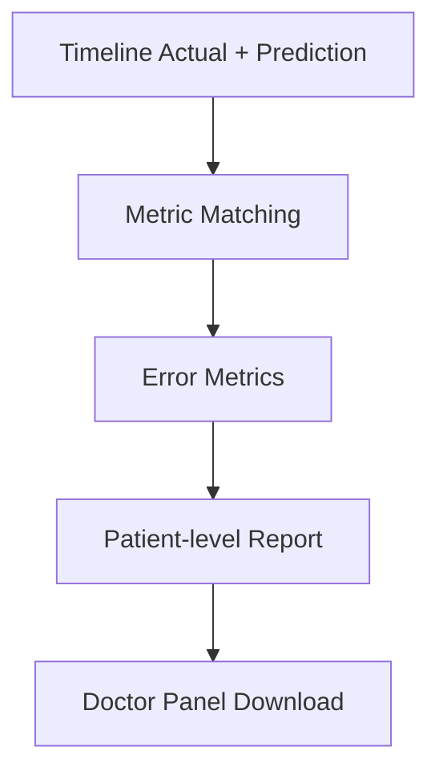

# Gelişmiş Kimerizm Sistemi (v2+) - Teknik ve Klinik Geliştirmeler

Bu doküman sistemin klasik sürüme göre getirdiği gelişmiş davranışları ve mevcut teknik kararların nedenlerini açıklar.

## 1) V2+ Hedefi

- daha güvenli risk skoru,
- ölçüm boşluklarında yanlış alarmın engellenmesi,
- klinik kurallara daha yakın cohort seçimi,
- tahmin boşluklarının açıklanabilir olması,
- doktor paneli için ölçülebilir model performansı.

## 2) Klinik Kurala Yaklaştırmalar

## 2.1 Improved Proxy Yeniden Tanımı

Eski yaklaşım: geç dönemde sadece KMR varlığı.

Yeni yaklaşım:

- geç dönem takip varlığı (Month_9..Month_12)
- KMR düşüş kalitesi
- KRE iyileşme/kötüleşmeme
- GFR iyileşme/kötüleşmeme
- küçük cohort fallback

Etkisi:

- referans cohort daha klinik anlamlı olur,
- fakat veri sayısı çok düşerse model stabilitesi korunur.

## 2.2 Erken Faz KMR Ağırlığı

İlk 48 saat KMR'nin geçici yüksek olabilmesi nedeniyle seviye cezası düşürülür.

- gün 1-2: `*0.55`
- gün 3-6: `*0.80`
- gün 7+: `*1.00`

Etkisi:

- erken dönemde gereksiz yüksek risk şişmesi azalır.

## 2.3 KRE/GFR Klinik Spektrum Uyumu

Konfigürasyon:

- KRE: `<1.2` çok iyi, `>4.5` çok kötü
- GFR: `>=90` çok iyi, `<=15` çok kötü

Etkisi:

- LAB seviyeleri klinik anlamla tutarlı şekilde risk bileşenine taşınır.

## 3) Tahmin Kalitesi İyileştirmeleri

## 3.1 Tahmin Sanitizasyonu

- KMR clamp: `0..100`
- KRE clamp: `0..15`
- GFR clamp: `0..180`
- interval sırası zorlanır: `lo <= pred <= hi`

Etkisi:

- negatif/saçma tahminlerin ve ters interval hatalarının önlenmesi.

## 3.2 GFR Bias Calibration

- hasta bazlı gözlemlenen bias ölçülür,
- damped düzeltme uygulanır.

Etkisi:

- sistematik GFR sapmalarını düşürür,
- aşırı düzeltme riskini sınırlar.

## 3.3 Tahmin Durum Kodları

Yeni alanlar:

- `kmr_pred_status`
- `kre_pred_status`
- `gfr_pred_status`

Kodlar:

- `ok`
- `timepoint_not_applicable`
- `insufficient_data`
- `missing_prediction`

Etkisi:

- UI'da boş tahminin nedeni açıklanabilir olur.

## 4) Risk Güvenliği İyileştirmeleri

## 4.1 No Measurement, No Carry-Forward

Eğer aynı noktada KMR/KRE/GFR hepsi boşsa:

- `overall_risk = 0`
- trend etkisi boş bırakılır

Etkisi:

- ölçüm yapılmayan dönemde yapay risk birikimi engellenir.

## 4.2 LAB Risk Cap (KMR+20)

LAB riski, KMR riskine göre aşırı ayrışırsa sınırlanır.

Etkisi:

- tek bir LAB sıçramasının toplam skoru orantısız şişirmesi azaltılır.

## 5) Anomali Görünürlüğü İyileştirmeleri

Anomali bayrakları artık:

- AI skorları
- klinik threshold ihlalleri

ile birlikte değerlendirilir.

Etkisi:

- listede/özetlerde anomali görünürlüğü grafikle daha tutarlı hale gelir.

## 6) Doktor Paneli Performans Raporu

Yeni dosyalar:

- `doctor_performance_report.json`
- `doctor_performance_report.csv`

Hasta bazlı metrikler:

- `n_eval_points`
- `mae`, `rmse`, `mape_percent`, `bias`
- `interval_coverage`
- `last_actual`, `last_pred`, `last_error`

## 7) Operasyonel Güvence

## 7.1 run_all Varsayılan Temizlik

`run_all.py` artık varsayılan olarak önce eski çıktıyı temizler.

Etkisi:

- stale artifact riski azalır,
- tekrar üretilebilirlik artar.

## 7.2 full_system_check Kapsamı

- Excel-JSON eşleşmesi
- sözleşme doğrulama
- doktor raporu doğrulama
- frontend lint/build

Etkisi:

- release öncesi kalite kapısı tek komuta indirgenir.

## 8) Bilinen Sınırlar

- Batch sistem; canlı API yok.
- TensorFlow bağımlılığı yoksa fallback kalite etkilenebilir.
- Klinik kararlar için tek başına yeterli değildir.

## 9) Önerilen İleri Adımlar

1. model versiyon metadata’sı (`model_id`, `train_stamp`) eklenmesi
2. drift takibi için dönemsel metrik paneli
3. hasta alt-grup bazlı performans raporu (yaş/cinsiyet/vital status)
4. klinik review için otomatik uyarı özetleri
