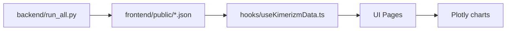

# Grafik Açıklama Dokümantasyonu (Detaylı)

Bu doküman her grafiğin:

- hangi dosyadan beslendiğini,
- hangi alanları çizdiğini,
- klinik yorum amacını,
- olası yanlış yorum risklerini

açıklar.

## 1) Dashboard (`/`)

## 1.1 Risk Dağılımı (Pie)

- Kaynak:
  - `patient_features.json`
  - `data_summary.json`
- Ana alanlar:
  - `risk_level`
  - `risk_distribution`
- Klinik amaç:
  - populasyonun alarm seviyelerine göre dağılımı
- Dikkat:
  - bu grafik bireysel hasta trendi göstermez.

## 1.2 Kohort Seyri (KMR)

- Kaynak: `cohort_trajectory.json`
- Çizim serileri:
  - `expected_kmr`
  - `cohort_median`
  - `cohort_mean`
  - `bound_lower`, `bound_upper`
- Klinik amaç:
  - iyileşmiş kohort referansı ile karşılaştırma

## 1.3 LAB Kohort Seyri

- Kaynak: `cohort_trajectory_lab.json`
- Çizim serileri:
  - KRE beklenen/cohort medyan
  - GFR beklenen/cohort medyan
- Klinik amaç:
  - böbrek fonksiyon trendinin kohortla karşılaştırılması

## 2) Hasta Detay (`/patients/[id]`)

Kaynak dosya:

- `patients/{id}.json`

## 2.1 KMR Paneli

Çizim katmanları:

- Gerçek değer: `timeline[].kmr`
- AI tahmini: `timeline[].kmr_pred`
- Güven bandı: `kmr_pred_lo`, `kmr_pred_hi`
- Anomali işaretleme: `kmr_anomaly_flag`
- Risk bileşen etkisi: `risk_components.kmr_*`

Klinik yorum:

- KMR düşüşü genelde olumlu,
- erken dönem yüksek değerler faz ağırlığı ile dengelenir,
- anomali bayrağı tek başına alarm seviyesi değildir.

## 2.2 KRE Paneli

Çizim katmanları:

- Gerçek değer: `timeline[].kre`
- Tahmin: `timeline[].kre_pred`
- Güven bandı: `kre_pred_lo`, `kre_pred_hi`
- Anomali: `kre_anomaly_flag`

Klinik yorum:

- KRE düşüşü iyileşmeye işaret eder.

## 2.3 GFR Paneli

Çizim katmanları:

- Gerçek değer: `timeline[].gfr`
- Tahmin: `timeline[].gfr_pred`
- Güven bandı: `gfr_pred_lo`, `gfr_pred_hi`
- Anomali: `gfr_anomaly_flag`

Klinik yorum:

- GFR artışı iyileşmeye işaret eder.

## 2.4 Risk Paneli

- Ana seri: `risk_score`
- Kategori: `risk_level`
- Breakdown: `risk_components`

Bu panel “hangi bileşen riski yükseltti?” sorusuna cevap verir.

## 3) Tahmin Boşlukları ve Durum Kodları

Grafikte tahmin boşluğunun nedeni `*_pred_status` ile belirlenir:

- `timepoint_not_applicable`: o metrik o zaman noktasına ait değil
- `insufficient_data`: model için yeterli hasta-içi veri yok
- `missing_prediction`: teorik olarak olmalıydı ama üretilemedi
- `ok`: tahmin mevcut

Bu yapı, “sistem veri çekemedi mi?” ile “o noktada ölçüm yok” durumlarını ayırır.

## 4) Hasta Listesi Grafiksiz Özet Kutuları (`/patients`)

Kaynak: `patient_features.json`

Alanlar:

- `last_kmr`, `last_kre`, `last_gfr`
- `last_*_time_key`
- `risk_score`, `risk_level`
- `has_anomaly`, `kmr_has_anomaly`, `kre_has_anomaly`, `gfr_has_anomaly`

Amaç:

- hızlı tarama,
- hasta detayına gitmeden triage.

## 5) Raporlar (`/reports`)

## 5.1 Hasta CSV/PDF

- seçili hasta veya tüm hasta özeti

## 5.2 Doktor Performans Raporu

- `doctor_performance_report.csv`
- `doctor_performance_report.json`

Grafik değil, model kalite raporudur.

Alanlar:

- `n_eval_points`, `mae`, `rmse`, `mape_percent`, `interval_coverage`

## 6) Grafik Veri Akışı



## 7) Grafik Doğrulama

Ana doğrulama komutu:

```bash
python3 ./backend/full_system_check.py
```

Bu komut grafik veri kaynağı olan JSON dosyalarının:

- varlığını,
- şemasını,
- Excel tutarlılığını

doğrular.

## 8) Yanlış Yorum Riskleri

- Tek bir noktadaki anomali = tek başına klinik karar değildir.
- Tahmin boşluğu her zaman model hatası değildir.
- Risk seviyesi, tüm bileşenlerin birleşimidir; tek metrikle yorumlanmamalıdır.
