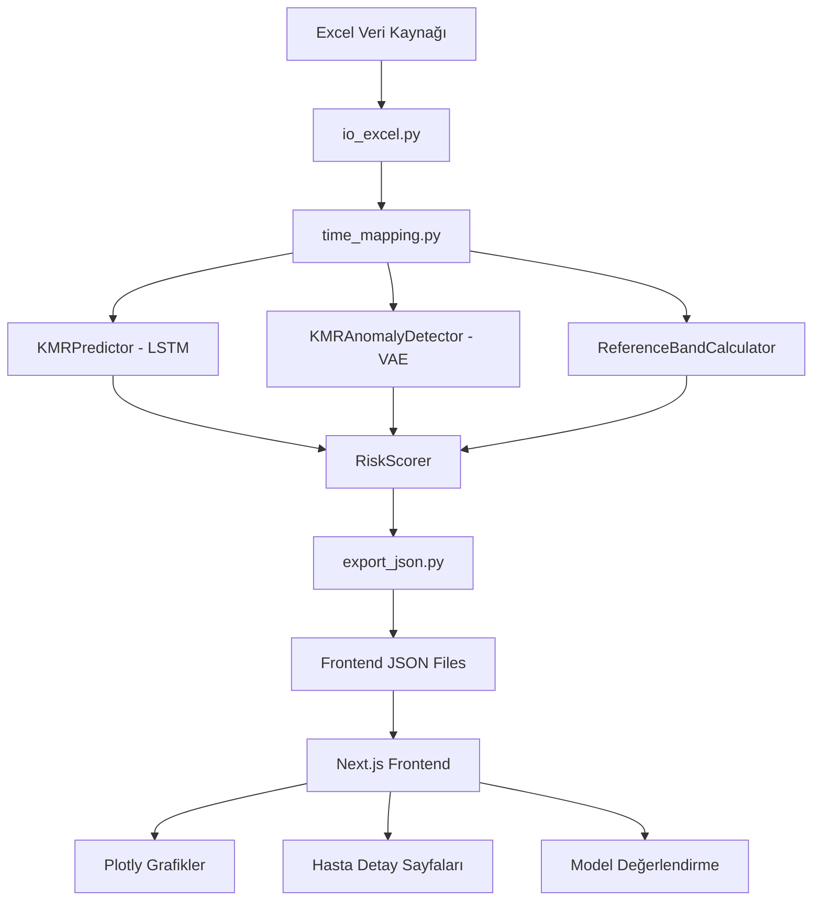

# NISTH - Sistem Mimarisi v3.0

**Non-invasive Screening of Transplantation Health (NISTH)**

Organ nakli sonrası hasta takibi için hibrit AI tabanlı zaman serisi analiz sistemi. KMR (Kimerizm), KRE (Kreatinin) ve GFR (Glomerüler Filtrasyon Hızı) verilerini entegre ederek kapsamlı risk değerlendirmesi sunar.

---

## İÇERİK TABLOSU
- Mimari Genel Bakış
- Veri Akışı ve Katmanları
- Backend Model Mimarisi
- Frontend Uygulama Mimarisi
- Risk Skorlama Sistemi
- Dağıtım ve Çalıştırma

---

## Mimari Genel Bakış



### Temel Bileşenler

| Katman | Teknoloji | Dosyalar |
|--------|-----------|----------|
| **Veri İşleme** | Python + Pandas | `io_excel.py`, `time_mapping.py` |
| **LSTM Tahmin** | TensorFlow/Keras | `kmr_model.py` |
| **Anomali Tespiti** | VAE Autoencoder | `anomaly_vae.py` |
| **Risk Skorlama** | İstatistiksel + AI | `risk_scoring.py` |
| **Referans Bandı** | Kohort Analizi | `reference_band.py` |
| **Frontend** | Next.js + React | `frontend/src/app/` |

---

## Veri Akışı ve Katmanları

### Girdi Verileri

**Excel Kaynak Dosyası**: `IM17 Kimerizm Birleşik Data v3.xlsx`
- **Metadata Sheet**: Hasta demografik bilgileri (cinsiyet, vital durum, tanı)
- **KMR Sheet**: Kimerizm zaman serisi (Day_7, Week_2, Month_1, vb.)
- **LAB Sheet**: Laboratuvar değerleri (Kreatinin, GFR)

### Zaman Noktaları Eşlemesi

```python
UNIFIED_TIME_MAP = {
    "Day_7":   {"order": 1,  "pseudo_days": 7,   "has_kmr": True,  "has_lab": True},
    "Week_2":  {"order": 2,  "pseudo_days": 14,  "has_kmr": True,  "has_lab": True},
    "Week_3":  {"order": 3,  "pseudo_days": 21,  "has_kmr": True,  "has_lab": True},
    "Month_1": {"order": 4,  "pseudo_days": 30,  "has_kmr": True,  "has_lab": True},
    "Month_2": {"order": 5,  "pseudo_days": 60,  "has_kmr": True,  "has_lab": True},
    "Month_3": {"order": 6,  "pseudo_days": 90,  "has_kmr": True,  "has_lab": True},
    "Month_6": {"order": 7,  "pseudo_days": 180, "has_kmr": True,  "has_lab": True},
    "Month_9": {"order": 8,  "pseudo_days": 270, "has_kmr": True,  "has_lab": False},
    "Year_1":  {"order": 9,  "pseudo_days": 365, "has_kmr": True,  "has_lab": True},
    "Year_2":  {"order": 10, "pseudo_days": 730, "has_kmr": True,  "has_lab": True},
    # ... devam eder
}
```

### Çıktı JSON Yapısı

```json
frontend/public/
├── patients/
│   ├── {patient_code}.json    # Hasta detay verileri
│   └── ...
├── summary.json               # Genel özet istatistikler
├── reference_band.json        # KMR/KRE/GFR referans bantları
├── patient_features.json      # Hasta özellik listesi
├── channel_overview.json      # Kanal bazlı istatistikler
└── cohort_trajectory.json     # İyileşmiş hasta kohort analizi
```

---

## Backend Model Mimarisi

### 1. LSTM Tahmin Modeli (`kmr_model.py`)

**Dinamik Karmaşıklık Seçimi**:
```python
def _determine_complexity(n_points):
    if n_points < 10:   return "simple"   # GRU-16
    elif n_points < 20: return "medium"   # LSTM 32-16
    else:               return "complex"  # LSTM 64-32-16
```

**Özellik Mühendisliği**:
- `delta_from_baseline`: Baseline'dan sapma
- `ratio_from_baseline`: Baseline oranı
- `ewma`: Üstel ağırlıklı hareketli ortalama
- `rolling_cv`: Kayan pencere varyasyon katsayısı
- `slope_short`: Kısa vadeli eğim (son 3 nokta)

**Model Çıktıları**:
- `kmr_pred`: Tahmin değeri
- `kmr_pred_lo`, `kmr_pred_hi`: Güven aralığı (%80)
- `residual`: Tahmin hatası

### 2. VAE Anomali Dedektörü (`anomaly_vae.py`)

**Autoencoder Mimarisi**:
```python
# Encoder
Input(5) → Dense(16, relu) → Dense(8, relu) → Dense(4, relu)

# Decoder  
Dense(4) → Dense(8, relu) → Dense(16, relu) → Dense(5)
```

**Anomali Skoru Hesaplama**:
```python
reconstruction_error = MSE(original, reconstructed)
threshold = Q3 + 1.5 * IQR  # Robust eşik
anomaly_score = reconstruction_error / threshold
anomaly_flag = anomaly_score > 1.0
```

### 3. Risk Skorlama (`risk_scoring.py`)

**5 Bileşenli Ensemble Skor**:

| Bileşen | Ağırlık | Açıklama |
|---------|---------|----------|
| **KMR Skoru** | 30% | KMR trend ve seviye analizi |
| **LAB Skoru** | 25% | Kreatinin ve GFR değerlendirmesi |
| **LSTM Residual** | 20% | Tahmin hatası bazlı anomali |
| **VAE Anomali** | 15% | Rekonstrüksiyon hatası |
| **Volatilite** | 10% | Değişkenlik analizi |

**Risk Kategorileri**:
- 0-20: Çok Düşük (Yeşil)
- 20-40: Düşük (Açık Yeşil)
- 40-60: Orta (Sarı)
- 60-80: Yüksek (Turuncu)
- 80-100: Çok Yüksek (Kırmızı)

---

## Frontend Uygulama Mimarisi

### Teknoloji Stack

- **Framework**: Next.js 15.4.6 (App Router)
- **UI Kütüphanesi**: React 18 + TypeScript
- **Stil**: TailwindCSS + shadcn/ui
- **Grafikler**: Plotly.js (react-plotly.js)
- **State Yönetimi**: React Query (TanStack Query)
- **İkonlar**: Lucide React

### Sayfa Yapısı

```bash
frontend/src/app/
├── page.tsx              # Ana Sayfa (Dashboard)
├── layout.tsx            # Global layout ve navigasyon
├── patients/
│   ├── page.tsx          # Hasta listesi
│   └── [id]/page.tsx     # Hasta detay sayfası
├── model-evaluation/
│   └── page.tsx          # Model değerlendirme
└── reports/
    └── page.tsx          # Rapor indirme
```

### Hasta Detay Sayfası Grafikleri

**KMR Zaman Serisi**:
- Gerçek KMR değerleri (çizgi + marker)
- AI Tahmini (LSTM prediction)
- Benzer Hastalar beklentisi (kohort median)
- Referans IQR bandı (P25-P75)
- Anomali noktaları vurgulama

**KRE/GFR Grafikleri**:
- Hasta gerçek değerleri
- Referans IQR bandı
- Klinik eşik çizgileri (1.2, 4.5 mg/dL - KRE; 15, 30, 60, 90 mL/min - GFR)

**Risk Analizi**:
- Risk skoru zaman serisi
- Risk bileşenleri breakdown
- Trend göstergesi

---

## Dağıtım ve Çalıştırma

### Gereksinimler

```bash
# Backend
Python 3.9+
tensorflow>=2.10
pandas, numpy, openpyxl

# Frontend
Node.js 18+
npm veya yarn
```

### Kurulum

```bash
# Backend bağımlılıkları
cd backend
pip install -r requirements.txt

# Frontend bağımlılıkları
cd frontend
npm install
```

### Pipeline Çalıştırma

```bash
# 1. Backend pipeline (Excel → JSON)
python -m backend.run_all

# 2. Frontend development server
cd frontend
npm run dev
```

### Üretim Dağıtımı

```bash
# Frontend build
cd frontend
npm run build
npm start
```

---

## Proje Dosya Yapısı

```bash
KMRProject/
├── backend/
│   ├── __init__.py
│   ├── config.py              # Konfigürasyon sabitleri
│   ├── io_excel.py            # Excel veri okuma
│   ├── time_mapping.py        # Zaman noktası eşleme
│   ├── kmr_model.py           # LSTM tahmin modeli
│   ├── anomaly_vae.py         # VAE anomali dedektörü
│   ├── risk_scoring.py        # Risk skorlama
│   ├── reference_band.py      # Referans bandı hesaplama
│   ├── cohort_trajectory.py   # Kohort analizi
│   ├── export_json.py         # JSON dışa aktarma
│   └── run_all.py             # Ana pipeline
│
├── frontend/
│   ├── src/
│   │   ├── app/               # Next.js App Router
│   │   ├── components/        # UI bileşenleri
│   │   ├── hooks/             # Custom React hooks
│   │   ├── types/             # TypeScript tipleri
│   │   └── utils/             # Yardımcı fonksiyonlar
│   └── public/
│       └── patients/          # Hasta JSON dosyaları
│
├── Doc/                       # Dokümantasyon
└── README.md
```

---

**Son güncelleme**: 2026-01-18  
**Versiyon**: v3.0  
**Sistem Adı**: NISTH (Non-invasive Screening of Transplantation Health)  
**İlgili dosyalar**: `README.md`, `GRAFIK_ACIKLAMA_DOKÜMANTASYON.md`, `GELISMIS_KIMERIZM_SISTEMI_v2.md`
