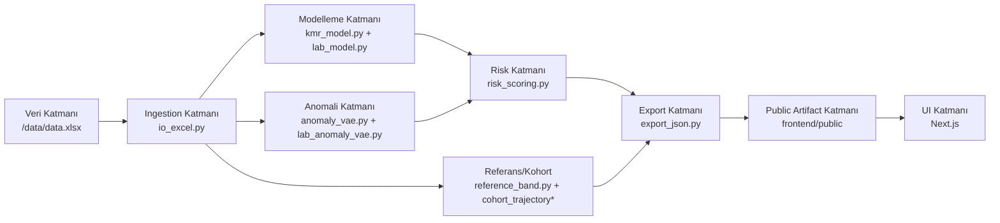
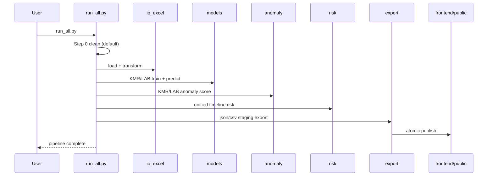
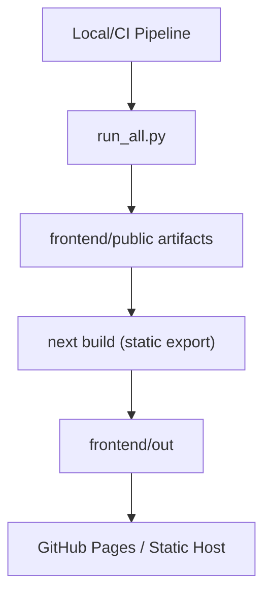

# Sistem Mimarisi (Detaylı)

Bu doküman NISTH sisteminin teknik mimarisini bileşen, veri akışı, çalışma sırası ve dağıtım modeli düzeyinde açıklar.

## 1) Mimari Prensip

Sistem bir **batch analytics pipeline** olarak tasarlanmıştır.

- canlı backend API yok,
- kaynak veri tek dosya (`data.xlsx`),
- çıktı sözleşmesi statik JSON/CSV,
- frontend bu sözleşmeyi doğrudan tüketir.

## 2) Katmanlı Mimari



## 3) Çalışma Sırası (Orchestrator)

Orkestrasyon dosyası:

- `./backend/run_all.py`



## 4) Bileşen Sorumluluk Matrisi

| Katman | Dosya | Sorumluluk | Kritik Çıktı |
|---|---|---|---|
| Ingestion | `io_excel.py` | Excel okuma, normalizasyon, long format, improved proxy | `meta_df`, `kmr_long`, `lab_long` |
| Zaman Sözleşmesi | `time_mapping.py` | KMR/LAB/unified order + pseudo_days | `UNIFIED_TIME_MAP` |
| KMR Model | `kmr_model.py` | hasta bazlı KMR tahmini | `kmr_pred*`, `residual` |
| LAB Model | `lab_model.py` | KRE/GFR tahmini, bias kalibrasyon | `kre_pred*`, `gfr_pred*` |
| KMR Anomali | `anomaly_vae.py` | reconstruction/tabanlı skor | `kmr_anomaly_*` |
| LAB Anomali | `lab_anomaly_vae.py` | KRE/GFR anomaly skorları | `kre_anomaly_*`, `gfr_anomaly_*` |
| Risk | `risk_scoring.py` | bileşen risk + overall risk + alarm | `risk_score`, `risk_level` |
| Referans | `reference_band.py` | cohort band + trend fit | `reference_band.json` |
| Export | `export_json.py` | frontend sözleşmeleri | `patients/*.json`, özet JSON'lar |
| QA | `full_system_check.py` | veri ve şema doğrulama + FE build | pass/fail raporu |

## 5) Veri Sözleşmesi Sınırı

Backend ile frontend arasında tek entegrasyon noktası:

- `./frontend/public`

Bu klasördeki dosyalar **API sözleşmesi** gibi düşünülmelidir.

### Sözleşme Dosyaları

- `patients/{id}.json`
- `patient_features.json`
- `data_summary.json`
- `reference_band.json`
- `cohort_trajectory.json`
- `cohort_trajectory_lab.json`
- `channel_overview.json`
- `doctor_performance_report.json`
- `doctor_performance_report.csv`

## 6) Tasarım Kararları

### 6.1 Unified Timeline

Farklı metriklerde farklı zaman noktası sorununu çözmek için tek timeline kullanılır. Böylece:

- grafikler tutarlı kalır,
- tahmin boşlukları şeffaflaşır,
- risk hesabı deterministic olur.

### 6.2 No Measurement, No Risk Carry-Forward

Ölçüm yoksa risk 0 alınır. Bu karar “ölçüm dışı” dönemlerde yanlış alarm birikimini engeller.

### 6.3 Atomic Publish

Export önce staging alana yazılır, sonra tek seferde `frontend/public` güncellenir. Kısmi/yarım veri servis edilmez.

## 7) Dağıtım Mimarisi



## 8) Kalite Kapısı

Release öncesi zorunlu komut:

```bash
python3 ./backend/full_system_check.py
```

Bu komut:

- data.xlsx ile JSON eşleşmesini,
- risk/anomali tutarlılığını,
- doktor raporu sözleşmesini,
- frontend lint/build durumunu

otomatik doğrular.

## 9) Gelecek Genişletme Noktaları

- canlı API modu (opsiyonel),
- model registry/versioning,
- online drift monitoring,
- metrik bazlı otomatik model fallback telemetrisi.
