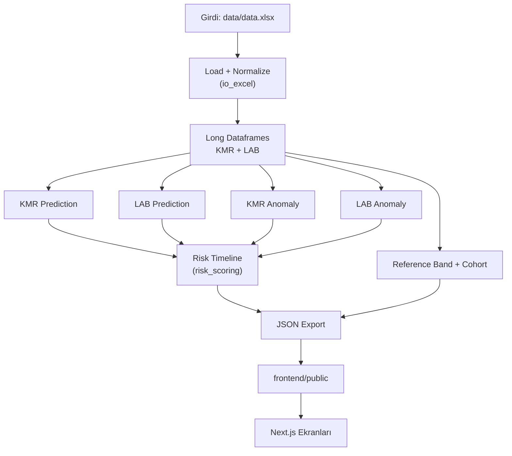
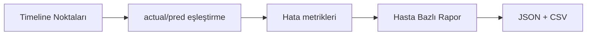

# Sistem Raporu (Uçtan Uca Teknik Doküman)

Bu rapor NISTH sisteminde verinin kaynaktan UI ekranına kadar nasıl aktığını, hangi kodun hangi çıktıyı ürettiğini ve skorlama formüllerinin nasıl uygulandığını teknik seviyede açıklar.

## 1) Raporun Kapsamı

Bu doküman şunları kapsar:

- veri ingestion ve normalize kuralları,
- zaman ekseni birleşimi,
- model/tahmin ve anomali algoritmaları,
- risk hesaplama matematiği,
- export sözleşmeleri,
- doktor paneli performans ölçümü,
- doğrulama ve kalite kapıları.

## 2) Sistem Yaşam Döngüsü



## 3) Veri Girişi

Ana giriş:

- `./data/data.xlsx`

İşleme adımları:

1. Kolon isimleri normalize edilir.
2. `patient_code` string'e zorlanır.
3. Meta alanlar ayrılır.
4. KMR ve LAB ölçümleri long forma çevrilir.

Long format üretim sonucu:

- KMR satırı:
  - `patient_code`, `time_key`, `time_order`, `pseudo_time_days`, `kmr`
- LAB satırı:
  - `patient_code`, `time_key`, `time_order`, `pseudo_time_days`, `kre`, `gfr`

## 4) Zaman Eksenleri

Kaynak: `./backend/time_mapping.py`

- KMR timeline: 21 nokta
- LAB timeline: 10 nokta
- Unified timeline: 22 nokta

Unified sözleşmesi:

- `order`
- `pseudo_days`
- `has_kmr`
- `has_lab`

Bu sözleşme hem model hem UI için tek gerçek zaman referansıdır.

## 5) Improved Cohort Tanımı

Kaynak: `./backend/io_excel.py`

Kurallar:

1. Geç dönem KMR takibi (`Month_9..Month_12`) şartı
2. Klinik iyileşme kontrolü:
   - KMR düşüş kalitesi,
   - KRE iyileşmesi,
   - GFR iyileşmesi
3. Kohort çok küçükse fallback

Bu cohort referans bant ve cohort trajectory hesaplarında kullanılır.

## 6) Tahmin Katmanı

## 6.1 KMR Tahmin

Dosya:

- `./backend/kmr_model.py`

Ana noktalar:

- Adaptif model karmaşıklığı
- Feature engineering
- Unified grid forecast
- Tahmin sanitizasyonu (`0..100`, interval düzeni)

## 6.2 LAB Tahmin

Dosya:

- `./backend/lab_model.py`

Ana noktalar:

- KRE/GFR single veya multi-output model
- Unified LAB timeline tahmini
- GFR bias calibration
- Tahmin sanitizasyonu (KRE `0..15`, GFR `0..180`)

## 7) Anomali Katmanı

## 7.1 KMR Anomali

Dosya:

- `./backend/anomaly_vae.py`

Ana noktalar:

- Reconstruction error tabanlı skor
- Eğitim başarısızsa fallback eşik yaklaşımı

## 7.2 LAB Anomali

Dosya:

- `./backend/lab_anomaly_vae.py`

Ana noktalar:

- KRE ve GFR için ayrı skorlar
- VAE yoksa basit yaklaşım fallback

## 8) Risk Hesaplama

Dosya:

- `./backend/risk_scoring.py`

### 8.1 KMR Bileşenleri

- `kmr_level`
- `kmr_trend`
- `kmr_volatility`
- `kmr_ae`
- `kmr_residual`

Erken dönem klinik ağırlık:

- ilk 48 saat: `0.55`
- gün 3-6: `0.80`
- gün 7+: `1.00`

### 8.2 LAB Bileşenleri

- `kre_level`
- `gfr_level`
- `lab_trend`
- LAB anomaly etkisi

### 8.3 Formüller

```text
kmr_risk =
  0.35*kmr_level +
  0.25*kmr_trend +
  0.10*kmr_volatility +
  0.15*kmr_ae +
  0.15*kmr_residual
```

```text
overall_risk = 0.65*kmr_risk + 0.35*min(lab_risk, kmr_risk+20)
```

Alarm sınıfları:

- `Normal`, `Dikkat`, `Kritik`, `Çok Kritik`

### 8.4 Ölçüm Olmayan Nokta Politikası

Aynı noktada tüm metrikler boşsa:

- risk `0`
- trend carry-forward uygulanmaz

Bu, yanlış alarm birikimini engeller.

### 8.5 Tahmin Durum Kodları

- `ok`
- `timepoint_not_applicable`
- `insufficient_data`
- `missing_prediction`

## 9) Export Katmanı

Dosya:

- `./backend/export_json.py`

Üretilen dosyalar:

- `./frontend/public/patients/*.json`
- `./frontend/public/patient_features.json`
- `./frontend/public/data_summary.json`
- `./frontend/public/reference_band.json`
- `./frontend/public/cohort_trajectory.json`
- `./frontend/public/cohort_trajectory_lab.json`
- `./frontend/public/channel_overview.json`
- `./frontend/public/doctor_performance_report.json`
- `./frontend/public/doctor_performance_report.csv`

## 10) Doktor Paneli Performans Ölçümü

Doktor raporu hasta bazlı model performansı verir:

- veri kapsama: `n_actual_points`, `n_pred_points`, `n_eval_points`
- hata metrikleri: `mae`, `rmse`, `mape_percent`, `bias`
- güven aralığı: `interval_coverage`
- son nokta kontrolü: `last_actual`, `last_pred`, `last_error`



## 11) Orkestrasyon

Dosya:

- `./backend/run_all.py`

Davranış:

- Varsayılan: temizlik + sıfırdan eğitim
- Opsiyon: `--skip-clean`

Akış:

1. Önce eski çıktı dosyaları silinir.
2. Tüm model ve skorlar yeniden hesaplanır.
3. Çıktılar staging alana yazılır.
4. Staging -> public atomik publish yapılır.

## 12) Doğrulama Kapısı

Dosya:

- `./backend/full_system_check.py`

Tek komut:

```bash
python3 ./backend/full_system_check.py
```

Kontroller:

- Excel-JSON sayısal eşleşmeler
- şema tutarlılığı
- risk/anomali tutarlılığı
- doktor raporu şeması
- frontend lint/build

## 13) Frontend Ekran Eşleşmesi

- Dashboard: summary + features + cohort dosyaları
- Hasta listesi: `patient_features.json`
- Hasta detay: `patients/{id}.json`
- Raporlar: doktor raporu dahil tüm dışa aktarımlar

## 14) Kalite ve Klinik Güvenlik Notu

- Sistem karar destek amaçlıdır.
- Klinik karar için tek başına kullanılmaz.
- Model çıktıları hekim yorumuyla değerlendirilmelidir.

## 15) Sonuç

NISTH, tek Excel kaynağından deterministik bir batch pipeline ile teknik olarak izlenebilir ve doğrulanabilir bir klinik analitik katmanı üretir.

- Girdi kontrolü net,
- skor mantığı izlenebilir,
- çıktı sözleşmeleri sabit,
- doğrulama kapısı otomatik.
