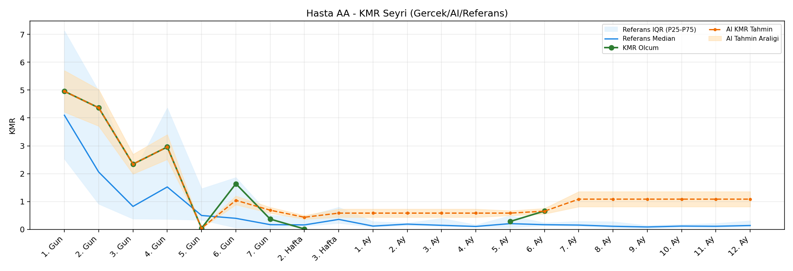
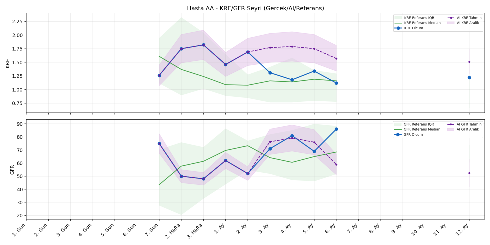
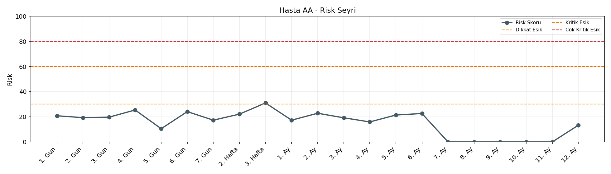

# Hasta AA

[Ana rapora don](../../Hasta_Raporları_Detay.md)

## Hasta Ozeti

| Alan | Deger |
|---|---|
| Yas | 32 |
| Cinsiyet | MALE |
| BMI | 21.6 |
| Vital Status | LIVING |
| Risk Skoru (Son) | 31.0 |
| Risk Seviyesi | Dikkat |
| Anomali Durumu | Yok |
| Son KMR | 0.6576 (6. Ay) |
| Son KRE | 1.22 (12. Ay) |
| Son GFR | 86.0 (6. Ay) |

## Grafikler

## IQR ve Median Ozeti

| Metrik | Hasta (Median / IQR) | Referans (Median / IQR) | Son Olcum Zamani |
|---|---|---|---|
| KMR | 1.148 / 2.499 | 0.142 / 0.866 | 6. Ay |
| KRE | 1.325 / 0.402 | 1.020 / 0.560 | 12. Ay |
| GFR | 69.000 / 23.000 | 59.800 / 29.600 | 6. Ay |

## AI Performans (Hasta Bazli)

| Metrik | Eval Nokta | MAE | RMSE | MAPE | Aralik Kapsama | Son Hata |
|---|---:|---:|---:|---:|---:|---:|
| KMR | 5 | 0.3802 | 0.4222 | %273.57 | %20.0 | 0.0271 |
| KRE | 4 | 0.612 | 0.617 | %50.03 | %0.0 | 0.610 |
| GFR | 4 | 15.77 | 16.73 | %21.37 | %25.0 | -8.50 |

## Zaman Serisi Detay Tablosu

| Zaman | KMR | AI KMR | Durum | KRE | AI KRE | Durum | GFR | AI GFR | Durum | Risk | Seviye | Anomali |
|---|---:|---:|---|---:|---:|---|---:|---:|---|---:|---|---|
| 1. Gun | 4.9575 | 4.9575 | Olcum Kopyasi | - | - | Uygulanmaz | - | - | Uygulanmaz | 20.8 | Normal | - |
| 2. Gun | 4.3652 | 4.3652 | Olcum Kopyasi | - | - | Uygulanmaz | - | - | Uygulanmaz | 19.3 | Normal | - |
| 3. Gun | 2.3416 | 2.3416 | Olcum Kopyasi | - | - | Uygulanmaz | - | - | Uygulanmaz | 19.7 | Normal | - |
| 4. Gun | 2.9578 | 2.9578 | Olcum Kopyasi | - | - | Uygulanmaz | - | - | Uygulanmaz | 25.4 | Normal | - |
| 5. Gun | 0.0400 | 0.0400 | Olcum Kopyasi | - | - | Uygulanmaz | - | - | Uygulanmaz | 10.5 | Normal | - |
| 6. Gun | 1.6379 | 1.1420 | Model | - | - | Uygulanmaz | - | - | Uygulanmaz | 23.8 | Normal | - |
| 7. Gun | 0.3694 | 0.8256 | Model | 1.26 | 1.26 | Olcum Kopyasi | 75.0 | 75.0 | Olcum Kopyasi | 17.6 | Normal | - |
| 2. Hafta | 0.0136 | 0.5507 | Model | 1.75 | 1.75 | Olcum Kopyasi | 50.0 | 50.0 | Olcum Kopyasi | 22.4 | Normal | - |
| 3. Hafta | - | 0.6679 | Ongoru | 1.82 | 1.82 | Olcum Kopyasi | 48.0 | 48.0 | Olcum Kopyasi | 31.0 | Dikkat | - |
| 1. Ay | - | 0.6679 | Ongoru | 1.46 | 1.46 | Olcum Kopyasi | 62.0 | 62.0 | Olcum Kopyasi | 17.3 | Normal | - |
| 2. Ay | - | 0.6679 | Ongoru | 1.69 | 1.69 | Olcum Kopyasi | 52.0 | 52.0 | Olcum Kopyasi | 22.8 | Normal | - |
| 3. Ay | - | 0.6679 | Ongoru | 1.31 | 1.87 | Model | 71.0 | 89.3 | Model | 19.2 | Normal | - |
| 4. Ay | - | 0.6679 | Ongoru | 1.18 | 1.91 | Model | 81.0 | 94.0 | Model | 15.9 | Normal | - |
| 5. Ay | 0.2833 | 0.6679 | Model | 1.34 | 1.89 | Model | 69.0 | 92.3 | Model | 21.6 | Normal | - |
| 6. Ay | 0.6576 | 0.6847 | Model | 1.12 | 1.73 | Model | 86.0 | 77.5 | Model | 22.7 | Normal | - |
| 7. Ay | - | 1.1128 | Ongoru | - | - | Uygulanmaz | - | - | Uygulanmaz | 0.0 | Normal | - |
| 8. Ay | - | 1.1128 | Ongoru | - | - | Uygulanmaz | - | - | Uygulanmaz | 0.0 | Normal | - |
| 9. Ay | - | 1.1128 | Ongoru | - | - | Uygulanmaz | - | - | Uygulanmaz | 0.0 | Normal | - |
| 10. Ay | - | 1.1128 | Ongoru | - | - | Uygulanmaz | - | - | Uygulanmaz | 0.0 | Normal | - |
| 11. Ay | - | 1.1128 | Ongoru | - | - | Uygulanmaz | - | - | Uygulanmaz | 0.0 | Normal | - |
| 12. Ay | - | 1.1128 | Ongoru | 1.22 | 1.58 | Ongoru | - | 62.6 | Ongoru | 13.3 | Normal | - |

> Not: Bu dosya `python3 backend/run_all.py` ile otomatik uretilir.
