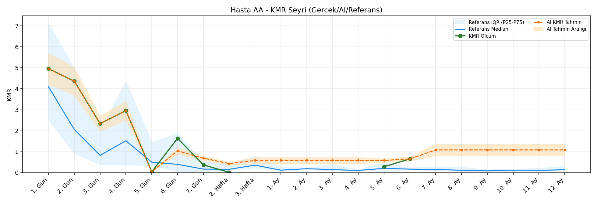
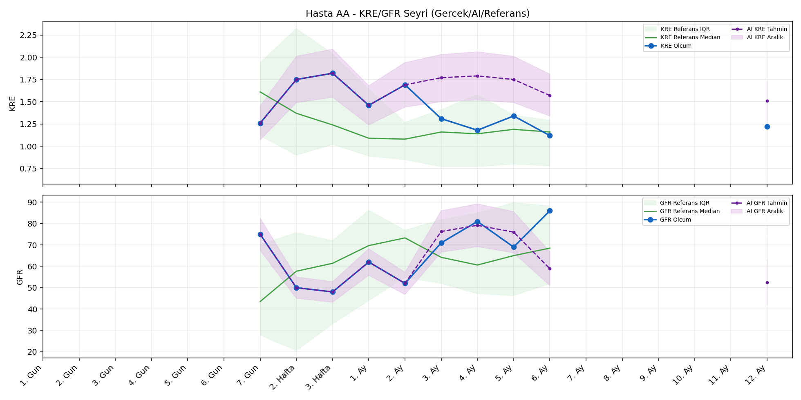
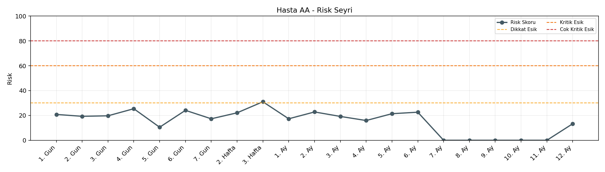

# Hasta AA

[Ana rapora don](../../Hasta_Raporları_Detay.md)

## Hasta Ozeti

| Alan | Deger |
|---|---|
| Yas | 32 |
| Cinsiyet | MALE |
| BMI | 21.6 |
| Vital Status | LIVING |
| Risk Skoru (Son) | 31.0 |
| Risk Seviyesi | Dikkat |
| Anomali Durumu | Yok |
| Son KMR | 0.6576 (6. Ay) |
| Son KRE | 1.22 (12. Ay) |
| Son GFR | 86.0 (6. Ay) |

## Grafikler

## IQR ve Median Ozeti

| Metrik | Hasta (Median / IQR) | Referans (Median / IQR) | Son Olcum Zamani |
|---|---|---|---|
| KMR | 1.148 / 2.499 | 0.167 / 0.095 | 6. Ay |
| KRE | 1.325 / 0.402 | 1.050 / 0.610 | 12. Ay |
| GFR | 69.000 / 23.000 | 68.500 / 36.400 | 6. Ay |

## AI Performans (Hasta Bazli)

| Metrik | Eval Nokta | MAE | RMSE | MAPE | Aralik Kapsama | Son Hata |
|---|---:|---:|---:|---:|---:|---:|
| KMR | 5 | 0.3280 | 0.3803 | %214.20 | %20.0 | -0.0050 |
| KRE | 4 | 0.482 | 0.488 | %39.40 | %0.0 | 0.450 |
| GFR | 4 | 10.30 | 14.27 | %12.84 | %75.0 | -27.10 |

## Zaman Serisi Detay Tablosu

| Zaman | KMR | AI KMR | Durum | KRE | AI KRE | Durum | GFR | AI GFR | Durum | Risk | Seviye | Anomali |
|---|---:|---:|---|---:|---:|---|---:|---:|---|---:|---|---|
| 1. Gun | 4.9575 | 4.9575 | Olcum Kopyasi | - | - | Uygulanmaz | - | - | Uygulanmaz | 20.8 | Normal | - |
| 2. Gun | 4.3652 | 4.3652 | Olcum Kopyasi | - | - | Uygulanmaz | - | - | Uygulanmaz | 19.3 | Normal | - |
| 3. Gun | 2.3416 | 2.3416 | Olcum Kopyasi | - | - | Uygulanmaz | - | - | Uygulanmaz | 19.7 | Normal | - |
| 4. Gun | 2.9578 | 2.9578 | Olcum Kopyasi | - | - | Uygulanmaz | - | - | Uygulanmaz | 25.4 | Normal | - |
| 5. Gun | 0.0400 | 0.0400 | Olcum Kopyasi | - | - | Uygulanmaz | - | - | Uygulanmaz | 10.5 | Normal | - |
| 6. Gun | 1.6379 | 1.0425 | Model | - | - | Uygulanmaz | - | - | Uygulanmaz | 24.1 | Normal | - |
| 7. Gun | 0.3694 | 0.6883 | Model | 1.26 | 1.26 | Olcum Kopyasi | 75.0 | 75.0 | Olcum Kopyasi | 17.3 | Normal | - |
| 2. Hafta | 0.0136 | 0.4345 | Model | 1.75 | 1.75 | Olcum Kopyasi | 50.0 | 50.0 | Olcum Kopyasi | 22.1 | Normal | - |
| 3. Hafta | - | 0.5829 | Ongoru | 1.82 | 1.82 | Olcum Kopyasi | 48.0 | 48.0 | Olcum Kopyasi | 31.0 | Dikkat | - |
| 1. Ay | - | 0.5829 | Ongoru | 1.46 | 1.46 | Olcum Kopyasi | 62.0 | 62.0 | Olcum Kopyasi | 17.3 | Normal | - |
| 2. Ay | - | 0.5829 | Ongoru | 1.69 | 1.69 | Olcum Kopyasi | 52.0 | 52.0 | Olcum Kopyasi | 22.8 | Normal | - |
| 3. Ay | - | 0.5829 | Ongoru | 1.31 | 1.77 | Model | 71.0 | 76.3 | Model | 19.2 | Normal | - |
| 4. Ay | - | 0.5829 | Ongoru | 1.18 | 1.79 | Model | 81.0 | 79.2 | Model | 15.9 | Normal | - |
| 5. Ay | 0.2833 | 0.5829 | Model | 1.34 | 1.75 | Model | 69.0 | 76.0 | Model | 21.4 | Normal | - |
| 6. Ay | 0.6576 | 0.6526 | Model | 1.12 | 1.57 | Model | 86.0 | 58.9 | Model | 22.6 | Normal | - |
| 7. Ay | - | 1.0842 | Ongoru | - | - | Uygulanmaz | - | - | Uygulanmaz | 0.0 | Normal | - |
| 8. Ay | - | 1.0842 | Ongoru | - | - | Uygulanmaz | - | - | Uygulanmaz | 0.0 | Normal | - |
| 9. Ay | - | 1.0842 | Ongoru | - | - | Uygulanmaz | - | - | Uygulanmaz | 0.0 | Normal | - |
| 10. Ay | - | 1.0842 | Ongoru | - | - | Uygulanmaz | - | - | Uygulanmaz | 0.0 | Normal | - |
| 11. Ay | - | 1.0842 | Ongoru | - | - | Uygulanmaz | - | - | Uygulanmaz | 0.0 | Normal | - |
| 12. Ay | - | 1.0842 | Ongoru | 1.22 | 1.51 | Ongoru | - | 52.5 | Ongoru | 13.3 | Normal | - |

> Not: Bu dosya `python3 backend/run_all.py` ile otomatik uretilir.
