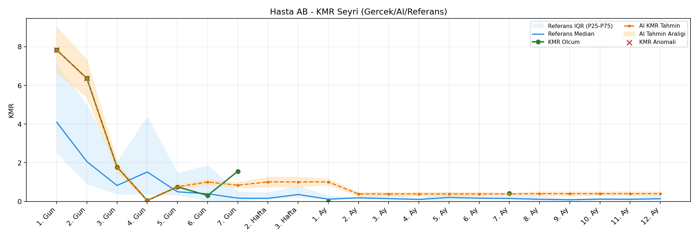
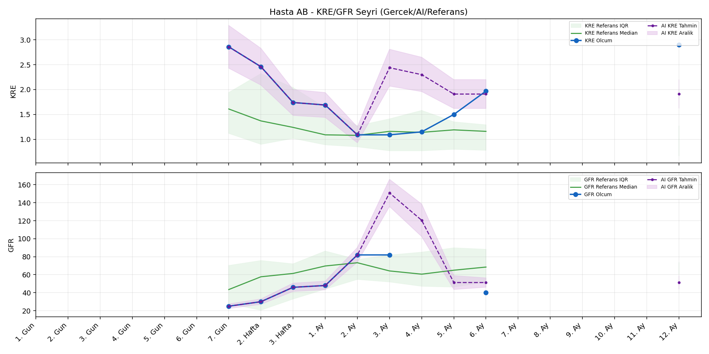

# Hasta AB

[Ana rapora don](../../Hasta_Raporları_Detay.md)

## Hasta Ozeti

| Alan | Deger |
|---|---|
| Yas | 43 |
| Cinsiyet | MALE |
| BMI | 17.0 |
| Vital Status | LIVING |
| Risk Skoru (Son) | 46.5 |
| Risk Seviyesi | Dikkat |
| Anomali Durumu | Var |
| Son KMR | 0.4104 (7. Ay) |
| Son KRE | 2.90 (12. Ay) |
| Son GFR | 40.0 (6. Ay) |

## Grafikler

## IQR ve Median Ozeti

| Metrik | Hasta (Median / IQR) | Referans (Median / IQR) | Son Olcum Zamani |
|---|---|---|---|
| KMR | 0.754 / 1.469 | 0.143 / 0.157 | 7. Ay |
| KRE | 1.715 / 1.100 | 1.020 / 0.560 | 12. Ay |
| GFR | 46.000 / 30.000 | 59.800 / 29.600 | 6. Ay |

## AI Performans (Hasta Bazli)

| Metrik | Eval Nokta | MAE | RMSE | MAPE | Aralik Kapsama | Son Hata |
|---|---:|---:|---:|---:|---:|---:|
| KMR | 4 | 0.4967 | 0.6344 | %268.12 | %25.0 | 0.0404 |
| KRE | 2 | 0.630 | 0.630 | %56.29 | %0.0 | 0.630 |
| GFR | 1 | 19.90 | 19.90 | %24.27 | %0.0 | 19.90 |

## Zaman Serisi Detay Tablosu

| Zaman | KMR | AI KMR | Durum | KRE | AI KRE | Durum | GFR | AI GFR | Durum | Risk | Seviye | Anomali |
|---|---:|---:|---|---:|---:|---|---:|---:|---|---:|---|---|
| 1. Gun | 7.8315 | 7.8315 | Olcum Kopyasi | - | - | Uygulanmaz | - | - | Uygulanmaz | 23.8 | Normal | KMR |
| 2. Gun | 6.3593 | 6.3593 | Olcum Kopyasi | - | - | Uygulanmaz | - | - | Uygulanmaz | 22.1 | Normal | KMR |
| 3. Gun | 1.7777 | 1.7777 | Olcum Kopyasi | - | - | Uygulanmaz | - | - | Uygulanmaz | 18.0 | Normal | - |
| 4. Gun | 0.0504 | 0.0504 | Olcum Kopyasi | - | - | Uygulanmaz | - | - | Uygulanmaz | 10.8 | Normal | - |
| 5. Gun | 0.7541 | 0.7541 | Olcum Kopyasi | - | - | Uygulanmaz | - | - | Uygulanmaz | 20.4 | Normal | - |
| 6. Gun | 0.3085 | 0.6944 | Model | - | - | Uygulanmaz | - | - | Uygulanmaz | 17.5 | Normal | - |
| 7. Gun | 1.5588 | 0.4310 | Model | 2.86 | 2.86 | Olcum Kopyasi | 25.0 | 25.0 | Olcum Kopyasi | 35.3 | Dikkat | - |
| 2. Hafta | - | 0.4326 | Ongoru | 2.46 | 2.46 | Olcum Kopyasi | 30.0 | 30.0 | Olcum Kopyasi | 46.5 | Dikkat | - |
| 3. Hafta | - | 0.4326 | Ongoru | 1.74 | 1.74 | Olcum Kopyasi | 46.0 | 46.0 | Olcum Kopyasi | 26.1 | Normal | - |
| 1. Ay | 0.0000 | 0.4326 | Model | 1.69 | 1.69 | Olcum Kopyasi | 48.0 | 48.0 | Olcum Kopyasi | 18.4 | Normal | - |
| 2. Ay | - | 0.4508 | Ongoru | 1.09 | 1.09 | Olcum Kopyasi | 82.0 | 82.0 | Olcum Kopyasi | 13.8 | Normal | - |
| 3. Ay | - | 0.4508 | Ongoru | 1.09 | 1.72 | Model | 82.0 | 101.9 | Model | 14.0 | Normal | - |
| 4. Ay | - | 0.4508 | Ongoru | 1.15 | 1.78 | Model | - | 85.8 | Model | 11.6 | Normal | - |
| 5. Ay | - | 0.4508 | Ongoru | 1.50 | 1.91 | Ongoru | - | 55.1 | Ongoru | 15.3 | Normal | - |
| 6. Ay | - | 0.4508 | Ongoru | 1.97 | 1.91 | Ongoru | 40.0 | 55.1 | Ongoru | 31.1 | Dikkat | - |
| 7. Ay | 0.4104 | 0.4508 | Model | - | - | Uygulanmaz | - | - | Uygulanmaz | 20.6 | Normal | - |
| 8. Ay | - | 0.5330 | Ongoru | - | - | Uygulanmaz | - | - | Uygulanmaz | 0.0 | Normal | - |
| 9. Ay | - | 0.5330 | Ongoru | - | - | Uygulanmaz | - | - | Uygulanmaz | 0.0 | Normal | - |
| 10. Ay | - | 0.5330 | Ongoru | - | - | Uygulanmaz | - | - | Uygulanmaz | 0.0 | Normal | - |
| 11. Ay | - | 0.5330 | Ongoru | - | - | Uygulanmaz | - | - | Uygulanmaz | 0.0 | Normal | - |
| 12. Ay | - | 0.5330 | Ongoru | 2.90 | 1.91 | Ongoru | - | 55.1 | Ongoru | 36.0 | Dikkat | - |

> Not: Bu dosya `python3 backend/run_all.py` ile otomatik uretilir.
