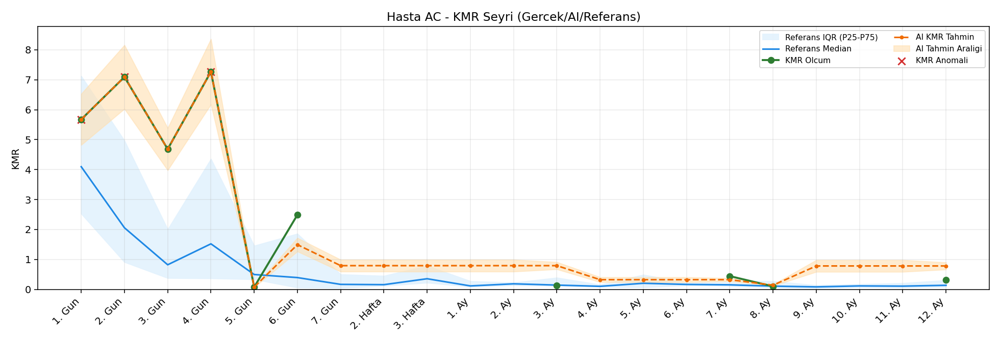
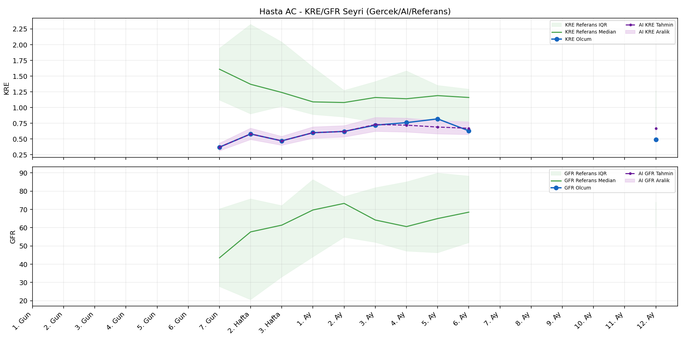
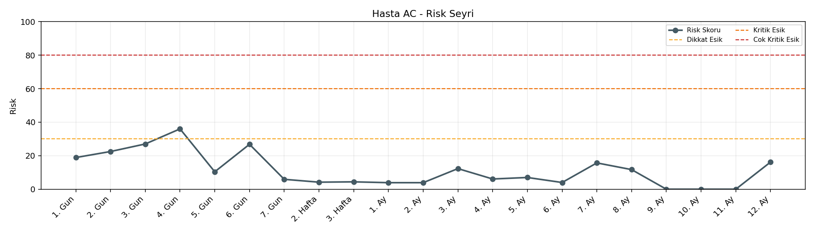

# Hasta AC

[Ana rapora don](../../Hasta_Raporları_Detay.md)

## Hasta Ozeti

| Alan | Deger |
|---|---|
| Yas | 6 |
| Cinsiyet | MALE |
| BMI | 23.7 |
| Vital Status | LIVING |
| Risk Skoru (Son) | 36.0 |
| Risk Seviyesi | Dikkat |
| Anomali Durumu | Var |
| Son KMR | 0.3153 (12. Ay) |
| Son KRE | 0.49 (12. Ay) |
| Son GFR | - (-) |

## Grafikler

## IQR ve Median Ozeti

| Metrik | Hasta (Median / IQR) | Referans (Median / IQR) | Son Olcum Zamani |
|---|---|---|---|
| KMR | 1.467 / 5.245 | 0.227 / 0.318 | 12. Ay |
| KRE | 0.610 / 0.185 | 1.020 / 0.560 | 12. Ay |
| GFR | - / - | - / - | - |

## AI Performans (Hasta Bazli)

| Metrik | Eval Nokta | MAE | RMSE | MAPE | Aralik Kapsama | Son Hata |
|---|---:|---:|---:|---:|---:|---:|
| KMR | 5 | 0.4309 | 0.5638 | %153.34 | %20.0 | 0.2882 |
| KRE | 5 | 0.084 | 0.104 | %13.71 | %60.0 | 0.180 |
| GFR | 0 | - | - | - | %0.0 | - |

## Zaman Serisi Detay Tablosu

| Zaman | KMR | AI KMR | Durum | KRE | AI KRE | Durum | GFR | AI GFR | Durum | Risk | Seviye | Anomali |
|---|---:|---:|---|---:|---:|---|---:|---:|---|---:|---|---|
| 1. Gun | 5.6758 | 5.6758 | Olcum Kopyasi | - | - | Uygulanmaz | - | - | Uygulanmaz | 18.9 | Normal | KMR |
| 2. Gun | 7.0929 | 7.0929 | Olcum Kopyasi | - | - | Uygulanmaz | - | - | Uygulanmaz | 22.5 | Normal | KMR |
| 3. Gun | 4.6846 | 4.6846 | Olcum Kopyasi | - | - | Uygulanmaz | - | - | Uygulanmaz | 27.0 | Normal | - |
| 4. Gun | 7.2683 | 7.2683 | Olcum Kopyasi | - | - | Uygulanmaz | - | - | Uygulanmaz | 36.0 | Dikkat | KMR |
| 5. Gun | 0.0791 | 0.0791 | Olcum Kopyasi | - | - | Uygulanmaz | - | - | Uygulanmaz | 10.4 | Normal | - |
| 6. Gun | 2.4900 | 1.4949 | Model | - | - | Uygulanmaz | - | - | Uygulanmaz | 26.8 | Normal | - |
| 7. Gun | - | 0.8462 | Ongoru | 0.37 | 0.37 | Olcum Kopyasi | - | - | Yetersiz Veri | 5.9 | Normal | - |
| 2. Hafta | - | 0.8462 | Ongoru | 0.58 | 0.58 | Olcum Kopyasi | - | - | Yetersiz Veri | 4.2 | Normal | - |
| 3. Hafta | - | 0.8462 | Ongoru | 0.47 | 0.47 | Olcum Kopyasi | - | - | Yetersiz Veri | 4.4 | Normal | - |
| 1. Ay | - | 0.8462 | Ongoru | 0.60 | 0.60 | Olcum Kopyasi | - | - | Yetersiz Veri | 3.9 | Normal | - |
| 2. Ay | - | 0.8462 | Ongoru | 0.62 | 0.62 | Olcum Kopyasi | - | - | Yetersiz Veri | 3.9 | Normal | - |
| 3. Ay | 0.1384 | 0.8462 | Model | 0.72 | 0.70 | Model | - | - | Yetersiz Veri | 12.4 | Normal | - |
| 4. Ay | - | 0.3943 | Ongoru | 0.76 | 0.72 | Model | - | - | Yetersiz Veri | 6.1 | Normal | - |
| 5. Ay | - | 0.3943 | Ongoru | 0.82 | 0.69 | Model | - | - | Yetersiz Veri | 7.0 | Normal | - |
| 6. Ay | - | 0.3943 | Ongoru | 0.63 | 0.68 | Model | - | - | Yetersiz Veri | 4.0 | Normal | - |
| 7. Ay | 0.4444 | 0.3943 | Model | - | - | Uygulanmaz | - | - | Uygulanmaz | 15.6 | Normal | - |
| 8. Ay | 0.1006 | 0.2139 | Model | - | - | Uygulanmaz | - | - | Uygulanmaz | 11.8 | Normal | - |
| 9. Ay | - | 0.6035 | Ongoru | - | - | Uygulanmaz | - | - | Uygulanmaz | 0.0 | Normal | - |
| 10. Ay | - | 0.6035 | Ongoru | - | - | Uygulanmaz | - | - | Uygulanmaz | 0.0 | Normal | - |
| 11. Ay | - | 0.6035 | Ongoru | - | - | Uygulanmaz | - | - | Uygulanmaz | 0.0 | Normal | - |
| 12. Ay | 0.3153 | 0.6035 | Model | 0.49 | 0.67 | Model | - | - | Yetersiz Veri | 15.9 | Normal | - |

> Not: Bu dosya `python3 backend/run_all.py` ile otomatik uretilir.
