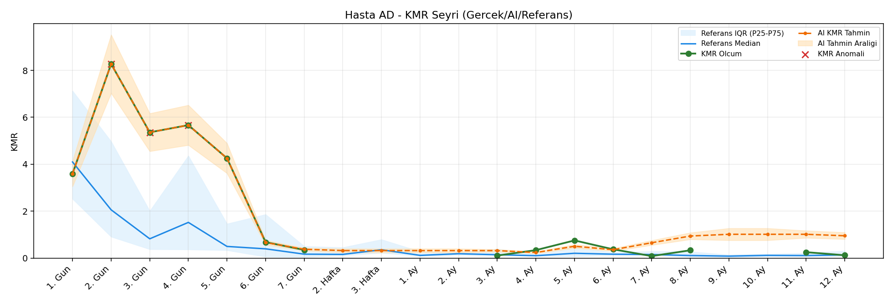
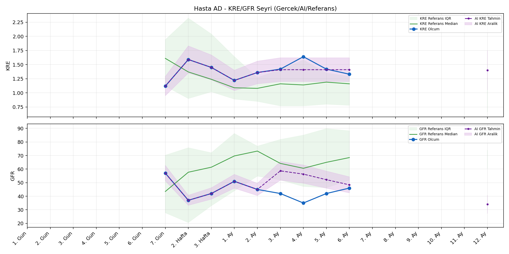
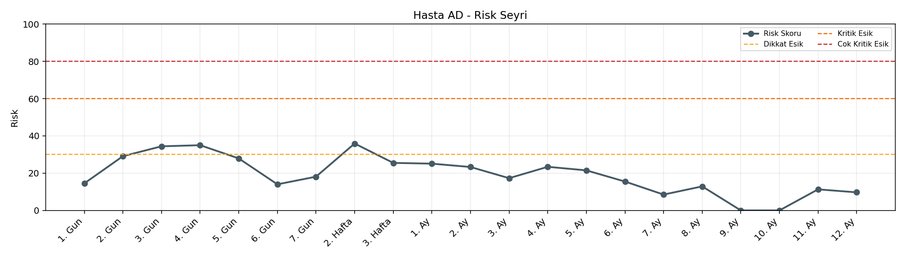

# Hasta AD

[Ana rapora don](../../Hasta_Raporları_Detay.md)

## Hasta Ozeti

| Alan | Deger |
|---|---|
| Yas | 51 |
| Cinsiyet | FEMALE |
| BMI | 29.8 |
| Vital Status | LIVING |
| Risk Skoru (Son) | 35.9 |
| Risk Seviyesi | Dikkat |
| Anomali Durumu | Var |
| Son KMR | 0.2535 (11. Ay) |
| Son KRE | 1.33 (6. Ay) |
| Son GFR | 46.0 (6. Ay) |

## Grafikler

## IQR ve Median Ozeti

| Metrik | Hasta (Median / IQR) | Referans (Median / IQR) | Son Olcum Zamani |
|---|---|---|---|
| KMR | 0.528 / 3.756 | 0.110 / 0.129 | 11. Ay |
| KRE | 1.420 / 0.120 | 1.170 / 0.770 | 6. Ay |
| GFR | 42.000 / 4.000 | 59.800 / 29.600 | 6. Ay |

## AI Performans (Hasta Bazli)

| Metrik | Eval Nokta | MAE | RMSE | MAPE | Aralik Kapsama | Son Hata |
|---|---:|---:|---:|---:|---:|---:|
| KMR | 9 | 0.7568 | 0.9250 | %361.98 | %0.0 | 1.3689 |
| KRE | 4 | 0.183 | 0.201 | %12.90 | %75.0 | 0.180 |
| GFR | 4 | 5.30 | 6.26 | %13.37 | %50.0 | -7.40 |

## Zaman Serisi Detay Tablosu

| Zaman | KMR | AI KMR | Durum | KRE | AI KRE | Durum | GFR | AI GFR | Durum | Risk | Seviye | Anomali |
|---|---:|---:|---|---:|---:|---|---:|---:|---|---:|---|---|
| 1. Gun | 3.5975 | 3.5975 | Olcum Kopyasi | - | - | Uygulanmaz | - | - | Uygulanmaz | 14.3 | Normal | - |
| 2. Gun | 8.2733 | 8.2733 | Olcum Kopyasi | - | - | Uygulanmaz | - | - | Uygulanmaz | 28.9 | Normal | KMR |
| 3. Gun | 5.3601 | 5.3601 | Olcum Kopyasi | - | - | Uygulanmaz | - | - | Uygulanmaz | 34.2 | Dikkat | KMR |
| 4. Gun | 5.6678 | 5.6678 | Olcum Kopyasi | - | - | Uygulanmaz | - | - | Uygulanmaz | 34.8 | Dikkat | KMR |
| 5. Gun | 4.2566 | 4.2566 | Olcum Kopyasi | - | - | Uygulanmaz | - | - | Uygulanmaz | 27.8 | Normal | - |
| 6. Gun | 0.6807 | 0.1670 | Model | - | - | Uygulanmaz | - | - | Uygulanmaz | 14.9 | Normal | - |
| 7. Gun | 0.3501 | 0.0270 | Model | 1.12 | 1.12 | Olcum Kopyasi | 57.0 | 57.0 | Olcum Kopyasi | 18.5 | Normal | - |
| 2. Hafta | - | 0.1803 | Ongoru | 1.59 | 1.59 | Olcum Kopyasi | 37.0 | 37.0 | Olcum Kopyasi | 35.9 | Dikkat | - |
| 3. Hafta | - | 0.1803 | Ongoru | 1.45 | 1.45 | Olcum Kopyasi | 42.0 | 42.0 | Olcum Kopyasi | 25.5 | Normal | - |
| 1. Ay | - | 0.1803 | Ongoru | 1.22 | 1.22 | Olcum Kopyasi | 51.0 | 51.0 | Olcum Kopyasi | 25.1 | Normal | - |
| 2. Ay | - | 0.1803 | Ongoru | 1.36 | 1.36 | Olcum Kopyasi | 45.0 | 45.0 | Olcum Kopyasi | 23.3 | Normal | - |
| 3. Ay | 0.1084 | 0.1803 | Model | 1.42 | 1.73 | Model | 42.0 | 45.3 | Model | 17.2 | Normal | - |
| 4. Ay | 0.3403 | 0.4373 | Model | 1.64 | 1.71 | Model | 35.0 | 44.5 | Model | 23.5 | Normal | - |
| 5. Ay | 0.7543 | 1.2601 | Model | 1.42 | 1.59 | Model | 42.0 | 41.0 | Model | 22.1 | Normal | - |
| 6. Ay | 0.3754 | 1.5785 | Model | 1.33 | 1.51 | Model | 46.0 | 38.6 | Model | 17.7 | Normal | - |
| 7. Ay | 0.0865 | 1.5474 | Model | - | - | Uygulanmaz | - | - | Uygulanmaz | 10.3 | Normal | - |
| 8. Ay | 0.3345 | 1.6016 | Model | - | - | Uygulanmaz | - | - | Uygulanmaz | 14.3 | Normal | - |
| 9. Ay | - | 1.6224 | Ongoru | - | - | Uygulanmaz | - | - | Uygulanmaz | 0.0 | Normal | - |
| 10. Ay | - | 1.6224 | Ongoru | - | - | Uygulanmaz | - | - | Uygulanmaz | 0.0 | Normal | - |
| 11. Ay | 0.2535 | 1.6224 | Model | - | - | Uygulanmaz | - | - | Uygulanmaz | 12.8 | Normal | - |
| 12. Ay | - | 1.6067 | Ongoru | - | 1.46 | Ongoru | - | 36.6 | Ongoru | 0.0 | Normal | - |

> Not: Bu dosya `python3 backend/run_all.py` ile otomatik uretilir.
