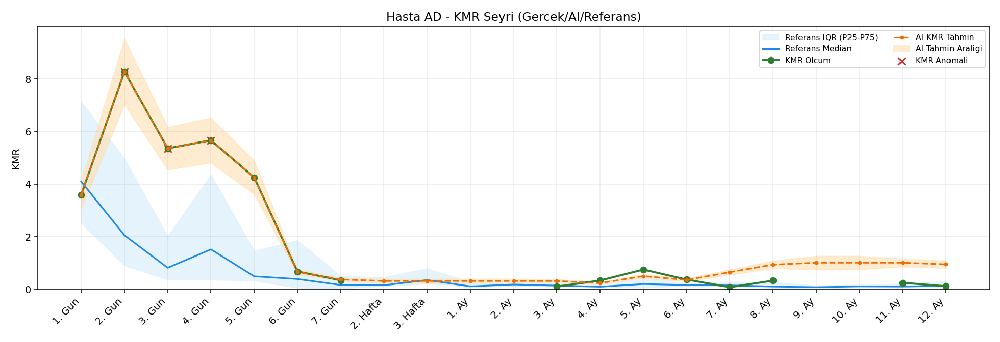
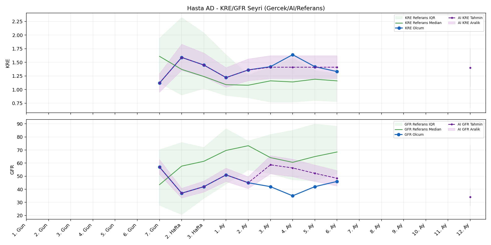
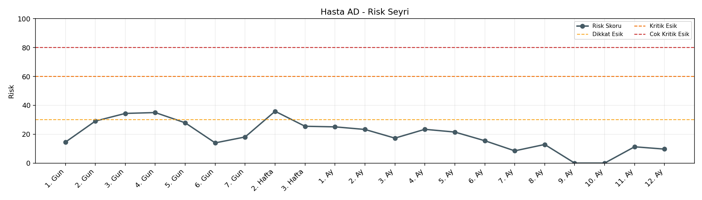

# Hasta AD

[Ana rapora don](../../Hasta_Raporları_Detay.md)

## Hasta Ozeti

| Alan | Deger |
|---|---|
| Yas | 51 |
| Cinsiyet | FEMALE |
| BMI | 29.8 |
| Vital Status | LIVING |
| Risk Skoru (Son) | 35.9 |
| Risk Seviyesi | Dikkat |
| Anomali Durumu | Var |
| Son KMR | 0.1217 (12. Ay) |
| Son KRE | 1.33 (6. Ay) |
| Son GFR | 46.0 (6. Ay) |

## Grafikler

## IQR ve Median Ozeti

| Metrik | Hasta (Median / IQR) | Referans (Median / IQR) | Son Olcum Zamani |
|---|---|---|---|
| KMR | 0.375 / 3.633 | 0.138 / 0.217 | 12. Ay |
| KRE | 1.420 / 0.120 | 1.160 / 0.510 | 6. Ay |
| GFR | 42.000 / 4.000 | 68.500 / 36.400 | 6. Ay |

## AI Performans (Hasta Bazli)

| Metrik | Eval Nokta | MAE | RMSE | MAPE | Aralik Kapsama | Son Hata |
|---|---:|---:|---:|---:|---:|---:|
| KMR | 10 | 0.3395 | 0.4563 | %209.72 | %30.0 | 0.8305 |
| KRE | 4 | 0.082 | 0.122 | %5.36 | %75.0 | 0.080 |
| GFR | 4 | 12.65 | 14.51 | %32.53 | %25.0 | 2.40 |

## Zaman Serisi Detay Tablosu

| Zaman | KMR | AI KMR | Durum | KRE | AI KRE | Durum | GFR | AI GFR | Durum | Risk | Seviye | Anomali |
|---|---:|---:|---|---:|---:|---|---:|---:|---|---:|---|---|
| 1. Gun | 3.5975 | 3.5975 | Olcum Kopyasi | - | - | Uygulanmaz | - | - | Uygulanmaz | 14.5 | Normal | - |
| 2. Gun | 8.2733 | 8.2733 | Olcum Kopyasi | - | - | Uygulanmaz | - | - | Uygulanmaz | 29.1 | Normal | KMR |
| 3. Gun | 5.3601 | 5.3601 | Olcum Kopyasi | - | - | Uygulanmaz | - | - | Uygulanmaz | 34.4 | Dikkat | KMR |
| 4. Gun | 5.6678 | 5.6678 | Olcum Kopyasi | - | - | Uygulanmaz | - | - | Uygulanmaz | 35.0 | Dikkat | KMR |
| 5. Gun | 4.2566 | 4.2566 | Olcum Kopyasi | - | - | Uygulanmaz | - | - | Uygulanmaz | 27.9 | Normal | - |
| 6. Gun | 0.6807 | 0.6634 | Model | - | - | Uygulanmaz | - | - | Uygulanmaz | 14.0 | Normal | - |
| 7. Gun | 0.3501 | 0.3782 | Model | 1.12 | 1.12 | Olcum Kopyasi | 57.0 | 57.0 | Olcum Kopyasi | 18.1 | Normal | - |
| 2. Hafta | - | 0.3212 | Ongoru | 1.59 | 1.59 | Olcum Kopyasi | 37.0 | 37.0 | Olcum Kopyasi | 35.9 | Dikkat | - |
| 3. Hafta | - | 0.3212 | Ongoru | 1.45 | 1.45 | Olcum Kopyasi | 42.0 | 42.0 | Olcum Kopyasi | 25.5 | Normal | - |
| 1. Ay | - | 0.3212 | Ongoru | 1.22 | 1.22 | Olcum Kopyasi | 51.0 | 51.0 | Olcum Kopyasi | 25.1 | Normal | - |
| 2. Ay | - | 0.3212 | Ongoru | 1.36 | 1.36 | Olcum Kopyasi | 45.0 | 45.0 | Olcum Kopyasi | 23.3 | Normal | - |
| 3. Ay | 0.1084 | 0.3212 | Model | 1.42 | 1.41 | Model | 42.0 | 58.7 | Model | 17.3 | Normal | - |
| 4. Ay | 0.3403 | 0.2384 | Model | 1.64 | 1.41 | Model | 35.0 | 56.3 | Model | 23.4 | Normal | - |
| 5. Ay | 0.7543 | 0.5057 | Model | 1.42 | 1.41 | Model | 42.0 | 52.2 | Model | 21.5 | Normal | - |
| 6. Ay | 0.3754 | 0.3581 | Model | 1.33 | 1.41 | Model | 46.0 | 48.4 | Model | 15.5 | Normal | - |
| 7. Ay | 0.0865 | 0.6559 | Model | - | - | Uygulanmaz | - | - | Uygulanmaz | 8.5 | Normal | - |
| 8. Ay | 0.3345 | 0.9414 | Model | - | - | Uygulanmaz | - | - | Uygulanmaz | 12.9 | Normal | - |
| 9. Ay | - | 1.0157 | Ongoru | - | - | Uygulanmaz | - | - | Uygulanmaz | 0.0 | Normal | - |
| 10. Ay | - | 1.0157 | Ongoru | - | - | Uygulanmaz | - | - | Uygulanmaz | 0.0 | Normal | - |
| 11. Ay | 0.2535 | 1.0157 | Model | - | - | Uygulanmaz | - | - | Uygulanmaz | 11.3 | Normal | - |
| 12. Ay | 0.1217 | 0.9522 | Model | - | 1.40 | Ongoru | - | 34.0 | Ongoru | 9.7 | Normal | - |

> Not: Bu dosya `python3 backend/run_all.py` ile otomatik uretilir.
