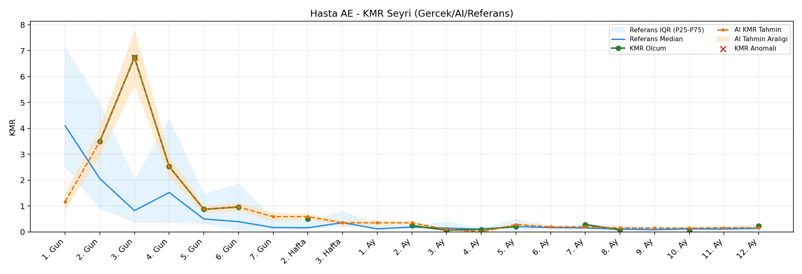
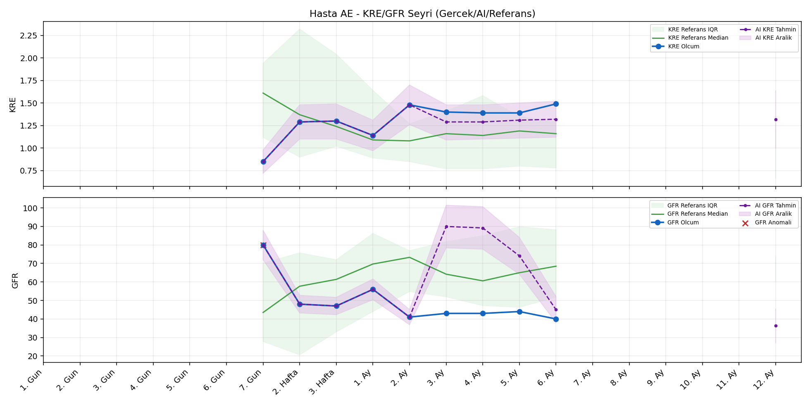
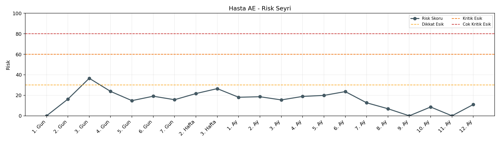

# Hasta AE

[Ana rapora don](../../Hasta_Raporları_Detay.md)

## Hasta Ozeti

| Alan | Deger |
|---|---|
| Yas | 50 |
| Cinsiyet | FEMALE |
| BMI | 22.6 |
| Vital Status | LIVING |
| Risk Skoru (Son) | 35.9 |
| Risk Seviyesi | Dikkat |
| Anomali Durumu | Var |
| Son KMR | 0.0740 (8. Ay) |
| Son KRE | 1.49 (6. Ay) |
| Son GFR | 40.0 (6. Ay) |

## Grafikler

## IQR ve Median Ozeti

| Metrik | Hasta (Median / IQR) | Referans (Median / IQR) | Son Olcum Zamani |
|---|---|---|---|
| KMR | 0.390 / 1.178 | 0.120 / 0.104 | 8. Ay |
| KRE | 1.390 / 0.110 | 1.170 / 0.770 | 6. Ay |
| GFR | 44.000 / 5.000 | 59.800 / 29.600 | 6. Ay |

## AI Performans (Hasta Bazli)

| Metrik | Eval Nokta | MAE | RMSE | MAPE | Aralik Kapsama | Son Hata |
|---|---:|---:|---:|---:|---:|---:|
| KMR | 7 | 0.1876 | 0.2377 | %167.05 | %14.3 | 0.0363 |
| KRE | 4 | 0.115 | 0.118 | %8.08 | %100.0 | -0.150 |
| GFR | 4 | 15.23 | 17.26 | %35.35 | %25.0 | 2.70 |

## Zaman Serisi Detay Tablosu

| Zaman | KMR | AI KMR | Durum | KRE | AI KRE | Durum | GFR | AI GFR | Durum | Risk | Seviye | Anomali |
|---|---:|---:|---|---:|---:|---|---:|---:|---|---:|---|---|
| 1. Gun | - | 1.3375 | Ongoru | - | - | Uygulanmaz | - | - | Uygulanmaz | 0.0 | Normal | - |
| 2. Gun | 3.4914 | 3.4914 | Olcum Kopyasi | - | - | Uygulanmaz | - | - | Uygulanmaz | 15.8 | Normal | - |
| 3. Gun | 6.7364 | 6.7364 | Olcum Kopyasi | - | - | Uygulanmaz | - | - | Uygulanmaz | 35.9 | Dikkat | KMR |
| 4. Gun | 2.5257 | 2.5257 | Olcum Kopyasi | - | - | Uygulanmaz | - | - | Uygulanmaz | 23.5 | Normal | - |
| 5. Gun | 0.8706 | 0.8706 | Olcum Kopyasi | - | - | Uygulanmaz | - | - | Uygulanmaz | 15.0 | Normal | - |
| 6. Gun | 0.9636 | 0.9636 | Olcum Kopyasi | - | - | Uygulanmaz | - | - | Uygulanmaz | 19.4 | Normal | - |
| 7. Gun | - | 0.1746 | Ongoru | 0.85 | 0.85 | Olcum Kopyasi | 80.0 | 80.0 | Olcum Kopyasi | 15.7 | Normal | GFR |
| 2. Hafta | 0.4956 | 0.1746 | Model | 1.29 | 1.29 | Olcum Kopyasi | 48.0 | 48.0 | Olcum Kopyasi | 22.2 | Normal | - |
| 3. Hafta | - | 0.3306 | Ongoru | 1.30 | 1.30 | Olcum Kopyasi | 47.0 | 47.0 | Olcum Kopyasi | 26.5 | Normal | - |
| 1. Ay | - | 0.3306 | Ongoru | 1.14 | 1.14 | Olcum Kopyasi | 56.0 | 56.0 | Olcum Kopyasi | 18.1 | Normal | - |
| 2. Ay | 0.2436 | 0.3306 | Model | 1.48 | 1.48 | Olcum Kopyasi | 41.0 | 41.0 | Olcum Kopyasi | 18.7 | Normal | - |
| 3. Ay | 0.0648 | 0.5248 | Model | 1.40 | 1.28 | Model | 43.0 | 65.7 | Model | 16.7 | Normal | - |
| 4. Ay | 0.0966 | 0.3063 | Model | 1.39 | 1.28 | Model | 43.0 | 65.2 | Model | 19.4 | Normal | - |
| 5. Ay | 0.2032 | 0.3661 | Model | 1.39 | 1.31 | Model | 44.0 | 57.3 | Model | 20.2 | Normal | - |
| 6. Ay | - | 0.2486 | Ongoru | 1.49 | 1.34 | Model | 40.0 | 42.7 | Model | 23.6 | Normal | - |
| 7. Ay | 0.2848 | 0.2486 | Model | - | - | Uygulanmaz | - | - | Uygulanmaz | 12.7 | Normal | - |
| 8. Ay | 0.0740 | 0.1103 | Model | - | - | Uygulanmaz | - | - | Uygulanmaz | 6.9 | Normal | - |
| 9. Ay | - | 0.1209 | Ongoru | - | - | Uygulanmaz | - | - | Uygulanmaz | 0.0 | Normal | - |
| 10. Ay | - | 0.1209 | Ongoru | - | - | Uygulanmaz | - | - | Uygulanmaz | 0.0 | Normal | - |
| 11. Ay | - | 0.1209 | Ongoru | - | - | Uygulanmaz | - | - | Uygulanmaz | 0.0 | Normal | - |
| 12. Ay | - | 0.1209 | Ongoru | - | 1.35 | Ongoru | - | 41.6 | Ongoru | 0.0 | Normal | - |

> Not: Bu dosya `python3 backend/run_all.py` ile otomatik uretilir.
