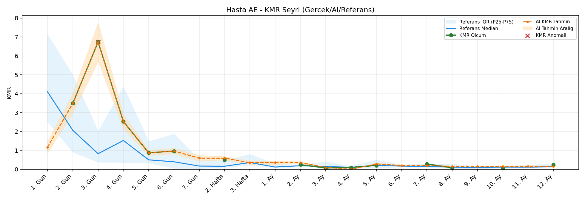
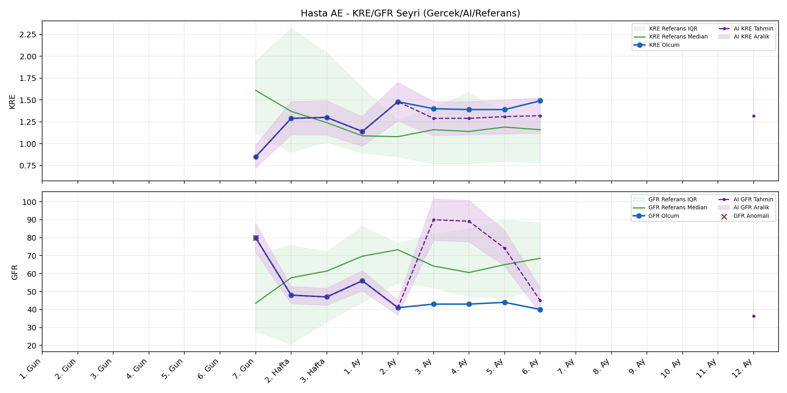
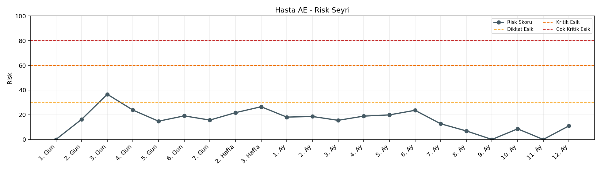

# Hasta AE

[Ana rapora don](../../Hasta_Raporları_Detay.md)

## Hasta Ozeti

| Alan | Deger |
|---|---|
| Yas | 50 |
| Cinsiyet | FEMALE |
| BMI | 22.6 |
| Vital Status | LIVING |
| Risk Skoru (Son) | 36.6 |
| Risk Seviyesi | Dikkat |
| Anomali Durumu | Var |
| Son KMR | 0.2313 (12. Ay) |
| Son KRE | 1.49 (6. Ay) |
| Son GFR | 40.0 (6. Ay) |

## Grafikler

## IQR ve Median Ozeti

| Metrik | Hasta (Median / IQR) | Referans (Median / IQR) | Son Olcum Zamani |
|---|---|---|---|
| KMR | 0.264 / 0.817 | 0.138 / 0.217 | 12. Ay |
| KRE | 1.390 / 0.110 | 1.160 / 0.510 | 6. Ay |
| GFR | 44.000 / 5.000 | 68.500 / 36.400 | 6. Ay |

## AI Performans (Hasta Bazli)

| Metrik | Eval Nokta | MAE | RMSE | MAPE | Aralik Kapsama | Son Hata |
|---|---:|---:|---:|---:|---:|---:|
| KMR | 9 | 0.0836 | 0.0861 | %68.91 | %0.0 | -0.0722 |
| KRE | 4 | 0.115 | 0.120 | %8.05 | %100.0 | -0.170 |
| GFR | 4 | 32.08 | 36.31 | %74.41 | %25.0 | 5.00 |

## Zaman Serisi Detay Tablosu

| Zaman | KMR | AI KMR | Durum | KRE | AI KRE | Durum | GFR | AI GFR | Durum | Risk | Seviye | Anomali |
|---|---:|---:|---|---:|---:|---|---:|---:|---|---:|---|---|
| 1. Gun | - | 1.1665 | Ongoru | - | - | Uygulanmaz | - | - | Uygulanmaz | 0.0 | Normal | - |
| 2. Gun | 3.4914 | 3.4914 | Olcum Kopyasi | - | - | Uygulanmaz | - | - | Uygulanmaz | 16.3 | Normal | - |
| 3. Gun | 6.7364 | 6.7364 | Olcum Kopyasi | - | - | Uygulanmaz | - | - | Uygulanmaz | 36.6 | Dikkat | KMR |
| 4. Gun | 2.5257 | 2.5257 | Olcum Kopyasi | - | - | Uygulanmaz | - | - | Uygulanmaz | 23.8 | Normal | - |
| 5. Gun | 0.8706 | 0.8706 | Olcum Kopyasi | - | - | Uygulanmaz | - | - | Uygulanmaz | 14.8 | Normal | - |
| 6. Gun | 0.9636 | 0.9636 | Olcum Kopyasi | - | - | Uygulanmaz | - | - | Uygulanmaz | 19.1 | Normal | - |
| 7. Gun | - | 0.5878 | Ongoru | 0.85 | 0.85 | Olcum Kopyasi | 80.0 | 80.0 | Olcum Kopyasi | 15.7 | Normal | GFR |
| 2. Hafta | 0.4956 | 0.5878 | Model | 1.29 | 1.29 | Olcum Kopyasi | 48.0 | 48.0 | Olcum Kopyasi | 21.7 | Normal | - |
| 3. Hafta | - | 0.3504 | Ongoru | 1.30 | 1.30 | Olcum Kopyasi | 47.0 | 47.0 | Olcum Kopyasi | 26.5 | Normal | - |
| 1. Ay | - | 0.3504 | Ongoru | 1.14 | 1.14 | Olcum Kopyasi | 56.0 | 56.0 | Olcum Kopyasi | 18.1 | Normal | - |
| 2. Ay | 0.2436 | 0.3504 | Model | 1.48 | 1.48 | Olcum Kopyasi | 41.0 | 41.0 | Olcum Kopyasi | 18.6 | Normal | - |
| 3. Ay | 0.0648 | 0.0973 | Model | 1.40 | 1.29 | Model | 43.0 | 90.0 | Model | 15.5 | Normal | - |
| 4. Ay | 0.0966 | 0.0000 | Model | 1.39 | 1.29 | Model | 43.0 | 89.2 | Model | 18.9 | Normal | - |
| 5. Ay | 0.2032 | 0.2859 | Model | 1.39 | 1.31 | Model | 44.0 | 74.1 | Model | 19.9 | Normal | - |
| 6. Ay | - | 0.1931 | Ongoru | 1.49 | 1.32 | Model | 40.0 | 45.0 | Model | 23.6 | Normal | - |
| 7. Ay | 0.2848 | 0.1931 | Model | - | - | Uygulanmaz | - | - | Uygulanmaz | 12.7 | Normal | - |
| 8. Ay | 0.0740 | 0.1547 | Model | - | - | Uygulanmaz | - | - | Uygulanmaz | 6.9 | Normal | - |
| 9. Ay | - | 0.1468 | Ongoru | - | - | Uygulanmaz | - | - | Uygulanmaz | 0.0 | Normal | - |
| 10. Ay | 0.0496 | 0.1468 | Model | - | - | Uygulanmaz | - | - | Uygulanmaz | 8.6 | Normal | - |
| 11. Ay | - | 0.1591 | Ongoru | - | - | Uygulanmaz | - | - | Uygulanmaz | 0.0 | Normal | - |
| 12. Ay | 0.2313 | 0.1591 | Model | - | 1.32 | Ongoru | - | 36.3 | Ongoru | 11.0 | Normal | - |

> Not: Bu dosya `python3 backend/run_all.py` ile otomatik uretilir.
