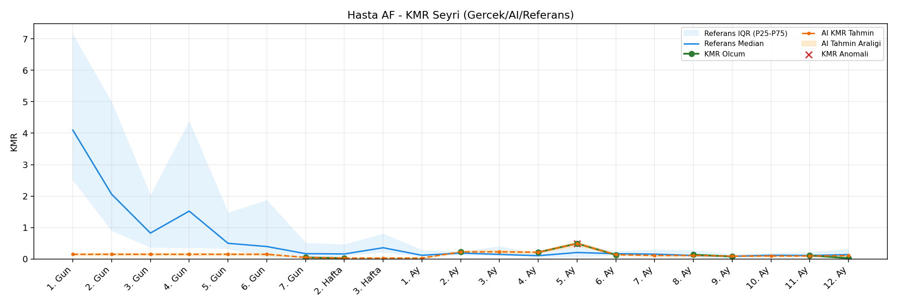
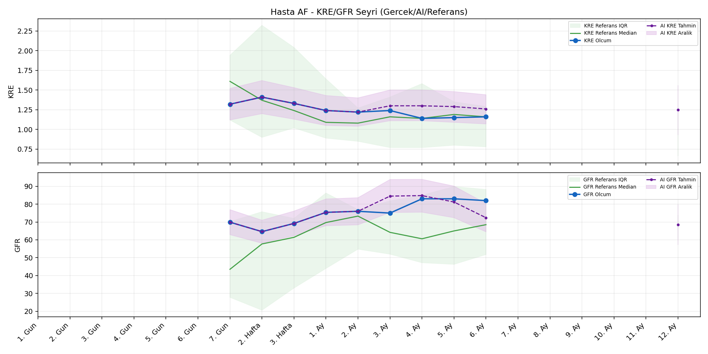
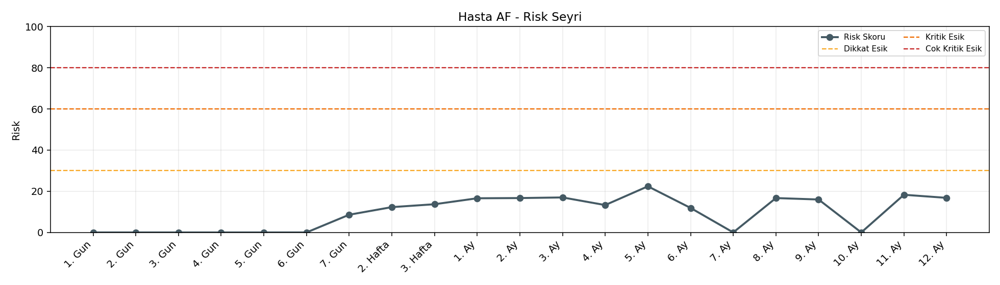

# Hasta AF

[Ana rapora don](../../Hasta_Raporları_Detay.md)

## Hasta Ozeti

| Alan | Deger |
|---|---|
| Yas | 34 |
| Cinsiyet | MALE |
| BMI | 26.5 |
| Vital Status | LIVING |
| Risk Skoru (Son) | 22.1 |
| Risk Seviyesi | Normal |
| Anomali Durumu | Yok |
| Son KMR | 0.1101 (11. Ay) |
| Son KRE | 1.16 (6. Ay) |
| Son GFR | 82.0 (6. Ay) |

## Grafikler

## IQR ve Median Ozeti

| Metrik | Hasta (Median / IQR) | Referans (Median / IQR) | Son Olcum Zamani |
|---|---|---|---|
| KMR | 0.131 / 0.134 | 0.110 / 0.129 | 11. Ay |
| KRE | 1.240 / 0.160 | 1.170 / 0.770 | 6. Ay |
| GFR | 75.400 / 12.100 | 59.800 / 29.600 | 6. Ay |

## AI Performans (Hasta Bazli)

| Metrik | Eval Nokta | MAE | RMSE | MAPE | Aralik Kapsama | Son Hata |
|---|---:|---:|---:|---:|---:|---:|
| KMR | 4 | 0.0268 | 0.0321 | %28.23 | %50.0 | 0.0339 |
| KRE | 4 | 0.130 | 0.135 | %11.19 | %100.0 | 0.110 |
| GFR | 4 | 5.72 | 7.06 | %7.25 | %50.0 | -9.90 |

## Zaman Serisi Detay Tablosu

| Zaman | KMR | AI KMR | Durum | KRE | AI KRE | Durum | GFR | AI GFR | Durum | Risk | Seviye | Anomali |
|---|---:|---:|---|---:|---:|---|---:|---:|---|---:|---|---|
| 1. Gun | - | 0.1625 | Ongoru | - | - | Uygulanmaz | - | - | Uygulanmaz | 0.0 | Normal | - |
| 2. Gun | - | 0.1625 | Ongoru | - | - | Uygulanmaz | - | - | Uygulanmaz | 0.0 | Normal | - |
| 3. Gun | - | 0.1625 | Ongoru | - | - | Uygulanmaz | - | - | Uygulanmaz | 0.0 | Normal | - |
| 4. Gun | - | 0.1625 | Ongoru | - | - | Uygulanmaz | - | - | Uygulanmaz | 0.0 | Normal | - |
| 5. Gun | - | 0.1625 | Ongoru | - | - | Uygulanmaz | - | - | Uygulanmaz | 0.0 | Normal | - |
| 6. Gun | - | 0.1625 | Ongoru | - | - | Uygulanmaz | - | - | Uygulanmaz | 0.0 | Normal | - |
| 7. Gun | 0.0491 | 0.0491 | Olcum Kopyasi | 1.32 | 1.32 | Olcum Kopyasi | 69.9 | 69.9 | Olcum Kopyasi | 8.8 | Normal | - |
| 2. Hafta | 0.0274 | 0.0274 | Olcum Kopyasi | 1.41 | 1.41 | Olcum Kopyasi | 64.6 | 64.6 | Olcum Kopyasi | 12.5 | Normal | - |
| 3. Hafta | - | 0.0274 | Ongoru | 1.33 | 1.33 | Olcum Kopyasi | 69.2 | 69.2 | Olcum Kopyasi | 13.7 | Normal | - |
| 1. Ay | - | 0.0274 | Ongoru | 1.24 | 1.24 | Olcum Kopyasi | 75.4 | 75.4 | Olcum Kopyasi | 16.6 | Normal | - |
| 2. Ay | 0.2269 | 0.2269 | Olcum Kopyasi | 1.22 | 1.22 | Olcum Kopyasi | 76.0 | 76.0 | Olcum Kopyasi | 16.5 | Normal | - |
| 3. Ay | - | 0.2269 | Ongoru | 1.24 | 1.32 | Model | 75.0 | 84.8 | Model | 17.0 | Normal | - |
| 4. Ay | 0.2128 | 0.2128 | Olcum Kopyasi | 1.14 | 1.32 | Model | 83.0 | 84.6 | Model | 13.1 | Normal | - |
| 5. Ay | 0.4904 | 0.4904 | Olcum Kopyasi | 1.15 | 1.30 | Model | 83.0 | 81.4 | Model | 22.1 | Normal | - |
| 6. Ay | 0.1313 | 0.1219 | Model | 1.16 | 1.27 | Model | 82.0 | 72.1 | Model | 12.2 | Normal | - |
| 7. Ay | - | 0.1245 | Ongoru | - | - | Uygulanmaz | - | - | Uygulanmaz | 0.0 | Normal | - |
| 8. Ay | 0.1358 | 0.1245 | Model | - | - | Uygulanmaz | - | - | Uygulanmaz | 16.6 | Normal | - |
| 9. Ay | 0.0789 | 0.1315 | Model | - | - | Uygulanmaz | - | - | Uygulanmaz | 17.3 | Normal | - |
| 10. Ay | - | 0.1440 | Ongoru | - | - | Uygulanmaz | - | - | Uygulanmaz | 0.0 | Normal | - |
| 11. Ay | 0.1101 | 0.1440 | Model | - | - | Uygulanmaz | - | - | Uygulanmaz | 19.0 | Normal | - |
| 12. Ay | - | 0.1461 | Ongoru | - | 1.22 | Ongoru | - | 68.4 | Ongoru | 0.0 | Normal | - |

> Not: Bu dosya `python3 backend/run_all.py` ile otomatik uretilir.
