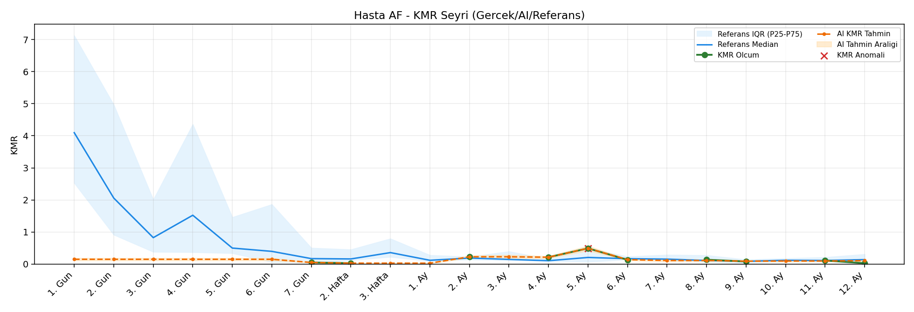
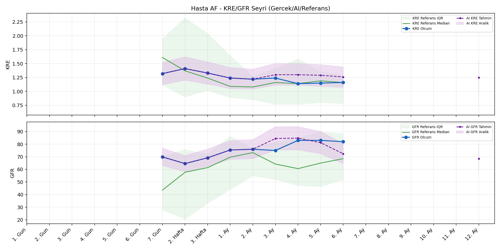
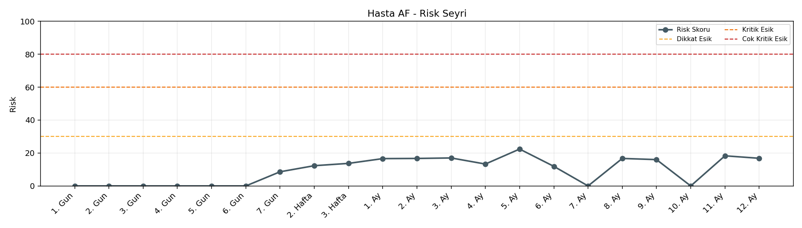

# Hasta AF

[Ana rapora don](../../Hasta_Raporları_Detay.md)

## Hasta Ozeti

| Alan | Deger |
|---|---|
| Yas | 34 |
| Cinsiyet | MALE |
| BMI | 26.5 |
| Vital Status | LIVING |
| Risk Skoru (Son) | 22.4 |
| Risk Seviyesi | Normal |
| Anomali Durumu | Var |
| Son KMR | 0.0253 (12. Ay) |
| Son KRE | 1.16 (6. Ay) |
| Son GFR | 82.0 (6. Ay) |

## Grafikler

## IQR ve Median Ozeti

| Metrik | Hasta (Median / IQR) | Referans (Median / IQR) | Son Olcum Zamani |
|---|---|---|---|
| KMR | 0.121 / 0.137 | 0.138 / 0.217 | 12. Ay |
| KRE | 1.240 / 0.160 | 1.160 / 0.510 | 6. Ay |
| GFR | 75.400 / 12.100 | 68.500 / 36.400 | 6. Ay |

## AI Performans (Hasta Bazli)

| Metrik | Eval Nokta | MAE | RMSE | MAPE | Aralik Kapsama | Son Hata |
|---|---:|---:|---:|---:|---:|---:|
| KMR | 5 | 0.0274 | 0.0387 | %42.32 | %40.0 | 0.0808 |
| KRE | 4 | 0.115 | 0.121 | %9.92 | %100.0 | 0.100 |
| GFR | 4 | 5.67 | 6.87 | %7.18 | %50.0 | -9.60 |

## Zaman Serisi Detay Tablosu

| Zaman | KMR | AI KMR | Durum | KRE | AI KRE | Durum | GFR | AI GFR | Durum | Risk | Seviye | Anomali |
|---|---:|---:|---|---:|---:|---|---:|---:|---|---:|---|---|
| 1. Gun | - | 0.1488 | Ongoru | - | - | Uygulanmaz | - | - | Uygulanmaz | 0.0 | Normal | - |
| 2. Gun | - | 0.1488 | Ongoru | - | - | Uygulanmaz | - | - | Uygulanmaz | 0.0 | Normal | - |
| 3. Gun | - | 0.1488 | Ongoru | - | - | Uygulanmaz | - | - | Uygulanmaz | 0.0 | Normal | - |
| 4. Gun | - | 0.1488 | Ongoru | - | - | Uygulanmaz | - | - | Uygulanmaz | 0.0 | Normal | - |
| 5. Gun | - | 0.1488 | Ongoru | - | - | Uygulanmaz | - | - | Uygulanmaz | 0.0 | Normal | - |
| 6. Gun | - | 0.1488 | Ongoru | - | - | Uygulanmaz | - | - | Uygulanmaz | 0.0 | Normal | - |
| 7. Gun | 0.0491 | 0.0491 | Olcum Kopyasi | 1.32 | 1.32 | Olcum Kopyasi | 69.9 | 69.9 | Olcum Kopyasi | 8.6 | Normal | - |
| 2. Hafta | 0.0274 | 0.0274 | Olcum Kopyasi | 1.41 | 1.41 | Olcum Kopyasi | 64.6 | 64.6 | Olcum Kopyasi | 12.3 | Normal | - |
| 3. Hafta | - | 0.0274 | Ongoru | 1.33 | 1.33 | Olcum Kopyasi | 69.2 | 69.2 | Olcum Kopyasi | 13.7 | Normal | - |
| 1. Ay | - | 0.0274 | Ongoru | 1.24 | 1.24 | Olcum Kopyasi | 75.4 | 75.4 | Olcum Kopyasi | 16.6 | Normal | - |
| 2. Ay | 0.2269 | 0.2269 | Olcum Kopyasi | 1.22 | 1.22 | Olcum Kopyasi | 76.0 | 76.0 | Olcum Kopyasi | 16.7 | Normal | - |
| 3. Ay | - | 0.2269 | Ongoru | 1.24 | 1.30 | Model | 75.0 | 84.5 | Model | 17.0 | Normal | - |
| 4. Ay | 0.2128 | 0.2128 | Olcum Kopyasi | 1.14 | 1.30 | Model | 83.0 | 84.8 | Model | 13.3 | Normal | - |
| 5. Ay | 0.4904 | 0.4904 | Olcum Kopyasi | 1.15 | 1.29 | Model | 83.0 | 81.2 | Model | 22.4 | Normal | KMR |
| 6. Ay | 0.1313 | 0.1368 | Model | 1.16 | 1.26 | Model | 82.0 | 72.4 | Model | 11.9 | Normal | - |
| 7. Ay | - | 0.1113 | Ongoru | - | - | Uygulanmaz | - | - | Uygulanmaz | 0.0 | Normal | - |
| 8. Ay | 0.1358 | 0.1113 | Model | - | - | Uygulanmaz | - | - | Uygulanmaz | 16.7 | Normal | - |
| 9. Ay | 0.0789 | 0.0902 | Model | - | - | Uygulanmaz | - | - | Uygulanmaz | 16.0 | Normal | - |
| 10. Ay | - | 0.0953 | Ongoru | - | - | Uygulanmaz | - | - | Uygulanmaz | 0.0 | Normal | - |
| 11. Ay | 0.1101 | 0.0953 | Model | - | - | Uygulanmaz | - | - | Uygulanmaz | 18.3 | Normal | - |
| 12. Ay | 0.0253 | 0.1061 | Model | - | 1.25 | Ongoru | - | 68.5 | Ongoru | 16.8 | Normal | - |

> Not: Bu dosya `python3 backend/run_all.py` ile otomatik uretilir.
