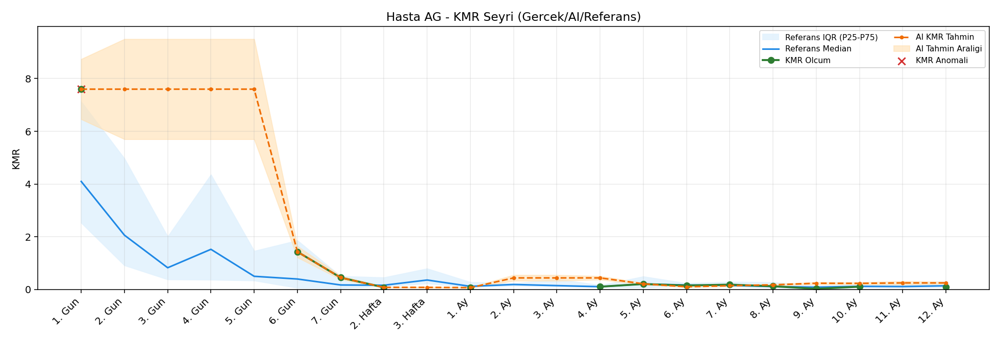
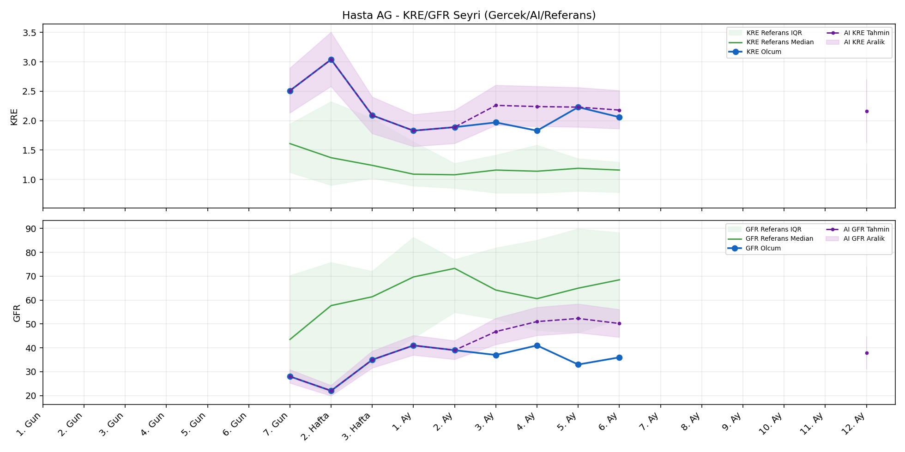
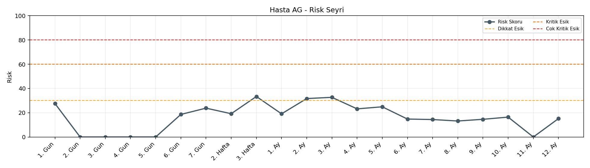

# Hasta AG

[Ana rapora don](../../Hasta_Raporları_Detay.md)

## Hasta Ozeti

| Alan | Deger |
|---|---|
| Yas | 51 |
| Cinsiyet | MALE |
| BMI | 21.7 |
| Vital Status | LIVING |
| Risk Skoru (Son) | 33.4 |
| Risk Seviyesi | Dikkat |
| Anomali Durumu | Var |
| Son KMR | 0.0244 (9. Ay) |
| Son KRE | 2.06 (6. Ay) |
| Son GFR | 36.0 (6. Ay) |

## Grafikler

## IQR ve Median Ozeti

| Metrik | Hasta (Median / IQR) | Referans (Median / IQR) | Son Olcum Zamani |
|---|---|---|---|
| KMR | 0.149 / 0.236 | 0.024 / 0.079 | 9. Ay |
| KRE | 2.060 / 0.340 | 1.170 / 0.770 | 6. Ay |
| GFR | 36.000 / 6.000 | 59.800 / 29.600 | 6. Ay |

## AI Performans (Hasta Bazli)

| Metrik | Eval Nokta | MAE | RMSE | MAPE | Aralik Kapsama | Son Hata |
|---|---:|---:|---:|---:|---:|---:|
| KMR | 6 | 0.2276 | 0.2794 | %285.48 | %0.0 | 0.5694 |
| KRE | 4 | 1.197 | 1.209 | %60.07 | %0.0 | 1.060 |
| GFR | 4 | 12.35 | 12.58 | %34.14 | %0.0 | 9.50 |

## Zaman Serisi Detay Tablosu

| Zaman | KMR | AI KMR | Durum | KRE | AI KRE | Durum | GFR | AI GFR | Durum | Risk | Seviye | Anomali |
|---|---:|---:|---|---:|---:|---|---:|---:|---|---:|---|---|
| 1. Gun | 7.5999 | 7.5999 | Olcum Kopyasi | - | - | Uygulanmaz | - | - | Uygulanmaz | 26.7 | Normal | KMR |
| 2. Gun | - | 7.5999 | Ongoru | - | - | Uygulanmaz | - | - | Uygulanmaz | 0.0 | Normal | - |
| 3. Gun | - | 7.5999 | Ongoru | - | - | Uygulanmaz | - | - | Uygulanmaz | 0.0 | Normal | - |
| 4. Gun | - | 7.5999 | Ongoru | - | - | Uygulanmaz | - | - | Uygulanmaz | 0.0 | Normal | - |
| 5. Gun | - | 7.5999 | Ongoru | - | - | Uygulanmaz | - | - | Uygulanmaz | 0.0 | Normal | - |
| 6. Gun | 1.4291 | 1.4291 | Olcum Kopyasi | - | - | Uygulanmaz | - | - | Uygulanmaz | 18.3 | Normal | - |
| 7. Gun | 0.4484 | 0.4484 | Olcum Kopyasi | 2.51 | 2.51 | Olcum Kopyasi | 28.0 | 28.0 | Olcum Kopyasi | 24.0 | Normal | - |
| 2. Hafta | 0.0787 | 0.0787 | Olcum Kopyasi | 3.04 | 3.04 | Olcum Kopyasi | 22.0 | 22.0 | Olcum Kopyasi | 19.3 | Normal | - |
| 3. Hafta | - | 0.0787 | Ongoru | 2.09 | 2.09 | Olcum Kopyasi | 35.0 | 35.0 | Olcum Kopyasi | 33.4 | Dikkat | - |
| 1. Ay | 0.0676 | 0.0676 | Olcum Kopyasi | 1.83 | 1.83 | Olcum Kopyasi | 41.0 | 41.0 | Olcum Kopyasi | 19.1 | Normal | - |
| 2. Ay | - | 0.2730 | Ongoru | 1.89 | 1.89 | Olcum Kopyasi | 39.0 | 39.0 | Olcum Kopyasi | 31.7 | Dikkat | - |
| 3. Ay | - | 0.2730 | Ongoru | 1.97 | 3.18 | Model | 37.0 | 50.1 | Model | 32.7 | Dikkat | - |
| 4. Ay | 0.1039 | 0.2730 | Model | 1.83 | 3.30 | Model | 41.0 | 51.9 | Model | 22.8 | Normal | - |
| 5. Ay | 0.2058 | 0.0000 | Model | 2.23 | 3.28 | Model | 33.0 | 48.9 | Model | 25.7 | Normal | - |
| 6. Ay | 0.1491 | 0.0000 | Model | 2.06 | 3.12 | Model | 36.0 | 45.5 | Model | 15.5 | Normal | - |
| 7. Ay | 0.1824 | 0.1292 | Model | - | - | Uygulanmaz | - | - | Uygulanmaz | 14.5 | Normal | - |
| 8. Ay | 0.1204 | 0.3397 | Model | - | - | Uygulanmaz | - | - | Uygulanmaz | 14.0 | Normal | - |
| 9. Ay | 0.0244 | 0.5938 | Model | - | - | Uygulanmaz | - | - | Uygulanmaz | 16.5 | Normal | - |
| 10. Ay | - | 0.5385 | Ongoru | - | - | Uygulanmaz | - | - | Uygulanmaz | 0.0 | Normal | - |
| 11. Ay | - | 0.5385 | Ongoru | - | - | Uygulanmaz | - | - | Uygulanmaz | 0.0 | Normal | - |
| 12. Ay | - | 0.5385 | Ongoru | - | 2.32 | Ongoru | - | 29.8 | Ongoru | 0.0 | Normal | - |

> Not: Bu dosya `python3 backend/run_all.py` ile otomatik uretilir.
