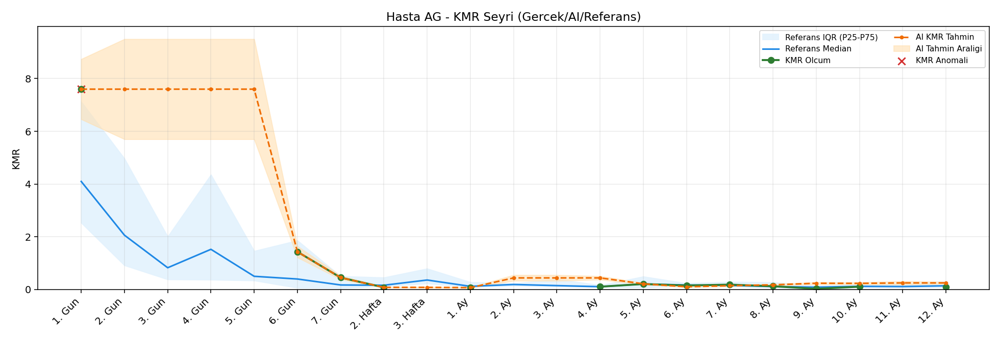
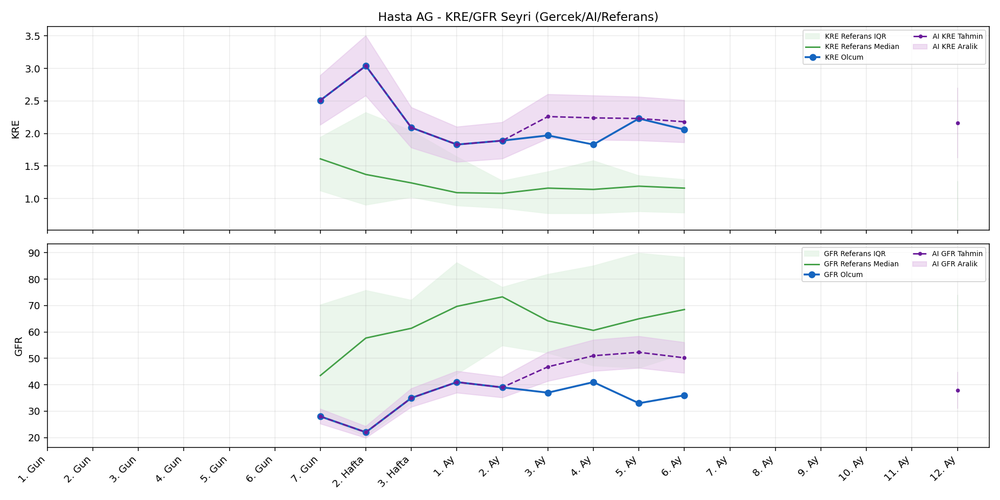
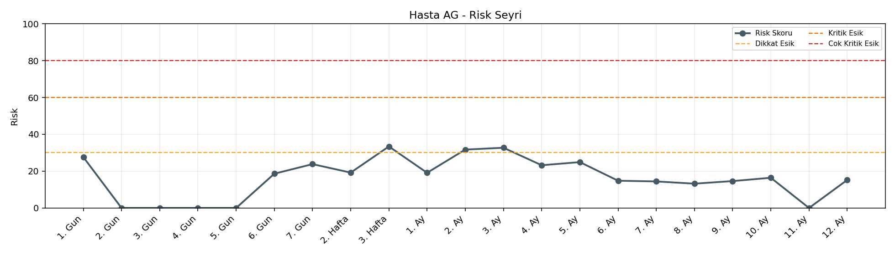

# Hasta AG

[Ana rapora don](../../Hasta_Raporları_Detay.md)

## Hasta Ozeti

| Alan | Deger |
|---|---|
| Yas | 51 |
| Cinsiyet | MALE |
| BMI | 21.7 |
| Vital Status | LIVING |
| Risk Skoru (Son) | 33.4 |
| Risk Seviyesi | Dikkat |
| Anomali Durumu | Var |
| Son KMR | 0.0819 (12. Ay) |
| Son KRE | 2.06 (6. Ay) |
| Son GFR | 36.0 (6. Ay) |

## Grafikler

## IQR ve Median Ozeti

| Metrik | Hasta (Median / IQR) | Referans (Median / IQR) | Son Olcum Zamani |
|---|---|---|---|
| KMR | 0.120 / 0.124 | 0.138 / 0.217 | 12. Ay |
| KRE | 2.060 / 0.340 | 1.160 / 0.510 | 6. Ay |
| GFR | 36.000 / 6.000 | 68.500 / 36.400 | 6. Ay |

## AI Performans (Hasta Bazli)

| Metrik | Eval Nokta | MAE | RMSE | MAPE | Aralik Kapsama | Son Hata |
|---|---:|---:|---:|---:|---:|---:|
| KMR | 8 | 0.1235 | 0.1606 | %146.33 | %12.5 | 0.1659 |
| KRE | 4 | 0.205 | 0.258 | %10.74 | %75.0 | 0.120 |
| GFR | 4 | 13.32 | 13.88 | %37.20 | %0.0 | 14.20 |

## Zaman Serisi Detay Tablosu

| Zaman | KMR | AI KMR | Durum | KRE | AI KRE | Durum | GFR | AI GFR | Durum | Risk | Seviye | Anomali |
|---|---:|---:|---|---:|---:|---|---:|---:|---|---:|---|---|
| 1. Gun | 7.5999 | 7.5999 | Olcum Kopyasi | - | - | Uygulanmaz | - | - | Uygulanmaz | 27.6 | Normal | KMR |
| 2. Gun | - | 7.5999 | Ongoru | - | - | Uygulanmaz | - | - | Uygulanmaz | 0.0 | Normal | - |
| 3. Gun | - | 7.5999 | Ongoru | - | - | Uygulanmaz | - | - | Uygulanmaz | 0.0 | Normal | - |
| 4. Gun | - | 7.5999 | Ongoru | - | - | Uygulanmaz | - | - | Uygulanmaz | 0.0 | Normal | - |
| 5. Gun | - | 7.5999 | Ongoru | - | - | Uygulanmaz | - | - | Uygulanmaz | 0.0 | Normal | - |
| 6. Gun | 1.4291 | 1.4291 | Olcum Kopyasi | - | - | Uygulanmaz | - | - | Uygulanmaz | 18.6 | Normal | - |
| 7. Gun | 0.4484 | 0.4484 | Olcum Kopyasi | 2.51 | 2.51 | Olcum Kopyasi | 28.0 | 28.0 | Olcum Kopyasi | 23.8 | Normal | - |
| 2. Hafta | 0.0787 | 0.0787 | Olcum Kopyasi | 3.04 | 3.04 | Olcum Kopyasi | 22.0 | 22.0 | Olcum Kopyasi | 19.2 | Normal | - |
| 3. Hafta | - | 0.0787 | Ongoru | 2.09 | 2.09 | Olcum Kopyasi | 35.0 | 35.0 | Olcum Kopyasi | 33.4 | Dikkat | - |
| 1. Ay | 0.0676 | 0.0676 | Olcum Kopyasi | 1.83 | 1.83 | Olcum Kopyasi | 41.0 | 41.0 | Olcum Kopyasi | 19.1 | Normal | - |
| 2. Ay | - | 0.4377 | Ongoru | 1.89 | 1.89 | Olcum Kopyasi | 39.0 | 39.0 | Olcum Kopyasi | 31.7 | Dikkat | - |
| 3. Ay | - | 0.4377 | Ongoru | 1.97 | 2.26 | Model | 37.0 | 46.8 | Model | 32.7 | Dikkat | - |
| 4. Ay | 0.1039 | 0.4377 | Model | 1.83 | 2.24 | Model | 41.0 | 51.0 | Model | 23.2 | Normal | - |
| 5. Ay | 0.2058 | 0.2130 | Model | 2.23 | 2.23 | Model | 33.0 | 52.3 | Model | 24.9 | Normal | - |
| 6. Ay | 0.1491 | 0.1003 | Model | 2.06 | 2.18 | Model | 36.0 | 50.2 | Model | 14.8 | Normal | - |
| 7. Ay | 0.1824 | 0.1420 | Model | - | - | Uygulanmaz | - | - | Uygulanmaz | 14.4 | Normal | - |
| 8. Ay | 0.1204 | 0.1749 | Model | - | - | Uygulanmaz | - | - | Uygulanmaz | 13.2 | Normal | - |
| 9. Ay | 0.0244 | 0.2353 | Model | - | - | Uygulanmaz | - | - | Uygulanmaz | 14.6 | Normal | - |
| 10. Ay | 0.1042 | 0.2307 | Model | - | - | Uygulanmaz | - | - | Uygulanmaz | 16.4 | Normal | - |
| 11. Ay | - | 0.2478 | Ongoru | - | - | Uygulanmaz | - | - | Uygulanmaz | 0.0 | Normal | - |
| 12. Ay | 0.0819 | 0.2478 | Model | - | 2.16 | Ongoru | - | 37.9 | Ongoru | 15.2 | Normal | - |

> Not: Bu dosya `python3 backend/run_all.py` ile otomatik uretilir.
