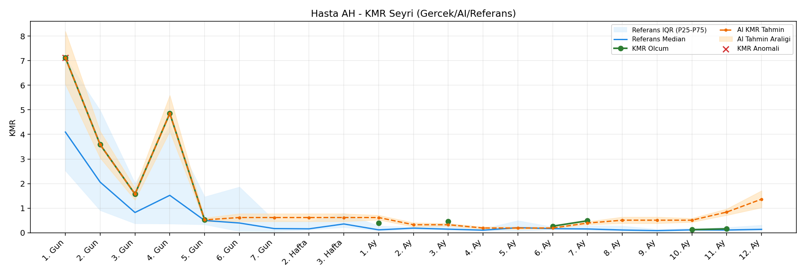
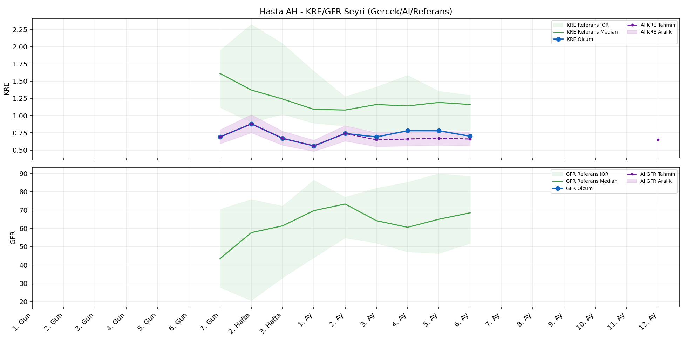
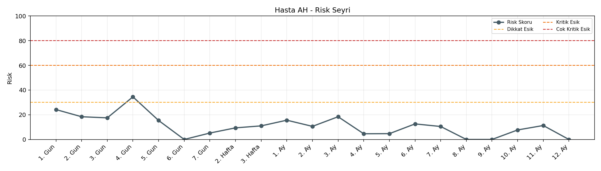

# Hasta AH

[Ana rapora don](../../Hasta_Raporları_Detay.md)

## Hasta Ozeti

| Alan | Deger |
|---|---|
| Yas | 12 |
| Cinsiyet | MALE |
| BMI | 25.5 |
| Vital Status | LIVING |
| Risk Skoru (Son) | 33.8 |
| Risk Seviyesi | Dikkat |
| Anomali Durumu | Var |
| Son KMR | 0.4879 (7. Ay) |
| Son KRE | 0.70 (6. Ay) |
| Son GFR | - (-) |

## Grafikler

## IQR ve Median Ozeti

| Metrik | Hasta (Median / IQR) | Referans (Median / IQR) | Son Olcum Zamani |
|---|---|---|---|
| KMR | 0.523 / 3.116 | 0.143 / 0.157 | 7. Ay |
| KRE | 0.700 / 0.090 | 1.170 / 0.770 | 6. Ay |
| GFR | - / - | - / - | - |

## AI Performans (Hasta Bazli)

| Metrik | Eval Nokta | MAE | RMSE | MAPE | Aralik Kapsama | Son Hata |
|---|---:|---:|---:|---:|---:|---:|
| KMR | 4 | 0.2499 | 0.2683 | %61.94 | %0.0 | 0.2112 |
| KRE | 4 | 0.050 | 0.061 | %6.53 | %100.0 | -0.010 |
| GFR | 0 | - | - | - | %0.0 | - |

## Zaman Serisi Detay Tablosu

| Zaman | KMR | AI KMR | Durum | KRE | AI KRE | Durum | GFR | AI GFR | Durum | Risk | Seviye | Anomali |
|---|---:|---:|---|---:|---:|---|---:|---:|---|---:|---|---|
| 1. Gun | 7.1234 | 7.1234 | Olcum Kopyasi | - | - | Uygulanmaz | - | - | Uygulanmaz | 23.4 | Normal | KMR |
| 2. Gun | 3.5853 | 3.5853 | Olcum Kopyasi | - | - | Uygulanmaz | - | - | Uygulanmaz | 17.8 | Normal | - |
| 3. Gun | 1.5725 | 1.5725 | Olcum Kopyasi | - | - | Uygulanmaz | - | - | Uygulanmaz | 17.9 | Normal | - |
| 4. Gun | 4.8553 | 4.8553 | Olcum Kopyasi | - | - | Uygulanmaz | - | - | Uygulanmaz | 33.8 | Dikkat | - |
| 5. Gun | 0.5231 | 0.5231 | Olcum Kopyasi | - | - | Uygulanmaz | - | - | Uygulanmaz | 15.8 | Normal | - |
| 6. Gun | - | 0.5870 | Ongoru | - | - | Uygulanmaz | - | - | Uygulanmaz | 0.0 | Normal | - |
| 7. Gun | - | 0.5870 | Ongoru | 0.69 | 0.69 | Olcum Kopyasi | - | - | Yetersiz Veri | 5.2 | Normal | - |
| 2. Hafta | - | 0.5870 | Ongoru | 0.88 | 0.88 | Olcum Kopyasi | - | - | Yetersiz Veri | 9.4 | Normal | - |
| 3. Hafta | - | 0.5870 | Ongoru | 0.67 | 0.67 | Olcum Kopyasi | - | - | Yetersiz Veri | 11.0 | Normal | - |
| 1. Ay | 0.4021 | 0.5870 | Model | 0.56 | 0.56 | Olcum Kopyasi | - | - | Yetersiz Veri | 15.8 | Normal | - |
| 2. Ay | - | 0.0512 | Ongoru | 0.74 | 0.74 | Olcum Kopyasi | - | - | Yetersiz Veri | 10.6 | Normal | - |
| 3. Ay | 0.4693 | 0.0512 | Model | 0.69 | 0.67 | Model | - | - | Yetersiz Veri | 19.2 | Normal | - |
| 4. Ay | - | 0.4520 | Ongoru | 0.78 | 0.69 | Model | - | - | Yetersiz Veri | 4.6 | Normal | - |
| 5. Ay | - | 0.4520 | Ongoru | 0.78 | 0.70 | Model | - | - | Yetersiz Veri | 4.7 | Normal | - |
| 6. Ay | 0.2668 | 0.4520 | Model | 0.70 | 0.69 | Model | - | - | Yetersiz Veri | 13.1 | Normal | - |
| 7. Ay | 0.4879 | 0.6991 | Model | - | - | Uygulanmaz | - | - | Uygulanmaz | 11.0 | Normal | - |
| 8. Ay | - | 0.9513 | Ongoru | - | - | Uygulanmaz | - | - | Uygulanmaz | 0.0 | Normal | - |
| 9. Ay | - | 0.9513 | Ongoru | - | - | Uygulanmaz | - | - | Uygulanmaz | 0.0 | Normal | - |
| 10. Ay | - | 0.9513 | Ongoru | - | - | Uygulanmaz | - | - | Uygulanmaz | 0.0 | Normal | - |
| 11. Ay | - | 0.9513 | Ongoru | - | - | Uygulanmaz | - | - | Uygulanmaz | 0.0 | Normal | - |
| 12. Ay | - | 0.9513 | Ongoru | - | 0.65 | Model | - | - | Yetersiz Veri | 0.0 | Normal | - |

> Not: Bu dosya `python3 backend/run_all.py` ile otomatik uretilir.
