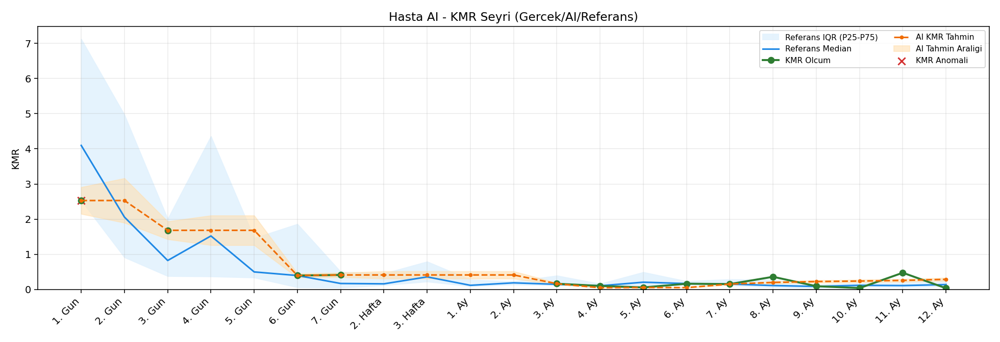
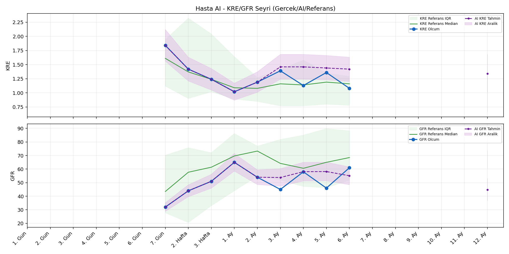
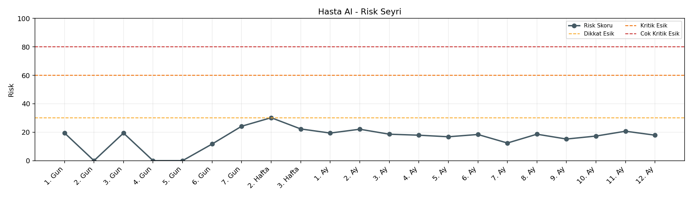

# Hasta AI

[Ana rapora don](../../Hasta_Raporları_Detay.md)

## Hasta Ozeti

| Alan | Deger |
|---|---|
| Yas | 47 |
| Cinsiyet | FEMALE |
| BMI | 24.7 |
| Vital Status | LIVING |
| Risk Skoru (Son) | 30.2 |
| Risk Seviyesi | Dikkat |
| Anomali Durumu | Yok |
| Son KMR | 0.3594 (8. Ay) |
| Son KRE | 1.08 (6. Ay) |
| Son GFR | 61.0 (6. Ay) |

## Grafikler

## IQR ve Median Ozeti

| Metrik | Hasta (Median / IQR) | Referans (Median / IQR) | Son Olcum Zamani |
|---|---|---|---|
| KMR | 0.261 / 0.252 | 0.120 / 0.104 | 8. Ay |
| KRE | 1.240 / 0.260 | 1.170 / 0.770 | 6. Ay |
| GFR | 51.000 / 13.000 | 59.800 / 29.600 | 6. Ay |

## AI Performans (Hasta Bazli)

| Metrik | Eval Nokta | MAE | RMSE | MAPE | Aralik Kapsama | Son Hata |
|---|---:|---:|---:|---:|---:|---:|
| KMR | 5 | 0.0918 | 0.1192 | %113.04 | %40.0 | -0.0036 |
| KRE | 4 | 0.360 | 0.381 | %30.50 | %25.0 | 0.480 |
| GFR | 4 | 26.45 | 28.29 | %53.73 | %0.0 | 10.90 |

## Zaman Serisi Detay Tablosu

| Zaman | KMR | AI KMR | Durum | KRE | AI KRE | Durum | GFR | AI GFR | Durum | Risk | Seviye | Anomali |
|---|---:|---:|---|---:|---:|---|---:|---:|---|---:|---|---|
| 1. Gun | 2.5296 | 2.5296 | Olcum Kopyasi | - | - | Uygulanmaz | - | - | Uygulanmaz | 18.0 | Normal | - |
| 2. Gun | - | 2.5296 | Ongoru | - | - | Uygulanmaz | - | - | Uygulanmaz | 0.0 | Normal | - |
| 3. Gun | 1.6818 | 1.6818 | Olcum Kopyasi | - | - | Uygulanmaz | - | - | Uygulanmaz | 18.4 | Normal | - |
| 4. Gun | - | 1.6818 | Ongoru | - | - | Uygulanmaz | - | - | Uygulanmaz | 0.0 | Normal | - |
| 5. Gun | - | 1.6818 | Ongoru | - | - | Uygulanmaz | - | - | Uygulanmaz | 0.0 | Normal | - |
| 6. Gun | 0.3956 | 0.3956 | Olcum Kopyasi | - | - | Uygulanmaz | - | - | Uygulanmaz | 12.1 | Normal | - |
| 7. Gun | 0.4121 | 0.4121 | Olcum Kopyasi | 1.84 | 1.84 | Olcum Kopyasi | 32.0 | 32.0 | Olcum Kopyasi | 24.6 | Normal | - |
| 2. Hafta | - | 0.4121 | Ongoru | 1.42 | 1.42 | Olcum Kopyasi | 44.0 | 44.0 | Olcum Kopyasi | 30.2 | Dikkat | - |
| 3. Hafta | - | 0.4121 | Ongoru | 1.24 | 1.24 | Olcum Kopyasi | 51.0 | 51.0 | Olcum Kopyasi | 22.3 | Normal | - |
| 1. Ay | - | 0.4121 | Ongoru | 1.02 | 1.02 | Olcum Kopyasi | 65.0 | 65.0 | Olcum Kopyasi | 19.4 | Normal | - |
| 2. Ay | - | 0.4121 | Ongoru | 1.19 | 1.19 | Olcum Kopyasi | 54.0 | 54.0 | Olcum Kopyasi | 22.1 | Normal | - |
| 3. Ay | 0.1625 | 0.1625 | Olcum Kopyasi | 1.39 | 1.61 | Model | 45.0 | 81.5 | Model | 18.9 | Normal | - |
| 4. Ay | 0.1002 | 0.2504 | Model | 1.13 | 1.62 | Model | 58.0 | 82.5 | Model | 18.6 | Normal | - |
| 5. Ay | 0.0569 | 0.2520 | Model | 1.36 | 1.61 | Model | 46.0 | 79.9 | Model | 18.2 | Normal | - |
| 6. Ay | 0.1616 | 0.1532 | Model | 1.08 | 1.56 | Model | 61.0 | 71.9 | Model | 17.9 | Normal | - |
| 7. Ay | 0.1536 | 0.2553 | Model | - | - | Uygulanmaz | - | - | Uygulanmaz | 13.3 | Normal | - |
| 8. Ay | 0.3594 | 0.3558 | Model | - | - | Uygulanmaz | - | - | Uygulanmaz | 17.7 | Normal | - |
| 9. Ay | - | 0.3814 | Ongoru | - | - | Uygulanmaz | - | - | Uygulanmaz | 0.0 | Normal | - |
| 10. Ay | - | 0.3814 | Ongoru | - | - | Uygulanmaz | - | - | Uygulanmaz | 0.0 | Normal | - |
| 11. Ay | - | 0.3814 | Ongoru | - | - | Uygulanmaz | - | - | Uygulanmaz | 0.0 | Normal | - |
| 12. Ay | - | 0.3814 | Ongoru | - | 1.37 | Ongoru | - | 40.0 | Ongoru | 0.0 | Normal | - |

> Not: Bu dosya `python3 backend/run_all.py` ile otomatik uretilir.
