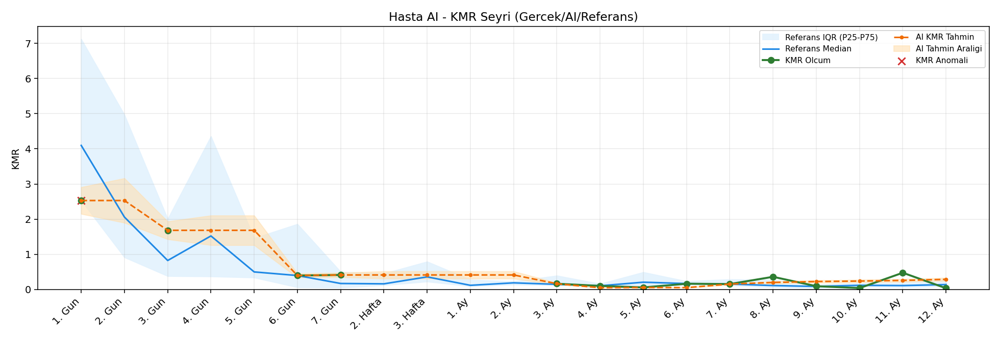
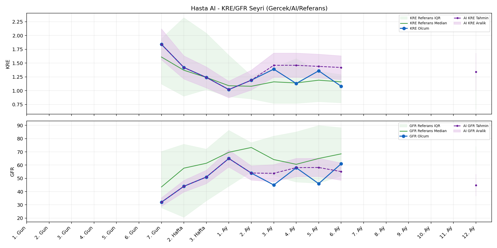
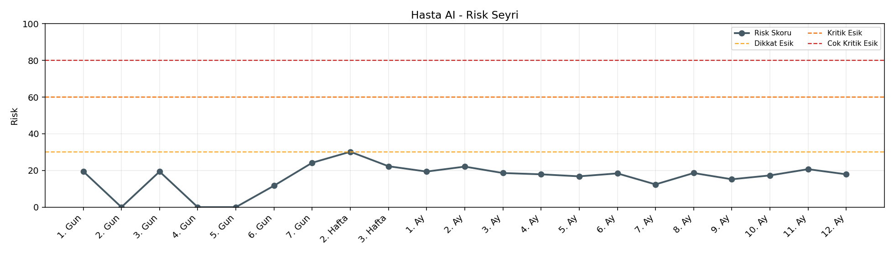

# Hasta AI

[Ana rapora don](../../Hasta_Raporları_Detay.md)

## Hasta Ozeti

| Alan | Deger |
|---|---|
| Yas | 47 |
| Cinsiyet | FEMALE |
| BMI | 24.7 |
| Vital Status | LIVING |
| Risk Skoru (Son) | 30.2 |
| Risk Seviyesi | Dikkat |
| Anomali Durumu | Var |
| Son KMR | 0.0343 (12. Ay) |
| Son KRE | 1.08 (6. Ay) |
| Son GFR | 61.0 (6. Ay) |

## Grafikler

## IQR ve Median Ozeti

| Metrik | Hasta (Median / IQR) | Referans (Median / IQR) | Son Olcum Zamani |
|---|---|---|---|
| KMR | 0.162 / 0.314 | 0.138 / 0.217 | 12. Ay |
| KRE | 1.240 / 0.260 | 1.160 / 0.510 | 6. Ay |
| GFR | 51.000 / 13.000 | 68.500 / 36.400 | 6. Ay |

## AI Performans (Hasta Bazli)

| Metrik | Eval Nokta | MAE | RMSE | MAPE | Aralik Kapsama | Son Hata |
|---|---:|---:|---:|---:|---:|---:|
| KMR | 9 | 0.1251 | 0.1524 | %140.09 | %22.2 | 0.2527 |
| KRE | 4 | 0.205 | 0.243 | %17.90 | %50.0 | 0.340 |
| GFR | 4 | 6.75 | 8.08 | %13.98 | %50.0 | -5.90 |

## Zaman Serisi Detay Tablosu

| Zaman | KMR | AI KMR | Durum | KRE | AI KRE | Durum | GFR | AI GFR | Durum | Risk | Seviye | Anomali |
|---|---:|---:|---|---:|---:|---|---:|---:|---|---:|---|---|
| 1. Gun | 2.5296 | 2.5296 | Olcum Kopyasi | - | - | Uygulanmaz | - | - | Uygulanmaz | 19.5 | Normal | KMR |
| 2. Gun | - | 2.5296 | Ongoru | - | - | Uygulanmaz | - | - | Uygulanmaz | 0.0 | Normal | - |
| 3. Gun | 1.6818 | 1.6818 | Olcum Kopyasi | - | - | Uygulanmaz | - | - | Uygulanmaz | 19.4 | Normal | - |
| 4. Gun | - | 1.6818 | Ongoru | - | - | Uygulanmaz | - | - | Uygulanmaz | 0.0 | Normal | - |
| 5. Gun | - | 1.6818 | Ongoru | - | - | Uygulanmaz | - | - | Uygulanmaz | 0.0 | Normal | - |
| 6. Gun | 0.3956 | 0.3956 | Olcum Kopyasi | - | - | Uygulanmaz | - | - | Uygulanmaz | 11.7 | Normal | - |
| 7. Gun | 0.4121 | 0.4121 | Olcum Kopyasi | 1.84 | 1.84 | Olcum Kopyasi | 32.0 | 32.0 | Olcum Kopyasi | 24.2 | Normal | - |
| 2. Hafta | - | 0.4121 | Ongoru | 1.42 | 1.42 | Olcum Kopyasi | 44.0 | 44.0 | Olcum Kopyasi | 30.2 | Dikkat | - |
| 3. Hafta | - | 0.4121 | Ongoru | 1.24 | 1.24 | Olcum Kopyasi | 51.0 | 51.0 | Olcum Kopyasi | 22.3 | Normal | - |
| 1. Ay | - | 0.4121 | Ongoru | 1.02 | 1.02 | Olcum Kopyasi | 65.0 | 65.0 | Olcum Kopyasi | 19.4 | Normal | - |
| 2. Ay | - | 0.4121 | Ongoru | 1.19 | 1.19 | Olcum Kopyasi | 54.0 | 54.0 | Olcum Kopyasi | 22.1 | Normal | - |
| 3. Ay | 0.1625 | 0.1625 | Olcum Kopyasi | 1.39 | 1.46 | Model | 45.0 | 53.8 | Model | 18.6 | Normal | - |
| 4. Ay | 0.1002 | 0.0487 | Model | 1.13 | 1.46 | Model | 58.0 | 58.1 | Model | 17.9 | Normal | - |
| 5. Ay | 0.0569 | 0.0558 | Model | 1.36 | 1.44 | Model | 46.0 | 58.2 | Model | 16.8 | Normal | - |
| 6. Ay | 0.1616 | 0.0517 | Model | 1.08 | 1.42 | Model | 61.0 | 55.1 | Model | 18.4 | Normal | - |
| 7. Ay | 0.1536 | 0.1526 | Model | - | - | Uygulanmaz | - | - | Uygulanmaz | 12.4 | Normal | - |
| 8. Ay | 0.3594 | 0.1989 | Model | - | - | Uygulanmaz | - | - | Uygulanmaz | 18.6 | Normal | - |
| 9. Ay | 0.0920 | 0.2252 | Model | - | - | Uygulanmaz | - | - | Uygulanmaz | 15.2 | Normal | - |
| 10. Ay | 0.0393 | 0.2384 | Model | - | - | Uygulanmaz | - | - | Uygulanmaz | 17.3 | Normal | - |
| 11. Ay | 0.4746 | 0.2573 | Model | - | - | Uygulanmaz | - | - | Uygulanmaz | 20.7 | Normal | - |
| 12. Ay | 0.0343 | 0.2870 | Model | - | 1.34 | Ongoru | - | 44.8 | Ongoru | 17.9 | Normal | - |

> Not: Bu dosya `python3 backend/run_all.py` ile otomatik uretilir.
