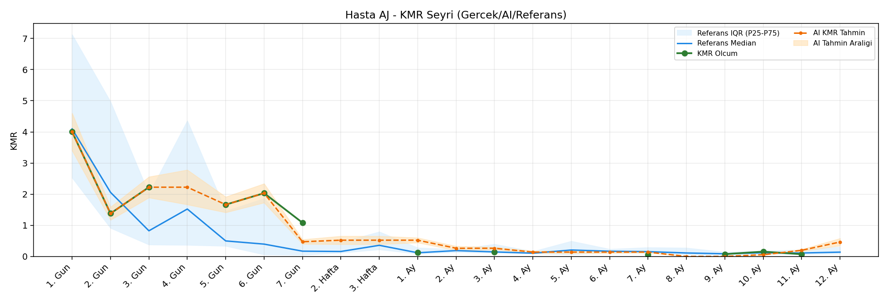
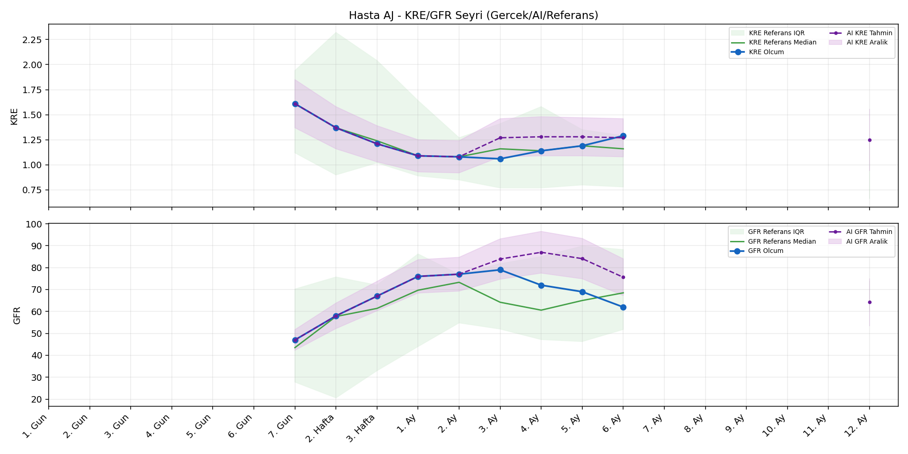
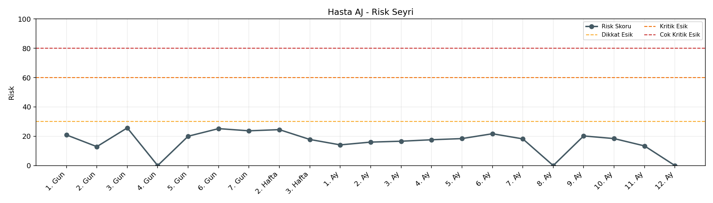

# Hasta AJ

[Ana rapora don](../../Hasta_Raporları_Detay.md)

## Hasta Ozeti

| Alan | Deger |
|---|---|
| Yas | 54 |
| Cinsiyet | MALE |
| BMI | 24.0 |
| Vital Status | LIVING |
| Risk Skoru (Son) | 24.9 |
| Risk Seviyesi | Normal |
| Anomali Durumu | Yok |
| Son KMR | 0.0586 (7. Ay) |
| Son KRE | 1.29 (6. Ay) |
| Son GFR | 62.0 (6. Ay) |

## Grafikler

## IQR ve Median Ozeti

| Metrik | Hasta (Median / IQR) | Referans (Median / IQR) | Son Olcum Zamani |
|---|---|---|---|
| KMR | 1.380 / 1.889 | 0.143 / 0.157 | 7. Ay |
| KRE | 1.190 / 0.200 | 1.170 / 0.770 | 6. Ay |
| GFR | 69.000 / 14.000 | 59.800 / 29.600 | 6. Ay |

## AI Performans (Hasta Bazli)

| Metrik | Eval Nokta | MAE | RMSE | MAPE | Aralik Kapsama | Son Hata |
|---|---:|---:|---:|---:|---:|---:|
| KMR | 4 | 0.4069 | 0.4316 | %416.89 | %0.0 | 0.5875 |
| KRE | 4 | 0.252 | 0.267 | %22.22 | %25.0 | 0.120 |
| GFR | 4 | 25.45 | 26.29 | %37.14 | %0.0 | 32.30 |

## Zaman Serisi Detay Tablosu

| Zaman | KMR | AI KMR | Durum | KRE | AI KRE | Durum | GFR | AI GFR | Durum | Risk | Seviye | Anomali |
|---|---:|---:|---|---:|---:|---|---:|---:|---|---:|---|---|
| 1. Gun | 4.0013 | 4.0013 | Olcum Kopyasi | - | - | Uygulanmaz | - | - | Uygulanmaz | 19.9 | Normal | - |
| 2. Gun | 1.3799 | 1.3799 | Olcum Kopyasi | - | - | Uygulanmaz | - | - | Uygulanmaz | 12.2 | Normal | - |
| 3. Gun | 2.2237 | 2.2237 | Olcum Kopyasi | - | - | Uygulanmaz | - | - | Uygulanmaz | 24.9 | Normal | - |
| 4. Gun | - | 2.2237 | Ongoru | - | - | Uygulanmaz | - | - | Uygulanmaz | 0.0 | Normal | - |
| 5. Gun | 1.6633 | 1.6633 | Olcum Kopyasi | - | - | Uygulanmaz | - | - | Uygulanmaz | 19.2 | Normal | - |
| 6. Gun | 2.0325 | 2.0325 | Olcum Kopyasi | - | - | Uygulanmaz | - | - | Uygulanmaz | 24.4 | Normal | - |
| 7. Gun | 1.0821 | 0.8711 | Model | 1.61 | 1.61 | Olcum Kopyasi | 47.0 | 47.0 | Olcum Kopyasi | 23.3 | Normal | - |
| 2. Hafta | - | 0.6109 | Ongoru | 1.37 | 1.37 | Olcum Kopyasi | 58.0 | 58.0 | Olcum Kopyasi | 24.5 | Normal | - |
| 3. Hafta | - | 0.6109 | Ongoru | 1.21 | 1.21 | Olcum Kopyasi | 67.0 | 67.0 | Olcum Kopyasi | 17.8 | Normal | - |
| 1. Ay | 0.1200 | 0.6109 | Model | 1.09 | 1.09 | Olcum Kopyasi | 76.0 | 76.0 | Olcum Kopyasi | 14.9 | Normal | - |
| 2. Ay | - | 0.4814 | Ongoru | 1.08 | 1.08 | Olcum Kopyasi | 77.0 | 77.0 | Olcum Kopyasi | 16.0 | Normal | - |
| 3. Ay | 0.1431 | 0.4814 | Model | 1.06 | 1.42 | Model | 79.0 | 93.7 | Model | 17.8 | Normal | - |
| 4. Ay | - | 0.6461 | Ongoru | 1.14 | 1.43 | Model | 72.0 | 98.2 | Model | 17.6 | Normal | - |
| 5. Ay | - | 0.6461 | Ongoru | 1.19 | 1.43 | Model | 69.0 | 97.6 | Model | 18.4 | Normal | - |
| 6. Ay | - | 0.6461 | Ongoru | 1.29 | 1.41 | Model | 62.0 | 94.3 | Model | 21.7 | Normal | - |
| 7. Ay | 0.0586 | 0.6461 | Model | - | - | Uygulanmaz | - | - | Uygulanmaz | 20.4 | Normal | - |
| 8. Ay | - | 0.7433 | Ongoru | - | - | Uygulanmaz | - | - | Uygulanmaz | 0.0 | Normal | - |
| 9. Ay | - | 0.7433 | Ongoru | - | - | Uygulanmaz | - | - | Uygulanmaz | 0.0 | Normal | - |
| 10. Ay | - | 0.7433 | Ongoru | - | - | Uygulanmaz | - | - | Uygulanmaz | 0.0 | Normal | - |
| 11. Ay | - | 0.7433 | Ongoru | - | - | Uygulanmaz | - | - | Uygulanmaz | 0.0 | Normal | - |
| 12. Ay | - | 0.7433 | Ongoru | - | 1.31 | Ongoru | - | 78.5 | Ongoru | 0.0 | Normal | - |

> Not: Bu dosya `python3 backend/run_all.py` ile otomatik uretilir.
