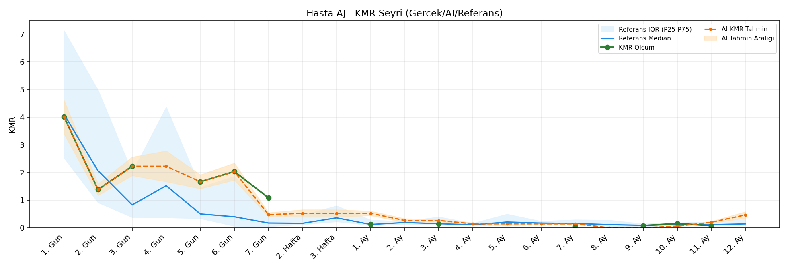
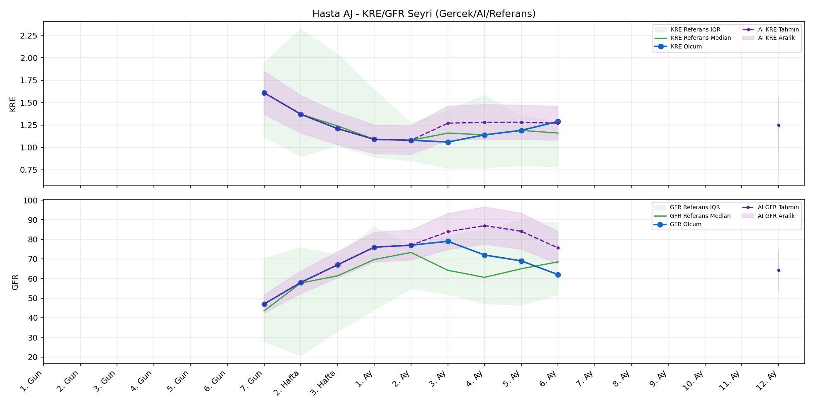
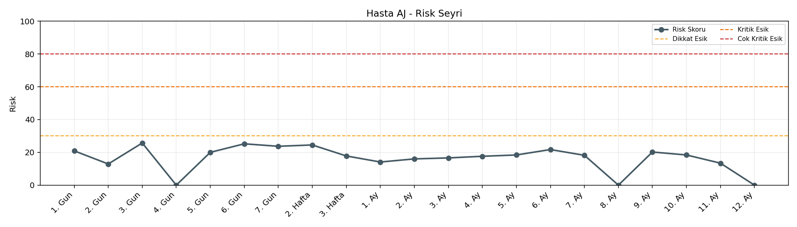

# Hasta AJ

[Ana rapora don](../../Hasta_Raporları_Detay.md)

## Hasta Ozeti

| Alan | Deger |
|---|---|
| Yas | 54 |
| Cinsiyet | MALE |
| BMI | 24.0 |
| Vital Status | LIVING |
| Risk Skoru (Son) | 25.7 |
| Risk Seviyesi | Normal |
| Anomali Durumu | Yok |
| Son KMR | 0.0721 (11. Ay) |
| Son KRE | 1.29 (6. Ay) |
| Son GFR | 62.0 (6. Ay) |

## Grafikler

## IQR ve Median Ozeti

| Metrik | Hasta (Median / IQR) | Referans (Median / IQR) | Son Olcum Zamani |
|---|---|---|---|
| KMR | 0.618 / 1.647 | 0.110 / 0.139 | 11. Ay |
| KRE | 1.190 / 0.200 | 1.160 / 0.510 | 6. Ay |
| GFR | 69.000 / 14.000 | 68.500 / 36.400 | 6. Ay |

## AI Performans (Hasta Bazli)

| Metrik | Eval Nokta | MAE | RMSE | MAPE | Aralik Kapsama | Son Hata |
|---|---:|---:|---:|---:|---:|---:|
| KMR | 7 | 0.2157 | 0.2890 | %135.73 | %0.0 | 0.1252 |
| KRE | 4 | 0.115 | 0.134 | %10.30 | %75.0 | -0.020 |
| GFR | 4 | 12.15 | 12.86 | %17.71 | %25.0 | 13.60 |

## Zaman Serisi Detay Tablosu

| Zaman | KMR | AI KMR | Durum | KRE | AI KRE | Durum | GFR | AI GFR | Durum | Risk | Seviye | Anomali |
|---|---:|---:|---|---:|---:|---|---:|---:|---|---:|---|---|
| 1. Gun | 4.0013 | 4.0013 | Olcum Kopyasi | - | - | Uygulanmaz | - | - | Uygulanmaz | 20.9 | Normal | - |
| 2. Gun | 1.3799 | 1.3799 | Olcum Kopyasi | - | - | Uygulanmaz | - | - | Uygulanmaz | 12.9 | Normal | - |
| 3. Gun | 2.2237 | 2.2237 | Olcum Kopyasi | - | - | Uygulanmaz | - | - | Uygulanmaz | 25.7 | Normal | - |
| 4. Gun | - | 2.2237 | Ongoru | - | - | Uygulanmaz | - | - | Uygulanmaz | 0.0 | Normal | - |
| 5. Gun | 1.6633 | 1.6633 | Olcum Kopyasi | - | - | Uygulanmaz | - | - | Uygulanmaz | 20.0 | Normal | - |
| 6. Gun | 2.0325 | 2.0325 | Olcum Kopyasi | - | - | Uygulanmaz | - | - | Uygulanmaz | 25.2 | Normal | - |
| 7. Gun | 1.0821 | 0.4722 | Model | 1.61 | 1.61 | Olcum Kopyasi | 47.0 | 47.0 | Olcum Kopyasi | 23.7 | Normal | - |
| 2. Hafta | - | 0.5214 | Ongoru | 1.37 | 1.37 | Olcum Kopyasi | 58.0 | 58.0 | Olcum Kopyasi | 24.5 | Normal | - |
| 3. Hafta | - | 0.5214 | Ongoru | 1.21 | 1.21 | Olcum Kopyasi | 67.0 | 67.0 | Olcum Kopyasi | 17.8 | Normal | - |
| 1. Ay | 0.1200 | 0.5214 | Model | 1.09 | 1.09 | Olcum Kopyasi | 76.0 | 76.0 | Olcum Kopyasi | 14.1 | Normal | - |
| 2. Ay | - | 0.2627 | Ongoru | 1.08 | 1.08 | Olcum Kopyasi | 77.0 | 77.0 | Olcum Kopyasi | 16.0 | Normal | - |
| 3. Ay | 0.1431 | 0.2627 | Model | 1.06 | 1.27 | Model | 79.0 | 83.9 | Model | 16.6 | Normal | - |
| 4. Ay | - | 0.1397 | Ongoru | 1.14 | 1.28 | Model | 72.0 | 87.0 | Model | 17.6 | Normal | - |
| 5. Ay | - | 0.1397 | Ongoru | 1.19 | 1.28 | Model | 69.0 | 84.1 | Model | 18.4 | Normal | - |
| 6. Ay | - | 0.1397 | Ongoru | 1.29 | 1.27 | Model | 62.0 | 75.6 | Model | 21.7 | Normal | - |
| 7. Ay | 0.0586 | 0.1397 | Model | - | - | Uygulanmaz | - | - | Uygulanmaz | 18.2 | Normal | - |
| 8. Ay | - | 0.0000 | Ongoru | - | - | Uygulanmaz | - | - | Uygulanmaz | 0.0 | Normal | - |
| 9. Ay | 0.0745 | 0.0000 | Model | - | - | Uygulanmaz | - | - | Uygulanmaz | 20.2 | Normal | - |
| 10. Ay | 0.1539 | 0.0560 | Model | - | - | Uygulanmaz | - | - | Uygulanmaz | 18.4 | Normal | - |
| 11. Ay | 0.0721 | 0.1973 | Model | - | - | Uygulanmaz | - | - | Uygulanmaz | 13.4 | Normal | - |
| 12. Ay | - | 0.4637 | Ongoru | - | 1.25 | Ongoru | - | 64.3 | Ongoru | 0.0 | Normal | - |

> Not: Bu dosya `python3 backend/run_all.py` ile otomatik uretilir.
