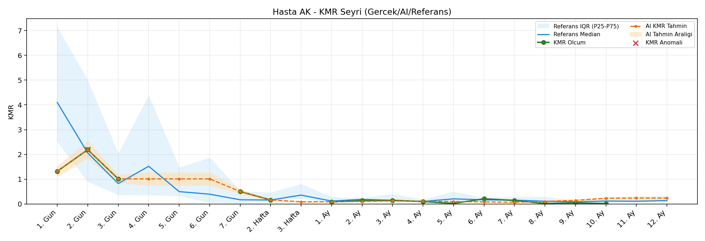
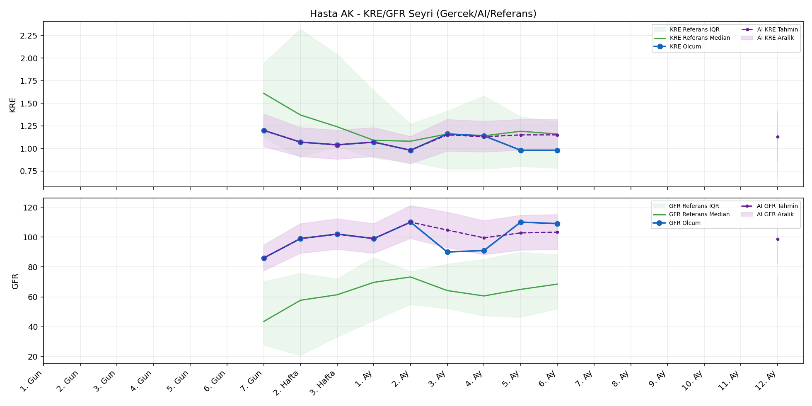
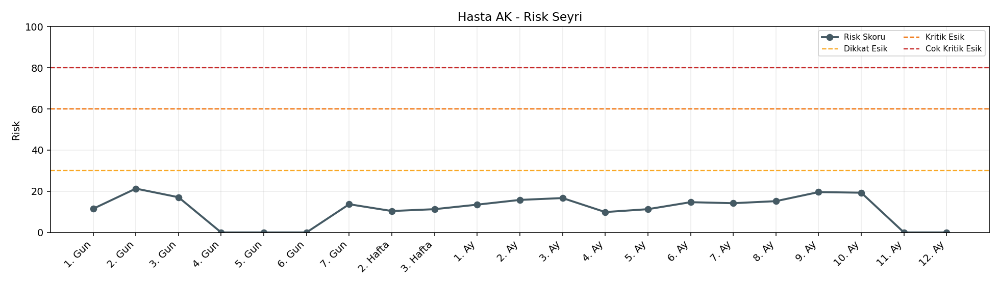

# Hasta AK

[Ana rapora don](../../Hasta_Raporları_Detay.md)

## Hasta Ozeti

| Alan | Deger |
|---|---|
| Yas | 20 |
| Cinsiyet | MALE |
| BMI | 15.8 |
| Vital Status | LIVING |
| Risk Skoru (Son) | 20.4 |
| Risk Seviyesi | Normal |
| Anomali Durumu | Var |
| Son KMR | 0.1420 (7. Ay) |
| Son KRE | 0.98 (6. Ay) |
| Son GFR | 109.0 (6. Ay) |

## Grafikler

## IQR ve Median Ozeti

| Metrik | Hasta (Median / IQR) | Referans (Median / IQR) | Son Olcum Zamani |
|---|---|---|---|
| KMR | 0.155 / 0.505 | 0.143 / 0.157 | 7. Ay |
| KRE | 1.070 / 0.160 | 1.170 / 0.770 | 6. Ay |
| GFR | 99.000 / 18.000 | 59.800 / 29.600 | 6. Ay |

## AI Performans (Hasta Bazli)

| Metrik | Eval Nokta | MAE | RMSE | MAPE | Aralik Kapsama | Son Hata |
|---|---:|---:|---:|---:|---:|---:|
| KMR | 7 | 0.0496 | 0.0534 | %52.20 | %14.3 | 0.0752 |
| KRE | 4 | 0.087 | 0.117 | %8.85 | %100.0 | 0.160 |
| GFR | 4 | 9.38 | 9.38 | %9.46 | %100.0 | -9.40 |

## Zaman Serisi Detay Tablosu

| Zaman | KMR | AI KMR | Durum | KRE | AI KRE | Durum | GFR | AI GFR | Durum | Risk | Seviye | Anomali |
|---|---:|---:|---|---:|---:|---|---:|---:|---|---:|---|---|
| 1. Gun | 1.3199 | 1.3199 | Olcum Kopyasi | - | - | Uygulanmaz | - | - | Uygulanmaz | 10.8 | Normal | - |
| 2. Gun | 2.1905 | 2.1905 | Olcum Kopyasi | - | - | Uygulanmaz | - | - | Uygulanmaz | 20.4 | Normal | KMR |
| 3. Gun | 1.0135 | 1.0135 | Olcum Kopyasi | - | - | Uygulanmaz | - | - | Uygulanmaz | 16.5 | Normal | - |
| 4. Gun | - | 1.0135 | Ongoru | - | - | Uygulanmaz | - | - | Uygulanmaz | 0.0 | Normal | - |
| 5. Gun | - | 1.0135 | Ongoru | - | - | Uygulanmaz | - | - | Uygulanmaz | 0.0 | Normal | - |
| 6. Gun | - | 1.0135 | Ongoru | - | - | Uygulanmaz | - | - | Uygulanmaz | 0.0 | Normal | - |
| 7. Gun | 0.5019 | 0.5019 | Olcum Kopyasi | 1.20 | 1.20 | Olcum Kopyasi | 86.0 | 86.0 | Olcum Kopyasi | 13.4 | Normal | - |
| 2. Hafta | 0.1622 | 0.1622 | Olcum Kopyasi | 1.07 | 1.07 | Olcum Kopyasi | 99.0 | 99.0 | Olcum Kopyasi | 10.6 | Normal | - |
| 3. Hafta | - | 0.1272 | Ongoru | 1.04 | 1.04 | Olcum Kopyasi | 102.0 | 102.0 | Olcum Kopyasi | 11.3 | Normal | - |
| 1. Ay | 0.0832 | 0.1272 | Model | 1.07 | 1.07 | Olcum Kopyasi | 99.0 | 99.0 | Olcum Kopyasi | 13.9 | Normal | - |
| 2. Ay | 0.1338 | 0.1213 | Model | 0.98 | 0.98 | Olcum Kopyasi | 110.0 | 110.0 | Olcum Kopyasi | 15.9 | Normal | - |
| 3. Ay | 0.1472 | 0.1069 | Model | 1.16 | 1.15 | Model | 90.0 | 99.5 | Model | 17.1 | Normal | - |
| 4. Ay | 0.0959 | 0.0476 | Model | 1.14 | 1.15 | Model | 91.0 | 100.3 | Model | 10.4 | Normal | - |
| 5. Ay | 0.0209 | 0.0942 | Model | 0.98 | 1.15 | Model | 110.0 | 100.7 | Model | 11.4 | Normal | - |
| 6. Ay | 0.2080 | 0.1542 | Model | 0.98 | 1.14 | Model | 109.0 | 99.6 | Model | 14.3 | Normal | - |
| 7. Ay | 0.1420 | 0.2172 | Model | - | - | Uygulanmaz | - | - | Uygulanmaz | 14.4 | Normal | - |
| 8. Ay | - | 0.1998 | Ongoru | - | - | Uygulanmaz | - | - | Uygulanmaz | 0.0 | Normal | - |
| 9. Ay | - | 0.1998 | Ongoru | - | - | Uygulanmaz | - | - | Uygulanmaz | 0.0 | Normal | - |
| 10. Ay | - | 0.1998 | Ongoru | - | - | Uygulanmaz | - | - | Uygulanmaz | 0.0 | Normal | - |
| 11. Ay | - | 0.1998 | Ongoru | - | - | Uygulanmaz | - | - | Uygulanmaz | 0.0 | Normal | - |
| 12. Ay | - | 0.1998 | Ongoru | - | 1.13 | Ongoru | - | 97.3 | Ongoru | 0.0 | Normal | - |

> Not: Bu dosya `python3 backend/run_all.py` ile otomatik uretilir.
