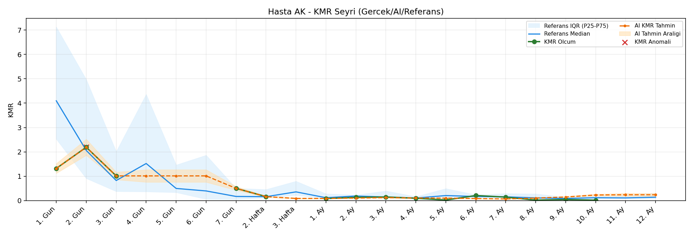
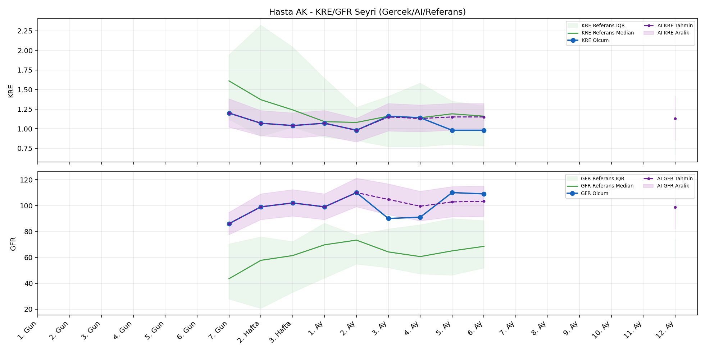
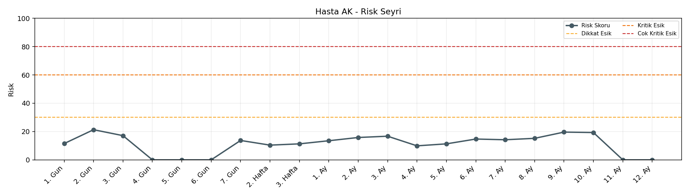

# Hasta AK

[Ana rapora don](../../Hasta_Raporları_Detay.md)

## Hasta Ozeti

| Alan | Deger |
|---|---|
| Yas | 20 |
| Cinsiyet | MALE |
| BMI | 15.8 |
| Vital Status | LIVING |
| Risk Skoru (Son) | 21.3 |
| Risk Seviyesi | Normal |
| Anomali Durumu | Var |
| Son KMR | 0.0160 (10. Ay) |
| Son KRE | 0.98 (6. Ay) |
| Son GFR | 109.0 (6. Ay) |

## Grafikler

## IQR ve Median Ozeti

| Metrik | Hasta (Median / IQR) | Referans (Median / IQR) | Son Olcum Zamani |
|---|---|---|---|
| KMR | 0.142 / 0.292 | 0.117 / 0.093 | 10. Ay |
| KRE | 1.070 / 0.160 | 1.160 / 0.510 | 6. Ay |
| GFR | 99.000 / 18.000 | 68.500 / 36.400 | 6. Ay |

## AI Performans (Hasta Bazli)

| Metrik | Eval Nokta | MAE | RMSE | MAPE | Aralik Kapsama | Son Hata |
|---|---:|---:|---:|---:|---:|---:|
| KMR | 10 | 0.0751 | 0.0962 | %113.09 | %20.0 | 0.2132 |
| KRE | 4 | 0.090 | 0.120 | %9.11 | %100.0 | 0.170 |
| GFR | 4 | 9.03 | 9.65 | %9.36 | %75.0 | -5.70 |

## Zaman Serisi Detay Tablosu

| Zaman | KMR | AI KMR | Durum | KRE | AI KRE | Durum | GFR | AI GFR | Durum | Risk | Seviye | Anomali |
|---|---:|---:|---|---:|---:|---|---:|---:|---|---:|---|---|
| 1. Gun | 1.3199 | 1.3199 | Olcum Kopyasi | - | - | Uygulanmaz | - | - | Uygulanmaz | 11.5 | Normal | - |
| 2. Gun | 2.1905 | 2.1905 | Olcum Kopyasi | - | - | Uygulanmaz | - | - | Uygulanmaz | 21.3 | Normal | KMR |
| 3. Gun | 1.0135 | 1.0135 | Olcum Kopyasi | - | - | Uygulanmaz | - | - | Uygulanmaz | 17.1 | Normal | - |
| 4. Gun | - | 1.0135 | Ongoru | - | - | Uygulanmaz | - | - | Uygulanmaz | 0.0 | Normal | - |
| 5. Gun | - | 1.0135 | Ongoru | - | - | Uygulanmaz | - | - | Uygulanmaz | 0.0 | Normal | - |
| 6. Gun | - | 1.0135 | Ongoru | - | - | Uygulanmaz | - | - | Uygulanmaz | 0.0 | Normal | - |
| 7. Gun | 0.5019 | 0.5019 | Olcum Kopyasi | 1.20 | 1.20 | Olcum Kopyasi | 86.0 | 86.0 | Olcum Kopyasi | 13.7 | Normal | - |
| 2. Hafta | 0.1622 | 0.1622 | Olcum Kopyasi | 1.07 | 1.07 | Olcum Kopyasi | 99.0 | 99.0 | Olcum Kopyasi | 10.4 | Normal | - |
| 3. Hafta | - | 0.0877 | Ongoru | 1.04 | 1.04 | Olcum Kopyasi | 102.0 | 102.0 | Olcum Kopyasi | 11.3 | Normal | - |
| 1. Ay | 0.0832 | 0.0877 | Model | 1.07 | 1.07 | Olcum Kopyasi | 99.0 | 99.0 | Olcum Kopyasi | 13.5 | Normal | - |
| 2. Ay | 0.1338 | 0.1038 | Model | 0.98 | 0.98 | Olcum Kopyasi | 110.0 | 110.0 | Olcum Kopyasi | 15.8 | Normal | - |
| 3. Ay | 0.1472 | 0.1214 | Model | 1.16 | 1.15 | Model | 90.0 | 104.7 | Model | 16.7 | Normal | - |
| 4. Ay | 0.0959 | 0.1057 | Model | 1.14 | 1.13 | Model | 91.0 | 99.5 | Model | 9.9 | Normal | - |
| 5. Ay | 0.0209 | 0.0998 | Model | 0.98 | 1.15 | Model | 110.0 | 102.8 | Model | 11.3 | Normal | - |
| 6. Ay | 0.2080 | 0.0835 | Model | 0.98 | 1.15 | Model | 109.0 | 103.3 | Model | 14.7 | Normal | - |
| 7. Ay | 0.1420 | 0.0664 | Model | - | - | Uygulanmaz | - | - | Uygulanmaz | 14.2 | Normal | - |
| 8. Ay | 0.0181 | 0.1034 | Model | - | - | Uygulanmaz | - | - | Uygulanmaz | 15.2 | Normal | - |
| 9. Ay | 0.0436 | 0.1473 | Model | - | - | Uygulanmaz | - | - | Uygulanmaz | 19.6 | Normal | - |
| 10. Ay | 0.0160 | 0.2292 | Model | - | - | Uygulanmaz | - | - | Uygulanmaz | 19.3 | Normal | - |
| 11. Ay | - | 0.2388 | Ongoru | - | - | Uygulanmaz | - | - | Uygulanmaz | 0.0 | Normal | - |
| 12. Ay | - | 0.2388 | Ongoru | - | 1.13 | Ongoru | - | 98.6 | Ongoru | 0.0 | Normal | - |

> Not: Bu dosya `python3 backend/run_all.py` ile otomatik uretilir.
