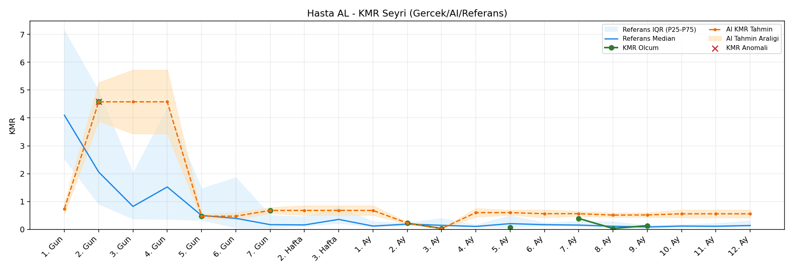
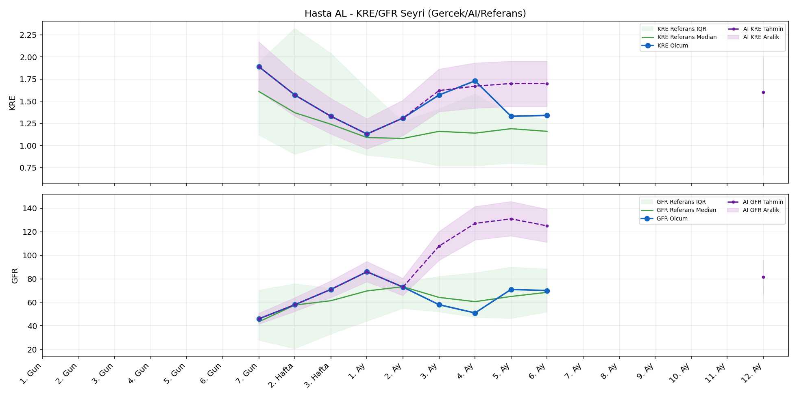
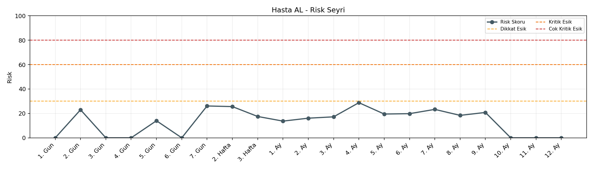

# Hasta AL

[Ana rapora don](../../Hasta_Raporları_Detay.md)

## Hasta Ozeti

| Alan | Deger |
|---|---|
| Yas | 30 |
| Cinsiyet | MALE |
| BMI | 18.0 |
| Vital Status | LIVING |
| Risk Skoru (Son) | 28.8 |
| Risk Seviyesi | Normal |
| Anomali Durumu | Yok |
| Son KMR | 0.3914 (7. Ay) |
| Son KRE | 1.34 (6. Ay) |
| Son GFR | 70.0 (6. Ay) |

## Grafikler

## IQR ve Median Ozeti

| Metrik | Hasta (Median / IQR) | Referans (Median / IQR) | Son Olcum Zamani |
|---|---|---|---|
| KMR | 0.391 / 0.430 | 0.143 / 0.157 | 7. Ay |
| KRE | 1.340 / 0.240 | 1.170 / 0.770 | 6. Ay |
| GFR | 70.000 / 13.000 | 59.800 / 29.600 | 6. Ay |

## AI Performans (Hasta Bazli)

| Metrik | Eval Nokta | MAE | RMSE | MAPE | Aralik Kapsama | Son Hata |
|---|---:|---:|---:|---:|---:|---:|
| KMR | 2 | 0.0733 | 0.1021 | %105.38 | %50.0 | -0.0022 |
| KRE | 4 | 0.417 | 0.451 | %29.57 | %25.0 | 0.560 |
| GFR | 4 | 16.03 | 17.85 | %27.88 | %0.0 | 9.40 |

## Zaman Serisi Detay Tablosu

| Zaman | KMR | AI KMR | Durum | KRE | AI KRE | Durum | GFR | AI GFR | Durum | Risk | Seviye | Anomali |
|---|---:|---:|---|---:|---:|---|---:|---:|---|---:|---|---|
| 1. Gun | - | 0.9210 | Ongoru | - | - | Uygulanmaz | - | - | Uygulanmaz | 0.0 | Normal | - |
| 2. Gun | 4.5791 | 4.5791 | Olcum Kopyasi | - | - | Uygulanmaz | - | - | Uygulanmaz | 21.9 | Normal | - |
| 3. Gun | - | 4.5791 | Ongoru | - | - | Uygulanmaz | - | - | Uygulanmaz | 0.0 | Normal | - |
| 4. Gun | - | 4.5791 | Ongoru | - | - | Uygulanmaz | - | - | Uygulanmaz | 0.0 | Normal | - |
| 5. Gun | 0.4731 | 0.4731 | Olcum Kopyasi | - | - | Uygulanmaz | - | - | Uygulanmaz | 14.3 | Normal | - |
| 6. Gun | - | 0.4731 | Ongoru | - | - | Uygulanmaz | - | - | Uygulanmaz | 0.0 | Normal | - |
| 7. Gun | 0.6799 | 0.6799 | Olcum Kopyasi | 1.89 | 1.89 | Olcum Kopyasi | 46.0 | 46.0 | Olcum Kopyasi | 26.4 | Normal | - |
| 2. Hafta | - | 0.6799 | Ongoru | 1.57 | 1.57 | Olcum Kopyasi | 58.0 | 58.0 | Olcum Kopyasi | 25.6 | Normal | - |
| 3. Hafta | - | 0.6799 | Ongoru | 1.33 | 1.33 | Olcum Kopyasi | 71.0 | 71.0 | Olcum Kopyasi | 17.5 | Normal | - |
| 1. Ay | - | 0.6799 | Ongoru | 1.13 | 1.13 | Olcum Kopyasi | 86.0 | 86.0 | Olcum Kopyasi | 13.7 | Normal | - |
| 2. Ay | 0.2250 | 0.2250 | Olcum Kopyasi | 1.31 | 1.31 | Olcum Kopyasi | 73.0 | 73.0 | Olcum Kopyasi | 16.3 | Normal | - |
| 3. Ay | 0.0296 | 0.0296 | Olcum Kopyasi | 1.57 | 1.86 | Model | 58.0 | 74.5 | Model | 17.4 | Normal | - |
| 4. Ay | - | 0.2131 | Ongoru | 1.73 | 1.94 | Model | 51.0 | 79.7 | Model | 28.8 | Normal | - |
| 5. Ay | 0.0687 | 0.2131 | Model | 1.33 | 1.94 | Model | 71.0 | 80.5 | Model | 17.8 | Normal | - |
| 6. Ay | - | 0.3892 | Ongoru | 1.34 | 1.90 | Model | 70.0 | 79.4 | Model | 19.8 | Normal | - |
| 7. Ay | 0.3914 | 0.3892 | Model | - | - | Uygulanmaz | - | - | Uygulanmaz | 22.6 | Normal | - |
| 8. Ay | - | 0.5764 | Ongoru | - | - | Uygulanmaz | - | - | Uygulanmaz | 0.0 | Normal | - |
| 9. Ay | - | 0.5764 | Ongoru | - | - | Uygulanmaz | - | - | Uygulanmaz | 0.0 | Normal | - |
| 10. Ay | - | 0.5764 | Ongoru | - | - | Uygulanmaz | - | - | Uygulanmaz | 0.0 | Normal | - |
| 11. Ay | - | 0.5764 | Ongoru | - | - | Uygulanmaz | - | - | Uygulanmaz | 0.0 | Normal | - |
| 12. Ay | - | 0.5764 | Ongoru | - | 1.60 | Ongoru | - | 61.2 | Ongoru | 0.0 | Normal | - |

> Not: Bu dosya `python3 backend/run_all.py` ile otomatik uretilir.
