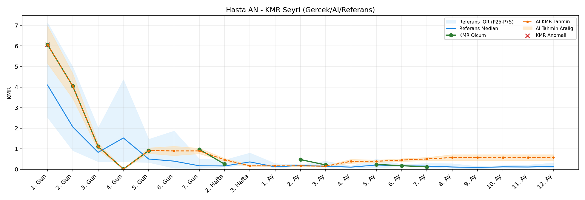
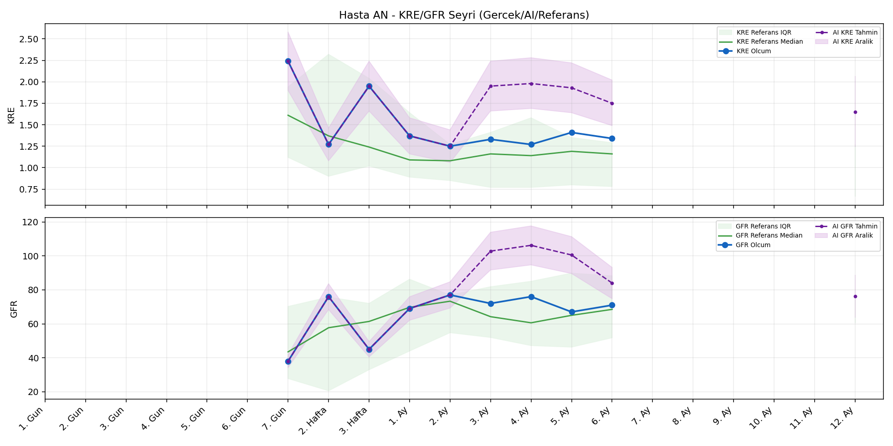
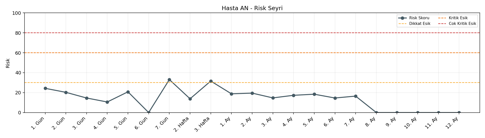

# Hasta AN

[Ana rapora don](../../Hasta_Raporları_Detay.md)

## Hasta Ozeti

| Alan | Deger |
|---|---|
| Yas | 28 |
| Cinsiyet | MALE |
| BMI | 23.8 |
| Vital Status | LIVING |
| Risk Skoru (Son) | 33.6 |
| Risk Seviyesi | Dikkat |
| Anomali Durumu | Var |
| Son KMR | 0.2347 (5. Ay) |
| Son KRE | 1.34 (6. Ay) |
| Son GFR | 71.0 (6. Ay) |

## Grafikler

## IQR ve Median Ozeti

| Metrik | Hasta (Median / IQR) | Referans (Median / IQR) | Son Olcum Zamani |
|---|---|---|---|
| KMR | 0.688 / 0.833 | 0.490 / 0.789 | 5. Ay |
| KRE | 1.340 / 0.140 | 1.170 / 0.770 | 6. Ay |
| GFR | 71.000 / 9.000 | 59.800 / 29.600 | 6. Ay |

## AI Performans (Hasta Bazli)

| Metrik | Eval Nokta | MAE | RMSE | MAPE | Aralik Kapsama | Son Hata |
|---|---:|---:|---:|---:|---:|---:|
| KMR | 5 | 0.3165 | 0.3757 | %107.93 | %0.0 | 0.6990 |
| KRE | 4 | 0.650 | 0.706 | %48.90 | %25.0 | 0.190 |
| GFR | 4 | 43.90 | 49.51 | %61.36 | %25.0 | -4.60 |

## Zaman Serisi Detay Tablosu

| Zaman | KMR | AI KMR | Durum | KRE | AI KRE | Durum | GFR | AI GFR | Durum | Risk | Seviye | Anomali |
|---|---:|---:|---|---:|---:|---|---:|---:|---|---:|---|---|
| 1. Gun | 6.0660 | 6.0660 | Olcum Kopyasi | - | - | Uygulanmaz | - | - | Uygulanmaz | 23.5 | Normal | KMR |
| 2. Gun | 4.0436 | 4.0436 | Olcum Kopyasi | - | - | Uygulanmaz | - | - | Uygulanmaz | 19.7 | Normal | - |
| 3. Gun | 1.1056 | 1.1056 | Olcum Kopyasi | - | - | Uygulanmaz | - | - | Uygulanmaz | 14.9 | Normal | - |
| 4. Gun | 0.0103 | 0.0103 | Olcum Kopyasi | - | - | Uygulanmaz | - | - | Uygulanmaz | 10.9 | Normal | - |
| 5. Gun | 0.9058 | 0.9058 | Olcum Kopyasi | - | - | Uygulanmaz | - | - | Uygulanmaz | 21.1 | Normal | - |
| 6. Gun | - | 0.7541 | Ongoru | - | - | Uygulanmaz | - | - | Uygulanmaz | 0.0 | Normal | - |
| 7. Gun | 0.9669 | 0.7541 | Model | 2.24 | 2.24 | Olcum Kopyasi | 38.0 | 38.0 | Olcum Kopyasi | 33.6 | Dikkat | - |
| 2. Hafta | 0.2495 | 0.3860 | Model | 1.27 | 1.27 | Olcum Kopyasi | 76.0 | 76.0 | Olcum Kopyasi | 13.7 | Normal | - |
| 3. Hafta | - | 0.1313 | Ongoru | 1.95 | 1.95 | Olcum Kopyasi | 45.0 | 45.0 | Olcum Kopyasi | 31.6 | Dikkat | - |
| 1. Ay | - | 0.1313 | Ongoru | 1.37 | 1.37 | Olcum Kopyasi | 69.0 | 69.0 | Olcum Kopyasi | 18.8 | Normal | - |
| 2. Ay | 0.4711 | 0.1313 | Model | 1.25 | 1.25 | Olcum Kopyasi | 77.0 | 77.0 | Olcum Kopyasi | 19.7 | Normal | - |
| 3. Ay | 0.2093 | 0.4039 | Model | 1.33 | 2.18 | Model | 72.0 | 133.7 | Model | 15.3 | Normal | - |
| 4. Ay | - | 0.9337 | Ongoru | 1.27 | 2.15 | Model | 76.0 | 131.9 | Model | 17.3 | Normal | - |
| 5. Ay | 0.2347 | 0.9337 | Model | 1.41 | 2.09 | Model | 67.0 | 120.4 | Model | 20.4 | Normal | - |
| 6. Ay | - | 1.0143 | Ongoru | 1.34 | 1.53 | Model | 71.0 | 66.4 | Model | 19.3 | Normal | - |
| 7. Ay | - | 1.0143 | Ongoru | - | - | Uygulanmaz | - | - | Uygulanmaz | 0.0 | Normal | - |
| 8. Ay | - | 1.0143 | Ongoru | - | - | Uygulanmaz | - | - | Uygulanmaz | 0.0 | Normal | - |
| 9. Ay | - | 1.0143 | Ongoru | - | - | Uygulanmaz | - | - | Uygulanmaz | 0.0 | Normal | - |
| 10. Ay | - | 1.0143 | Ongoru | - | - | Uygulanmaz | - | - | Uygulanmaz | 0.0 | Normal | - |
| 11. Ay | - | 1.0143 | Ongoru | - | - | Uygulanmaz | - | - | Uygulanmaz | 0.0 | Normal | - |
| 12. Ay | - | 1.0143 | Ongoru | - | 1.51 | Ongoru | - | 58.9 | Ongoru | 0.0 | Normal | - |

> Not: Bu dosya `python3 backend/run_all.py` ile otomatik uretilir.
