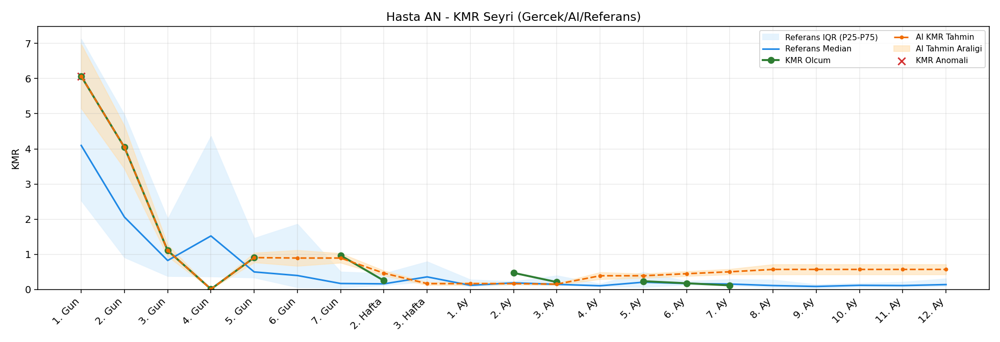
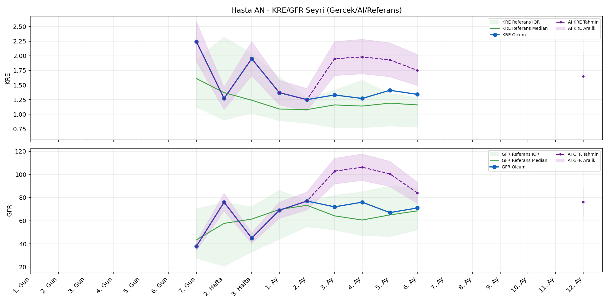
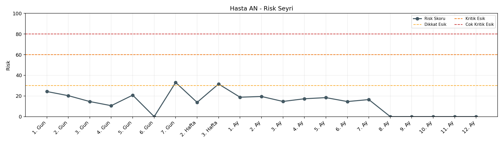

# Hasta AN

[Ana rapora don](../../Hasta_Raporları_Detay.md)

## Hasta Ozeti

| Alan | Deger |
|---|---|
| Yas | 28 |
| Cinsiyet | MALE |
| BMI | 23.8 |
| Vital Status | LIVING |
| Risk Skoru (Son) | 33.1 |
| Risk Seviyesi | Dikkat |
| Anomali Durumu | Var |
| Son KMR | 0.1155 (7. Ay) |
| Son KRE | 1.34 (6. Ay) |
| Son GFR | 71.0 (6. Ay) |

## Grafikler

## IQR ve Median Ozeti

| Metrik | Hasta (Median / IQR) | Referans (Median / IQR) | Son Olcum Zamani |
|---|---|---|---|
| KMR | 0.360 / 0.801 | 0.154 / 0.171 | 7. Ay |
| KRE | 1.340 / 0.140 | 1.160 / 0.510 | 6. Ay |
| GFR | 71.000 / 9.000 | 68.500 / 36.400 | 6. Ay |

## AI Performans (Hasta Bazli)

| Metrik | Eval Nokta | MAE | RMSE | MAPE | Aralik Kapsama | Son Hata |
|---|---:|---:|---:|---:|---:|---:|
| KMR | 7 | 0.2094 | 0.2377 | %106.00 | %14.3 | 0.3870 |
| KRE | 4 | 0.565 | 0.576 | %42.50 | %0.0 | 0.410 |
| GFR | 4 | 26.88 | 28.07 | %37.71 | %0.0 | 13.00 |

## Zaman Serisi Detay Tablosu

| Zaman | KMR | AI KMR | Durum | KRE | AI KRE | Durum | GFR | AI GFR | Durum | Risk | Seviye | Anomali |
|---|---:|---:|---|---:|---:|---|---:|---:|---|---:|---|---|
| 1. Gun | 6.0660 | 6.0660 | Olcum Kopyasi | - | - | Uygulanmaz | - | - | Uygulanmaz | 24.3 | Normal | KMR |
| 2. Gun | 4.0436 | 4.0436 | Olcum Kopyasi | - | - | Uygulanmaz | - | - | Uygulanmaz | 20.3 | Normal | - |
| 3. Gun | 1.1056 | 1.1056 | Olcum Kopyasi | - | - | Uygulanmaz | - | - | Uygulanmaz | 14.6 | Normal | - |
| 4. Gun | 0.0103 | 0.0103 | Olcum Kopyasi | - | - | Uygulanmaz | - | - | Uygulanmaz | 10.6 | Normal | - |
| 5. Gun | 0.9058 | 0.9058 | Olcum Kopyasi | - | - | Uygulanmaz | - | - | Uygulanmaz | 20.8 | Normal | - |
| 6. Gun | - | 0.8933 | Ongoru | - | - | Uygulanmaz | - | - | Uygulanmaz | 0.0 | Normal | - |
| 7. Gun | 0.9669 | 0.8933 | Model | 2.24 | 2.24 | Olcum Kopyasi | 38.0 | 38.0 | Olcum Kopyasi | 33.1 | Dikkat | - |
| 2. Hafta | 0.2495 | 0.4632 | Model | 1.27 | 1.27 | Olcum Kopyasi | 76.0 | 76.0 | Olcum Kopyasi | 13.8 | Normal | - |
| 3. Hafta | - | 0.1654 | Ongoru | 1.95 | 1.95 | Olcum Kopyasi | 45.0 | 45.0 | Olcum Kopyasi | 31.6 | Dikkat | - |
| 1. Ay | - | 0.1654 | Ongoru | 1.37 | 1.37 | Olcum Kopyasi | 69.0 | 69.0 | Olcum Kopyasi | 18.8 | Normal | - |
| 2. Ay | 0.4711 | 0.1654 | Model | 1.25 | 1.25 | Olcum Kopyasi | 77.0 | 77.0 | Olcum Kopyasi | 19.5 | Normal | - |
| 3. Ay | 0.2093 | 0.1503 | Model | 1.33 | 1.95 | Model | 72.0 | 102.8 | Model | 14.7 | Normal | - |
| 4. Ay | - | 0.3893 | Ongoru | 1.27 | 1.98 | Model | 76.0 | 106.2 | Model | 17.3 | Normal | - |
| 5. Ay | 0.2347 | 0.3893 | Model | 1.41 | 1.93 | Model | 67.0 | 100.5 | Model | 18.4 | Normal | - |
| 6. Ay | 0.1757 | 0.4476 | Model | 1.34 | 1.75 | Model | 71.0 | 84.0 | Model | 14.6 | Normal | - |
| 7. Ay | 0.1155 | 0.5025 | Model | - | - | Uygulanmaz | - | - | Uygulanmaz | 16.5 | Normal | - |
| 8. Ay | - | 0.5695 | Ongoru | - | - | Uygulanmaz | - | - | Uygulanmaz | 0.0 | Normal | - |
| 9. Ay | - | 0.5695 | Ongoru | - | - | Uygulanmaz | - | - | Uygulanmaz | 0.0 | Normal | - |
| 10. Ay | - | 0.5695 | Ongoru | - | - | Uygulanmaz | - | - | Uygulanmaz | 0.0 | Normal | - |
| 11. Ay | - | 0.5695 | Ongoru | - | - | Uygulanmaz | - | - | Uygulanmaz | 0.0 | Normal | - |
| 12. Ay | - | 0.5695 | Ongoru | - | 1.65 | Ongoru | - | 76.3 | Ongoru | 0.0 | Normal | - |

> Not: Bu dosya `python3 backend/run_all.py` ile otomatik uretilir.
