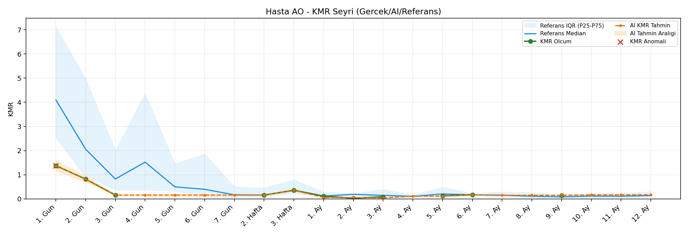
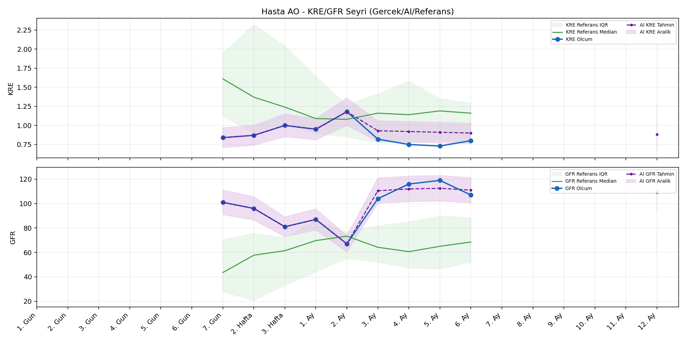
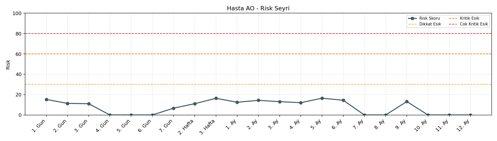

# Hasta AO

[Ana rapora don](../../Hasta_Raporları_Detay.md)

## Hasta Ozeti

| Alan | Deger |
|---|---|
| Yas | 19 |
| Cinsiyet | FEMALE |
| BMI | 20.5 |
| Vital Status | LIVING |
| Risk Skoru (Son) | 16.3 |
| Risk Seviyesi | Normal |
| Anomali Durumu | Yok |
| Son KMR | 0.0889 (3. Ay) |
| Son KRE | 0.80 (6. Ay) |
| Son GFR | 107.0 (6. Ay) |

## Grafikler

## IQR ve Median Ozeti

| Metrik | Hasta (Median / IQR) | Referans (Median / IQR) | Son Olcum Zamani |
|---|---|---|---|
| KMR | 0.157 / 0.364 | 0.446 / 0.307 | 3. Ay |
| KRE | 0.840 / 0.150 | 1.170 / 0.770 | 6. Ay |
| GFR | 101.000 / 20.000 | 59.800 / 29.600 | 6. Ay |

## AI Performans (Hasta Bazli)

| Metrik | Eval Nokta | MAE | RMSE | MAPE | Aralik Kapsama | Son Hata |
|---|---:|---:|---:|---:|---:|---:|
| KMR | 3 | 0.0273 | 0.0328 | %41.02 | %33.3 | 0.0024 |
| KRE | 4 | 0.220 | 0.225 | %28.71 | %0.0 | 0.170 |
| GFR | 4 | 33.42 | 33.62 | %30.18 | %0.0 | 30.80 |

## Zaman Serisi Detay Tablosu

| Zaman | KMR | AI KMR | Durum | KRE | AI KRE | Durum | GFR | AI GFR | Durum | Risk | Seviye | Anomali |
|---|---:|---:|---|---:|---:|---|---:|---:|---|---:|---|---|
| 1. Gun | 1.3765 | 1.3765 | Olcum Kopyasi | - | - | Uygulanmaz | - | - | Uygulanmaz | 13.9 | Normal | - |
| 2. Gun | 0.8183 | 0.8183 | Olcum Kopyasi | - | - | Uygulanmaz | - | - | Uygulanmaz | 10.5 | Normal | - |
| 3. Gun | 0.1574 | 0.1574 | Olcum Kopyasi | - | - | Uygulanmaz | - | - | Uygulanmaz | 11.4 | Normal | - |
| 4. Gun | - | 0.1574 | Ongoru | - | - | Uygulanmaz | - | - | Uygulanmaz | 0.0 | Normal | - |
| 5. Gun | - | 0.1574 | Ongoru | - | - | Uygulanmaz | - | - | Uygulanmaz | 0.0 | Normal | - |
| 6. Gun | - | 0.1574 | Ongoru | - | - | Uygulanmaz | - | - | Uygulanmaz | 0.0 | Normal | - |
| 7. Gun | - | 0.1574 | Ongoru | 0.84 | 0.84 | Olcum Kopyasi | 101.0 | 101.0 | Olcum Kopyasi | 6.7 | Normal | - |
| 2. Hafta | 0.1562 | 0.1562 | Olcum Kopyasi | 0.87 | 0.87 | Olcum Kopyasi | 96.0 | 96.0 | Olcum Kopyasi | 11.3 | Normal | - |
| 3. Hafta | 0.3571 | 0.3571 | Olcum Kopyasi | 1.00 | 1.00 | Olcum Kopyasi | 81.0 | 81.0 | Olcum Kopyasi | 16.3 | Normal | - |
| 1. Ay | 0.1144 | 0.1489 | Model | 0.95 | 0.95 | Olcum Kopyasi | 87.0 | 87.0 | Olcum Kopyasi | 12.5 | Normal | - |
| 2. Ay | 0.0255 | 0.0706 | Model | 1.18 | 1.18 | Olcum Kopyasi | 67.0 | 67.0 | Olcum Kopyasi | 14.7 | Normal | - |
| 3. Ay | 0.0889 | 0.0913 | Model | 0.82 | 1.00 | Model | 104.0 | 143.2 | Model | 12.6 | Normal | - |
| 4. Ay | - | 0.0109 | Ongoru | 0.75 | 1.01 | Model | 116.0 | 149.7 | Model | 12.1 | Normal | - |
| 5. Ay | - | 0.0109 | Ongoru | 0.73 | 1.00 | Model | 119.0 | 149.0 | Model | 12.1 | Normal | - |
| 6. Ay | - | 0.0109 | Ongoru | 0.80 | 0.97 | Model | 107.0 | 137.8 | Model | 11.7 | Normal | - |
| 7. Ay | - | 0.0109 | Ongoru | - | - | Uygulanmaz | - | - | Uygulanmaz | 0.0 | Normal | - |
| 8. Ay | - | 0.0109 | Ongoru | - | - | Uygulanmaz | - | - | Uygulanmaz | 0.0 | Normal | - |
| 9. Ay | - | 0.0109 | Ongoru | - | - | Uygulanmaz | - | - | Uygulanmaz | 0.0 | Normal | - |
| 10. Ay | - | 0.0109 | Ongoru | - | - | Uygulanmaz | - | - | Uygulanmaz | 0.0 | Normal | - |
| 11. Ay | - | 0.0109 | Ongoru | - | - | Uygulanmaz | - | - | Uygulanmaz | 0.0 | Normal | - |
| 12. Ay | - | 0.0109 | Ongoru | - | 0.93 | Ongoru | - | 120.8 | Ongoru | 0.0 | Normal | - |

> Not: Bu dosya `python3 backend/run_all.py` ile otomatik uretilir.
