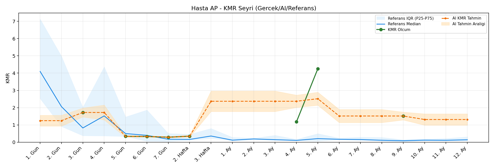
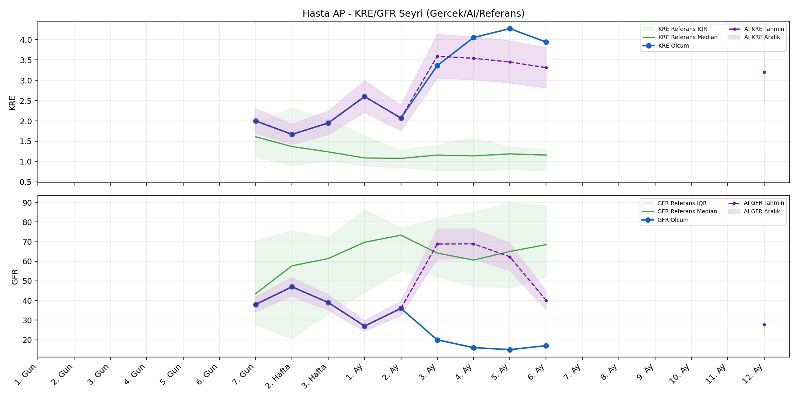
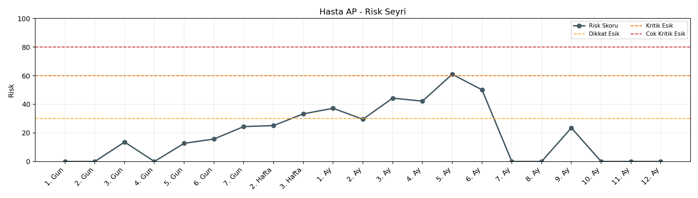

# Hasta AP

[Ana rapora don](../../Hasta_Raporları_Detay.md)

## Hasta Ozeti

| Alan | Deger |
|---|---|
| Yas | 49 |
| Cinsiyet | MALE |
| BMI | 31.0 |
| Vital Status | LIVING |
| Risk Skoru (Son) | 63.5 |
| Risk Seviyesi | Kritik |
| Anomali Durumu | Yok |
| Son KMR | 4.2522 (5. Ay) |
| Son KRE | 3.94 (6. Ay) |
| Son GFR | 17.0 (6. Ay) |

## Grafikler

## IQR ve Median Ozeti

| Metrik | Hasta (Median / IQR) | Referans (Median / IQR) | Son Olcum Zamani |
|---|---|---|---|
| KMR | 0.349 / 1.115 | 0.490 / 0.789 | 5. Ay |
| KRE | 2.600 / 1.940 | 1.170 / 0.770 | 6. Ay |
| GFR | 27.000 / 21.000 | 59.800 / 29.600 | 6. Ay |

## AI Performans (Hasta Bazli)

| Metrik | Eval Nokta | MAE | RMSE | MAPE | Aralik Kapsama | Son Hata |
|---|---:|---:|---:|---:|---:|---:|
| KMR | 2 | 1.5625 | 2.1714 | %38.42 | %50.0 | -3.0703 |
| KRE | 4 | 0.942 | 1.018 | %23.42 | %25.0 | -1.060 |
| GFR | 4 | 3.83 | 4.19 | %23.79 | %25.0 | 4.10 |

## Zaman Serisi Detay Tablosu

| Zaman | KMR | AI KMR | Durum | KRE | AI KRE | Durum | GFR | AI GFR | Durum | Risk | Seviye | Anomali |
|---|---:|---:|---|---:|---:|---|---:|---:|---|---:|---|---|
| 1. Gun | - | 1.2080 | Ongoru | - | - | Uygulanmaz | - | - | Uygulanmaz | 0.0 | Normal | - |
| 2. Gun | - | 1.2080 | Ongoru | - | - | Uygulanmaz | - | - | Uygulanmaz | 0.0 | Normal | - |
| 3. Gun | 1.7201 | 1.7201 | Olcum Kopyasi | - | - | Uygulanmaz | - | - | Uygulanmaz | 13.6 | Normal | - |
| 4. Gun | - | 1.7201 | Ongoru | - | - | Uygulanmaz | - | - | Uygulanmaz | 0.0 | Normal | - |
| 5. Gun | 0.3378 | 0.3378 | Olcum Kopyasi | - | - | Uygulanmaz | - | - | Uygulanmaz | 12.4 | Normal | - |
| 6. Gun | 0.3301 | 0.3301 | Olcum Kopyasi | - | - | Uygulanmaz | - | - | Uygulanmaz | 15.5 | Normal | - |
| 7. Gun | 0.2887 | 0.2887 | Olcum Kopyasi | 2.00 | 2.00 | Olcum Kopyasi | 38.0 | 38.0 | Olcum Kopyasi | 24.2 | Normal | - |
| 2. Hafta | 0.3489 | 0.3489 | Olcum Kopyasi | 1.67 | 1.67 | Olcum Kopyasi | 47.0 | 47.0 | Olcum Kopyasi | 25.0 | Normal | - |
| 3. Hafta | - | 1.2332 | Ongoru | 1.95 | 1.95 | Olcum Kopyasi | 39.0 | 39.0 | Olcum Kopyasi | 33.3 | Dikkat | - |
| 1. Ay | - | 1.2332 | Ongoru | 2.60 | 2.60 | Olcum Kopyasi | 27.0 | 27.0 | Olcum Kopyasi | 37.2 | Dikkat | - |
| 2. Ay | - | 1.2332 | Ongoru | 2.07 | 2.07 | Olcum Kopyasi | 36.0 | 36.0 | Olcum Kopyasi | 29.5 | Normal | - |
| 3. Ay | - | 1.2332 | Ongoru | 3.36 | 3.05 | Model | 20.0 | 21.0 | Model | 44.3 | Dikkat | - |
| 4. Ay | 1.1785 | 1.2332 | Model | 4.05 | 3.00 | Model | 16.0 | 20.7 | Model | 32.0 | Dikkat | - |
| 5. Ay | 4.2522 | 1.1819 | Model | 4.27 | 2.92 | Model | 15.0 | 20.5 | Model | 63.5 | Kritik | - |
| 6. Ay | - | 0.8316 | Ongoru | 3.94 | 2.88 | Model | 17.0 | 21.1 | Model | 50.1 | Dikkat | - |
| 7. Ay | - | 0.8316 | Ongoru | - | - | Uygulanmaz | - | - | Uygulanmaz | 0.0 | Normal | - |
| 8. Ay | - | 0.8316 | Ongoru | - | - | Uygulanmaz | - | - | Uygulanmaz | 0.0 | Normal | - |
| 9. Ay | - | 0.8316 | Ongoru | - | - | Uygulanmaz | - | - | Uygulanmaz | 0.0 | Normal | - |
| 10. Ay | - | 0.8316 | Ongoru | - | - | Uygulanmaz | - | - | Uygulanmaz | 0.0 | Normal | - |
| 11. Ay | - | 0.8316 | Ongoru | - | - | Uygulanmaz | - | - | Uygulanmaz | 0.0 | Normal | - |
| 12. Ay | - | 0.8316 | Ongoru | - | 2.89 | Ongoru | - | 21.8 | Ongoru | 0.0 | Normal | - |

> Not: Bu dosya `python3 backend/run_all.py` ile otomatik uretilir.
