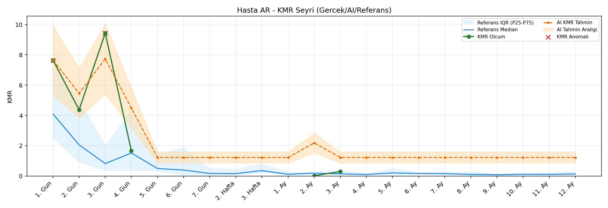
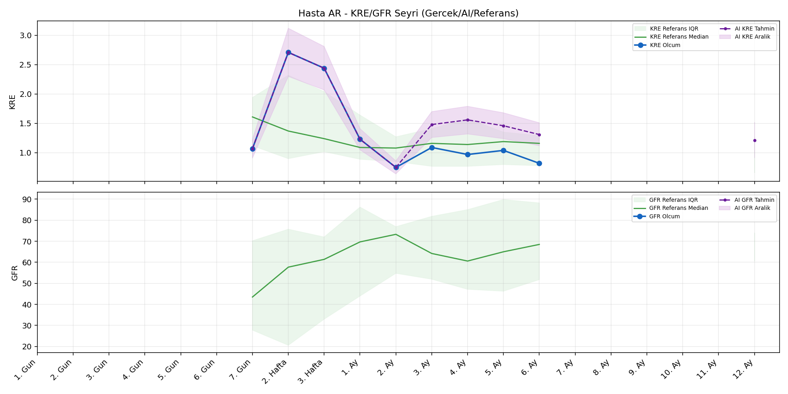
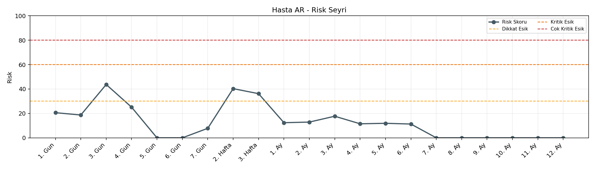

# Hasta AR

[Ana rapora don](../../Hasta_Raporları_Detay.md)

## Hasta Ozeti

| Alan | Deger |
|---|---|
| Yas | 16 |
| Cinsiyet | MALE |
| BMI | 20.1 |
| Vital Status | LIVING |
| Risk Skoru (Son) | 43.7 |
| Risk Seviyesi | Dikkat |
| Anomali Durumu | Var |
| Son KMR | 0.2956 (3. Ay) |
| Son KRE | 0.82 (6. Ay) |
| Son GFR | - (-) |

## Grafikler

## IQR ve Median Ozeti

| Metrik | Hasta (Median / IQR) | Referans (Median / IQR) | Son Olcum Zamani |
|---|---|---|---|
| KMR | 3.021 / 6.191 | 0.446 / 0.307 | 3. Ay |
| KRE | 1.070 / 0.260 | 1.170 / 0.770 | 6. Ay |
| GFR | - / - | - / - | - |

## AI Performans (Hasta Bazli)

| Metrik | Eval Nokta | MAE | RMSE | MAPE | Aralik Kapsama | Son Hata |
|---|---:|---:|---:|---:|---:|---:|
| KMR | 0 | - | - | - | %0.0 | - |
| KRE | 4 | 0.237 | 0.256 | %25.60 | %50.0 | 0.380 |
| GFR | 0 | - | - | - | %0.0 | - |

## Zaman Serisi Detay Tablosu

| Zaman | KMR | AI KMR | Durum | KRE | AI KRE | Durum | GFR | AI GFR | Durum | Risk | Seviye | Anomali |
|---|---:|---:|---|---:|---:|---|---:|---:|---|---:|---|---|
| 1. Gun | 7.6473 | 7.6473 | EWMA Yedek | - | - | Uygulanmaz | - | - | Uygulanmaz | 20.6 | Normal | KMR |
| 2. Gun | 4.3755 | 5.4661 | EWMA Yedek | - | - | Uygulanmaz | - | - | Uygulanmaz | 18.7 | Normal | - |
| 3. Gun | 9.4367 | 7.7350 | EWMA Yedek | - | - | Uygulanmaz | - | - | Uygulanmaz | 43.7 | Dikkat | KMR |
| 4. Gun | 1.6673 | 4.4989 | EWMA Yedek | - | - | Uygulanmaz | - | - | Uygulanmaz | 25.1 | Normal | - |
| 5. Gun | - | 1.2266 | Yedek Ongoru | - | - | Uygulanmaz | - | - | Uygulanmaz | 0.0 | Normal | - |
| 6. Gun | - | 1.2266 | Yedek Ongoru | - | - | Uygulanmaz | - | - | Uygulanmaz | 0.0 | Normal | - |
| 7. Gun | - | 1.2266 | Yedek Ongoru | 1.07 | 1.07 | Olcum Kopyasi | - | - | Yetersiz Veri | 7.8 | Normal | - |
| 2. Hafta | - | 1.2266 | Yedek Ongoru | 2.71 | 2.71 | Olcum Kopyasi | - | - | Yetersiz Veri | 40.3 | Dikkat | - |
| 3. Hafta | - | 1.2266 | Yedek Ongoru | 2.44 | 2.44 | Olcum Kopyasi | - | - | Yetersiz Veri | 36.2 | Dikkat | - |
| 1. Ay | - | 1.2266 | Yedek Ongoru | 1.23 | 1.23 | Olcum Kopyasi | - | - | Yetersiz Veri | 12.4 | Normal | - |
| 2. Ay | 0.0211 | 2.1878 | EWMA Yedek | 0.75 | 0.75 | Olcum Kopyasi | - | - | Yetersiz Veri | 12.9 | Normal | - |
| 3. Ay | 0.2956 | 1.2266 | EWMA Yedek | 1.09 | 1.23 | Model | - | - | Yetersiz Veri | 17.7 | Normal | - |
| 4. Ay | - | 1.2266 | Yedek Ongoru | 0.97 | 1.24 | Model | - | - | Yetersiz Veri | 11.5 | Normal | - |
| 5. Ay | - | 1.2266 | Yedek Ongoru | 1.04 | 1.20 | Model | - | - | Yetersiz Veri | 11.9 | Normal | - |
| 6. Ay | - | 1.2266 | Yedek Ongoru | 0.82 | 1.20 | Model | - | - | Yetersiz Veri | 11.3 | Normal | - |
| 7. Ay | - | 1.2266 | Yedek Ongoru | - | - | Uygulanmaz | - | - | Uygulanmaz | 0.0 | Normal | - |
| 8. Ay | - | 1.2266 | Yedek Ongoru | - | - | Uygulanmaz | - | - | Uygulanmaz | 0.0 | Normal | - |
| 9. Ay | - | 1.2266 | Yedek Ongoru | - | - | Uygulanmaz | - | - | Uygulanmaz | 0.0 | Normal | - |
| 10. Ay | - | 1.2266 | Yedek Ongoru | - | - | Uygulanmaz | - | - | Uygulanmaz | 0.0 | Normal | - |
| 11. Ay | - | 1.2266 | Yedek Ongoru | - | - | Uygulanmaz | - | - | Uygulanmaz | 0.0 | Normal | - |
| 12. Ay | - | 1.2266 | Yedek Ongoru | - | 1.22 | Model | - | - | Yetersiz Veri | 0.0 | Normal | - |

> Not: Bu dosya `python3 backend/run_all.py` ile otomatik uretilir.
