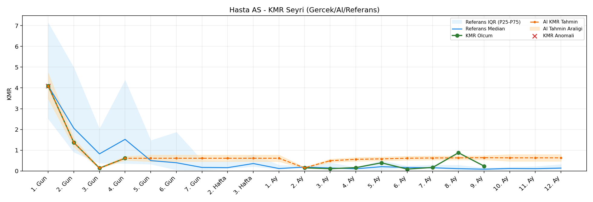
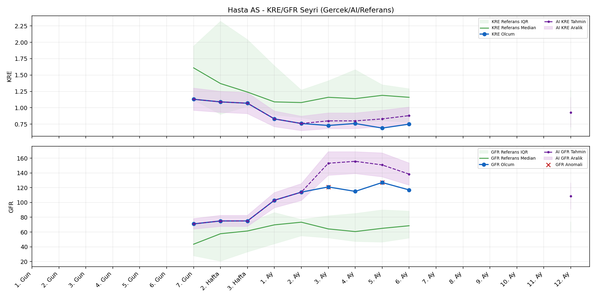
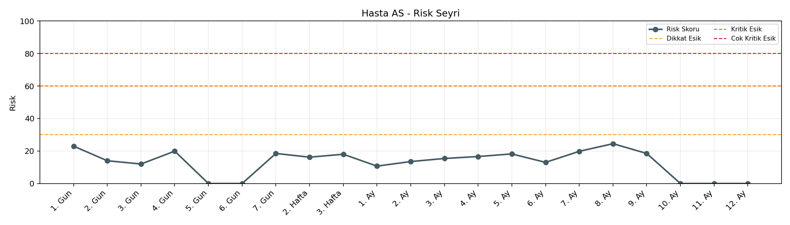

# Hasta AS

[Ana rapora don](../../Hasta_Raporları_Detay.md)

## Hasta Ozeti

| Alan | Deger |
|---|---|
| Yas | 18 |
| Cinsiyet | FEMALE |
| BMI | 26.0 |
| Vital Status | LIVING |
| Risk Skoru (Son) | 21.2 |
| Risk Seviyesi | Normal |
| Anomali Durumu | Var |
| Son KMR | 0.3929 (5. Ay) |
| Son KRE | 0.75 (6. Ay) |
| Son GFR | 117.0 (6. Ay) |

## Grafikler

## IQR ve Median Ozeti

| Metrik | Hasta (Median / IQR) | Referans (Median / IQR) | Son Olcum Zamani |
|---|---|---|---|
| KMR | 0.276 / 0.654 | 0.490 / 0.789 | 5. Ay |
| KRE | 0.760 / 0.320 | 1.170 / 0.770 | 6. Ay |
| GFR | 114.000 / 42.000 | 59.800 / 29.600 | 6. Ay |

## AI Performans (Hasta Bazli)

| Metrik | Eval Nokta | MAE | RMSE | MAPE | Aralik Kapsama | Son Hata |
|---|---:|---:|---:|---:|---:|---:|
| KMR | 3 | 0.6469 | 0.6490 | %400.53 | %0.0 | 0.5804 |
| KRE | 4 | 0.298 | 0.301 | %40.82 | %0.0 | 0.220 |
| GFR | 4 | 16.70 | 19.46 | %14.10 | %50.0 | -7.30 |

## Zaman Serisi Detay Tablosu

| Zaman | KMR | AI KMR | Durum | KRE | AI KRE | Durum | GFR | AI GFR | Durum | Risk | Seviye | Anomali |
|---|---:|---:|---|---:|---:|---|---:|---:|---|---:|---|---|
| 1. Gun | 4.0976 | 4.0976 | Olcum Kopyasi | - | - | Uygulanmaz | - | - | Uygulanmaz | 21.2 | Normal | KMR |
| 2. Gun | 1.3695 | 1.3695 | Olcum Kopyasi | - | - | Uygulanmaz | - | - | Uygulanmaz | 13.3 | Normal | - |
| 3. Gun | 0.1370 | 0.1370 | Olcum Kopyasi | - | - | Uygulanmaz | - | - | Uygulanmaz | 12.2 | Normal | - |
| 4. Gun | 0.6115 | 0.6115 | Olcum Kopyasi | - | - | Uygulanmaz | - | - | Uygulanmaz | 20.2 | Normal | - |
| 5. Gun | - | 0.6115 | Ongoru | - | - | Uygulanmaz | - | - | Uygulanmaz | 0.0 | Normal | - |
| 6. Gun | - | 0.6115 | Ongoru | - | - | Uygulanmaz | - | - | Uygulanmaz | 0.0 | Normal | - |
| 7. Gun | - | 0.6115 | Ongoru | 1.13 | 1.13 | Olcum Kopyasi | 71.0 | 71.0 | Olcum Kopyasi | 18.5 | Normal | - |
| 2. Hafta | - | 0.6115 | Ongoru | 1.09 | 1.09 | Olcum Kopyasi | 75.0 | 75.0 | Olcum Kopyasi | 16.2 | Normal | - |
| 3. Hafta | - | 0.6115 | Ongoru | 1.07 | 1.07 | Olcum Kopyasi | 75.0 | 75.0 | Olcum Kopyasi | 18.0 | Normal | - |
| 1. Ay | - | 0.6115 | Ongoru | 0.83 | 0.83 | Olcum Kopyasi | 103.0 | 103.0 | Olcum Kopyasi | 10.7 | Normal | - |
| 2. Ay | 0.1502 | 0.1502 | Olcum Kopyasi | 0.76 | 0.76 | Olcum Kopyasi | 114.0 | 114.0 | Olcum Kopyasi | 13.6 | Normal | - |
| 3. Ay | 0.1096 | 0.8154 | Model | 0.73 | 1.06 | Model | 121.0 | 145.8 | Model | 17.0 | Normal | GFR |
| 4. Ay | 0.1597 | 0.8143 | Model | 0.76 | 1.06 | Model | 115.0 | 143.4 | Model | 18.1 | Normal | - |
| 5. Ay | 0.3929 | 0.9733 | Model | 0.69 | 1.03 | Model | 127.0 | 133.3 | Model | 20.5 | Normal | GFR |
| 6. Ay | - | 0.9199 | Ongoru | 0.75 | 0.97 | Model | 117.0 | 109.7 | Model | 11.0 | Normal | - |
| 7. Ay | - | 0.9199 | Ongoru | - | - | Uygulanmaz | - | - | Uygulanmaz | 0.0 | Normal | - |
| 8. Ay | - | 0.9199 | Ongoru | - | - | Uygulanmaz | - | - | Uygulanmaz | 0.0 | Normal | - |
| 9. Ay | - | 0.9199 | Ongoru | - | - | Uygulanmaz | - | - | Uygulanmaz | 0.0 | Normal | - |
| 10. Ay | - | 0.9199 | Ongoru | - | - | Uygulanmaz | - | - | Uygulanmaz | 0.0 | Normal | - |
| 11. Ay | - | 0.9199 | Ongoru | - | - | Uygulanmaz | - | - | Uygulanmaz | 0.0 | Normal | - |
| 12. Ay | - | 0.9199 | Ongoru | - | 0.90 | Ongoru | - | 86.5 | Ongoru | 0.0 | Normal | - |

> Not: Bu dosya `python3 backend/run_all.py` ile otomatik uretilir.
