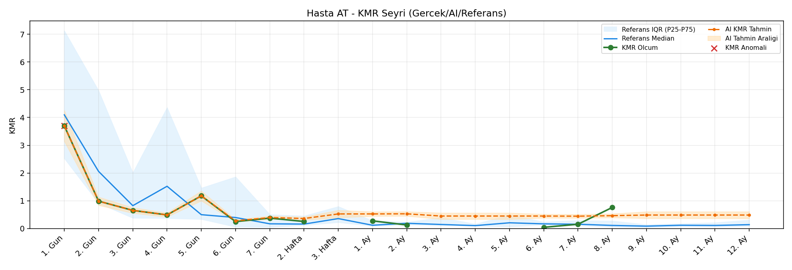
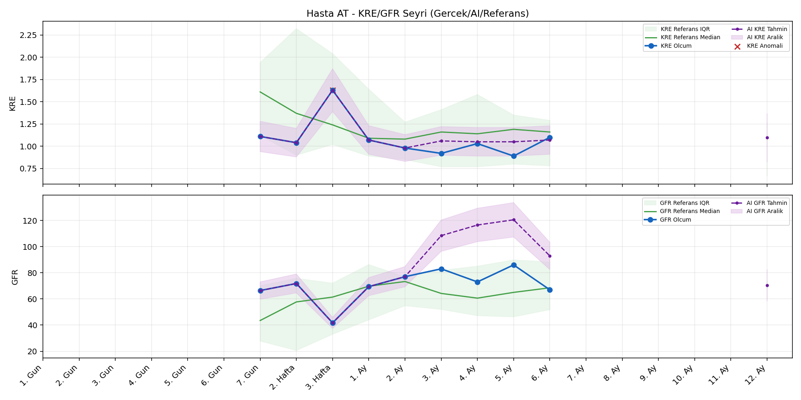
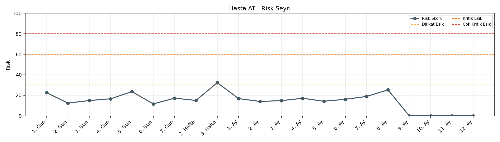

# Hasta AT

[Ana rapora don](../../Hasta_Raporları_Detay.md)

## Hasta Ozeti

| Alan | Deger |
|---|---|
| Yas | 71 |
| Cinsiyet | MALE |
| BMI | 22.7 |
| Vital Status | LIVING |
| Risk Skoru (Son) | 32.3 |
| Risk Seviyesi | Dikkat |
| Anomali Durumu | Var |
| Son KMR | 0.1264 (2. Ay) |
| Son KRE | 1.10 (6. Ay) |
| Son GFR | 67.0 (6. Ay) |

## Grafikler

## IQR ve Median Ozeti

| Metrik | Hasta (Median / IQR) | Referans (Median / IQR) | Son Olcum Zamani |
|---|---|---|---|
| KMR | 0.433 / 0.654 | 0.364 / 0.137 | 2. Ay |
| KRE | 1.040 / 0.120 | 1.170 / 0.770 | 6. Ay |
| GFR | 71.800 / 10.000 | 59.800 / 29.600 | 6. Ay |

## AI Performans (Hasta Bazli)

| Metrik | Eval Nokta | MAE | RMSE | MAPE | Aralik Kapsama | Son Hata |
|---|---:|---:|---:|---:|---:|---:|
| KMR | 5 | 0.0931 | 0.1118 | %63.24 | %20.0 | 0.0383 |
| KRE | 4 | 0.095 | 0.118 | %10.31 | %75.0 | -0.020 |
| GFR | 4 | 26.02 | 27.11 | %33.88 | %0.0 | 17.50 |

## Zaman Serisi Detay Tablosu

| Zaman | KMR | AI KMR | Durum | KRE | AI KRE | Durum | GFR | AI GFR | Durum | Risk | Seviye | Anomali |
|---|---:|---:|---|---:|---:|---|---:|---:|---|---:|---|---|
| 1. Gun | 3.6975 | 3.6975 | Olcum Kopyasi | - | - | Uygulanmaz | - | - | Uygulanmaz | 21.4 | Normal | KMR |
| 2. Gun | 0.9869 | 0.9869 | Olcum Kopyasi | - | - | Uygulanmaz | - | - | Uygulanmaz | 12.0 | Normal | - |
| 3. Gun | 0.6524 | 0.6524 | Olcum Kopyasi | - | - | Uygulanmaz | - | - | Uygulanmaz | 15.2 | Normal | - |
| 4. Gun | 0.4902 | 0.4902 | Olcum Kopyasi | - | - | Uygulanmaz | - | - | Uygulanmaz | 16.8 | Normal | - |
| 5. Gun | 1.1759 | 1.1759 | Olcum Kopyasi | - | - | Uygulanmaz | - | - | Uygulanmaz | 23.2 | Normal | - |
| 6. Gun | 0.2488 | 0.2476 | Model | - | - | Uygulanmaz | - | - | Uygulanmaz | 11.6 | Normal | - |
| 7. Gun | 0.3757 | 0.2382 | Model | 1.11 | 1.11 | Olcum Kopyasi | 66.4 | 66.4 | Olcum Kopyasi | 17.8 | Normal | - |
| 2. Hafta | 0.2517 | 0.1242 | Model | 1.04 | 1.04 | Olcum Kopyasi | 71.8 | 71.8 | Olcum Kopyasi | 15.2 | Normal | - |
| 3. Hafta | - | 0.2421 | Ongoru | 1.63 | 1.63 | Olcum Kopyasi | 41.7 | 41.7 | Olcum Kopyasi | 32.3 | Dikkat | KRE |
| 1. Ay | 0.0812 | 0.2421 | Model | 1.07 | 1.07 | Olcum Kopyasi | 69.4 | 69.4 | Olcum Kopyasi | 14.3 | Normal | - |
| 2. Ay | 0.1264 | 0.1647 | Model | 0.98 | 0.98 | Olcum Kopyasi | 77.0 | 77.0 | Olcum Kopyasi | 14.7 | Normal | - |
| 3. Ay | - | 0.0000 | Ongoru | 0.92 | 1.08 | Model | 83.0 | 104.4 | Model | 14.8 | Normal | - |
| 4. Ay | - | 0.0000 | Ongoru | 1.03 | 1.06 | Model | 73.0 | 110.6 | Model | 17.1 | Normal | - |
| 5. Ay | - | 0.0000 | Ongoru | 0.89 | 1.06 | Model | 86.0 | 113.6 | Model | 14.2 | Normal | - |
| 6. Ay | - | 0.0000 | Ongoru | 1.10 | 1.08 | Model | 67.0 | 84.5 | Model | 19.0 | Normal | - |
| 7. Ay | - | 0.0000 | Ongoru | - | - | Uygulanmaz | - | - | Uygulanmaz | 0.0 | Normal | - |
| 8. Ay | - | 0.0000 | Ongoru | - | - | Uygulanmaz | - | - | Uygulanmaz | 0.0 | Normal | - |
| 9. Ay | - | 0.0000 | Ongoru | - | - | Uygulanmaz | - | - | Uygulanmaz | 0.0 | Normal | - |
| 10. Ay | - | 0.0000 | Ongoru | - | - | Uygulanmaz | - | - | Uygulanmaz | 0.0 | Normal | - |
| 11. Ay | - | 0.0000 | Ongoru | - | - | Uygulanmaz | - | - | Uygulanmaz | 0.0 | Normal | - |
| 12. Ay | - | 0.0000 | Ongoru | - | 1.11 | Ongoru | - | 60.6 | Ongoru | 0.0 | Normal | - |

> Not: Bu dosya `python3 backend/run_all.py` ile otomatik uretilir.
