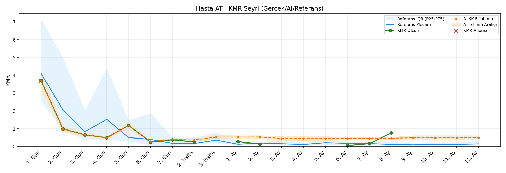
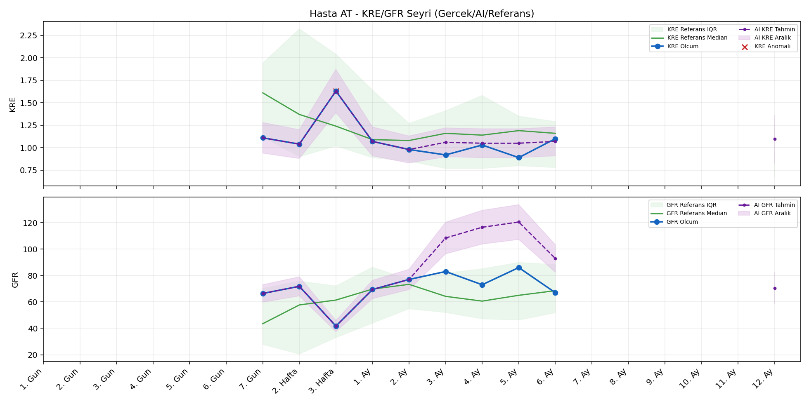
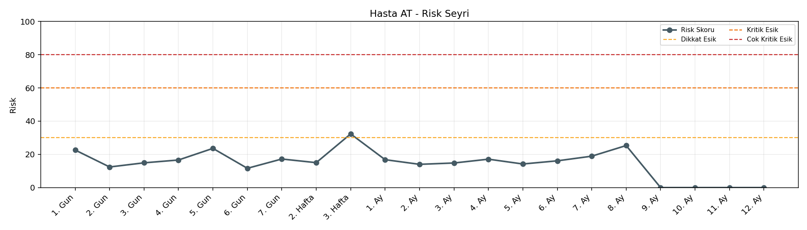

# Hasta AT

[Ana rapora don](../../Hasta_Raporları_Detay.md)

## Hasta Ozeti

| Alan | Deger |
|---|---|
| Yas | 71 |
| Cinsiyet | MALE |
| BMI | 22.7 |
| Vital Status | LIVING |
| Risk Skoru (Son) | 32.3 |
| Risk Seviyesi | Dikkat |
| Anomali Durumu | Var |
| Son KMR | 0.7589 (8. Ay) |
| Son KRE | 1.10 (6. Ay) |
| Son GFR | 67.0 (6. Ay) |

## Grafikler

## IQR ve Median Ozeti

| Metrik | Hasta (Median / IQR) | Referans (Median / IQR) | Son Olcum Zamani |
|---|---|---|---|
| KMR | 0.376 / 0.510 | 0.111 / 0.212 | 8. Ay |
| KRE | 1.040 / 0.120 | 1.160 / 0.510 | 6. Ay |
| GFR | 71.800 / 10.000 | 68.500 / 36.400 | 6. Ay |

## AI Performans (Hasta Bazli)

| Metrik | Eval Nokta | MAE | RMSE | MAPE | Aralik Kapsama | Son Hata |
|---|---:|---:|---:|---:|---:|---:|
| KMR | 8 | 0.2250 | 0.2680 | %188.53 | %25.0 | -0.2964 |
| KRE | 4 | 0.088 | 0.108 | %9.47 | %100.0 | -0.030 |
| GFR | 4 | 32.33 | 33.16 | %42.24 | %0.0 | 25.90 |

## Zaman Serisi Detay Tablosu

| Zaman | KMR | AI KMR | Durum | KRE | AI KRE | Durum | GFR | AI GFR | Durum | Risk | Seviye | Anomali |
|---|---:|---:|---|---:|---:|---|---:|---:|---|---:|---|---|
| 1. Gun | 3.6975 | 3.6975 | Olcum Kopyasi | - | - | Uygulanmaz | - | - | Uygulanmaz | 22.6 | Normal | KMR |
| 2. Gun | 0.9869 | 0.9869 | Olcum Kopyasi | - | - | Uygulanmaz | - | - | Uygulanmaz | 12.4 | Normal | - |
| 3. Gun | 0.6524 | 0.6524 | Olcum Kopyasi | - | - | Uygulanmaz | - | - | Uygulanmaz | 14.9 | Normal | - |
| 4. Gun | 0.4902 | 0.4902 | Olcum Kopyasi | - | - | Uygulanmaz | - | - | Uygulanmaz | 16.6 | Normal | - |
| 5. Gun | 1.1759 | 1.1759 | Olcum Kopyasi | - | - | Uygulanmaz | - | - | Uygulanmaz | 23.6 | Normal | - |
| 6. Gun | 0.2488 | 0.2768 | Model | - | - | Uygulanmaz | - | - | Uygulanmaz | 11.6 | Normal | - |
| 7. Gun | 0.3757 | 0.3947 | Model | 1.11 | 1.11 | Olcum Kopyasi | 66.4 | 66.4 | Olcum Kopyasi | 17.2 | Normal | - |
| 2. Hafta | 0.2517 | 0.3597 | Model | 1.04 | 1.04 | Olcum Kopyasi | 71.8 | 71.8 | Olcum Kopyasi | 15.0 | Normal | - |
| 3. Hafta | - | 0.5253 | Ongoru | 1.63 | 1.63 | Olcum Kopyasi | 41.7 | 41.7 | Olcum Kopyasi | 32.3 | Dikkat | KRE |
| 1. Ay | 0.2767 | 0.5253 | Model | 1.07 | 1.07 | Olcum Kopyasi | 69.4 | 69.4 | Olcum Kopyasi | 16.8 | Normal | - |
| 2. Ay | 0.1264 | 0.5298 | Model | 0.98 | 0.98 | Olcum Kopyasi | 77.0 | 77.0 | Olcum Kopyasi | 14.0 | Normal | - |
| 3. Ay | - | 0.4492 | Ongoru | 0.92 | 1.06 | Model | 83.0 | 108.4 | Model | 14.8 | Normal | - |
| 4. Ay | - | 0.4492 | Ongoru | 1.03 | 1.05 | Model | 73.0 | 116.5 | Model | 17.1 | Normal | - |
| 5. Ay | - | 0.4492 | Ongoru | 0.89 | 1.05 | Model | 86.0 | 120.5 | Model | 14.2 | Normal | - |
| 6. Ay | 0.0426 | 0.4492 | Model | 1.10 | 1.07 | Model | 67.0 | 92.9 | Model | 16.1 | Normal | - |
| 7. Ay | 0.1544 | 0.4443 | Model | - | - | Uygulanmaz | - | - | Uygulanmaz | 18.9 | Normal | - |
| 8. Ay | 0.7589 | 0.4625 | Model | - | - | Uygulanmaz | - | - | Uygulanmaz | 25.3 | Normal | - |
| 9. Ay | - | 0.4854 | Ongoru | - | - | Uygulanmaz | - | - | Uygulanmaz | 0.0 | Normal | - |
| 10. Ay | - | 0.4854 | Ongoru | - | - | Uygulanmaz | - | - | Uygulanmaz | 0.0 | Normal | - |
| 11. Ay | - | 0.4854 | Ongoru | - | - | Uygulanmaz | - | - | Uygulanmaz | 0.0 | Normal | - |
| 12. Ay | - | 0.4854 | Ongoru | - | 1.10 | Ongoru | - | 70.4 | Ongoru | 0.0 | Normal | - |

> Not: Bu dosya `python3 backend/run_all.py` ile otomatik uretilir.
