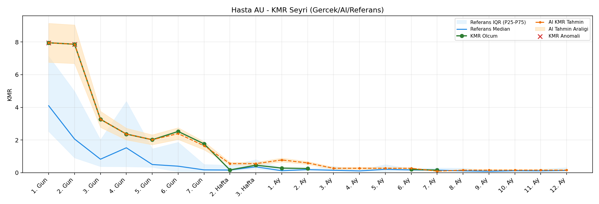
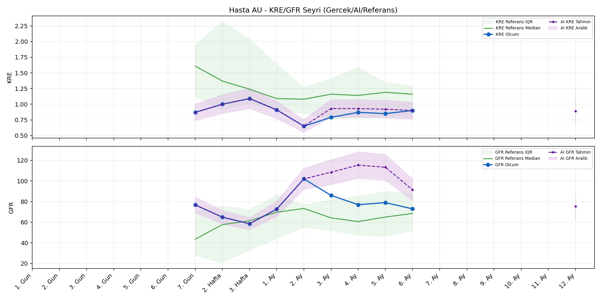
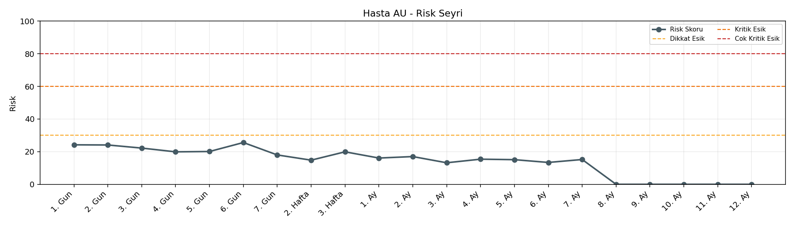

# Hasta AU

[Ana rapora don](../../Hasta_Raporları_Detay.md)

## Hasta Ozeti

| Alan | Deger |
|---|---|
| Yas | 52 |
| Cinsiyet | FEMALE |
| BMI | 26.6 |
| Vital Status | LIVING |
| Risk Skoru (Son) | 25.3 |
| Risk Seviyesi | Normal |
| Anomali Durumu | Var |
| Son KMR | 0.2529 (2. Ay) |
| Son KRE | 0.90 (6. Ay) |
| Son GFR | 73.0 (6. Ay) |

## Grafikler

## IQR ve Median Ozeti

| Metrik | Hasta (Median / IQR) | Referans (Median / IQR) | Son Olcum Zamani |
|---|---|---|---|
| KMR | 2.014 / 2.527 | 0.364 / 0.137 | 2. Ay |
| KRE | 0.870 / 0.060 | 1.170 / 0.770 | 6. Ay |
| GFR | 76.800 / 6.300 | 59.800 / 29.600 | 6. Ay |

## AI Performans (Hasta Bazli)

| Metrik | Eval Nokta | MAE | RMSE | MAPE | Aralik Kapsama | Son Hata |
|---|---:|---:|---:|---:|---:|---:|
| KMR | 6 | 0.2897 | 0.4100 | %97.47 | %33.3 | 0.7330 |
| KRE | 4 | 0.142 | 0.155 | %17.07 | %75.0 | 0.050 |
| GFR | 4 | 9.82 | 11.27 | %12.83 | %25.0 | 10.90 |

## Zaman Serisi Detay Tablosu

| Zaman | KMR | AI KMR | Durum | KRE | AI KRE | Durum | GFR | AI GFR | Durum | Risk | Seviye | Anomali |
|---|---:|---:|---|---:|---:|---|---:|---:|---|---:|---|---|
| 1. Gun | 7.9520 | 7.9520 | Olcum Kopyasi | - | - | Uygulanmaz | - | - | Uygulanmaz | 23.6 | Normal | KMR |
| 2. Gun | 7.8654 | 7.8654 | Olcum Kopyasi | - | - | Uygulanmaz | - | - | Uygulanmaz | 23.5 | Normal | KMR |
| 3. Gun | 3.2688 | 3.2688 | Olcum Kopyasi | - | - | Uygulanmaz | - | - | Uygulanmaz | 21.7 | Normal | - |
| 4. Gun | 2.3638 | 2.3638 | Olcum Kopyasi | - | - | Uygulanmaz | - | - | Uygulanmaz | 20.1 | Normal | - |
| 5. Gun | 2.0143 | 2.0143 | Olcum Kopyasi | - | - | Uygulanmaz | - | - | Uygulanmaz | 20.5 | Normal | - |
| 6. Gun | 2.5226 | 2.4725 | Model | - | - | Uygulanmaz | - | - | Uygulanmaz | 25.3 | Normal | - |
| 7. Gun | 1.7632 | 1.9152 | Model | 0.87 | 0.87 | Olcum Kopyasi | 76.8 | 76.8 | Olcum Kopyasi | 18.3 | Normal | - |
| 2. Hafta | 0.1658 | 0.2111 | Model | 1.00 | 1.00 | Olcum Kopyasi | 64.9 | 64.9 | Olcum Kopyasi | 14.6 | Normal | - |
| 3. Hafta | 0.4567 | 0.3575 | Model | 1.09 | 1.09 | Olcum Kopyasi | 58.5 | 58.5 | Olcum Kopyasi | 20.2 | Normal | - |
| 1. Ay | 0.2799 | 0.9386 | Model | 0.91 | 0.91 | Olcum Kopyasi | 72.7 | 72.7 | Olcum Kopyasi | 16.6 | Normal | - |
| 2. Ay | 0.2529 | 0.9859 | Model | 0.65 | 0.65 | Olcum Kopyasi | 102.0 | 102.0 | Olcum Kopyasi | 17.9 | Normal | - |
| 3. Ay | - | 0.6771 | Ongoru | 0.79 | 1.01 | Model | 86.0 | 86.6 | Model | 13.2 | Normal | - |
| 4. Ay | - | 0.6771 | Ongoru | 0.87 | 1.02 | Model | 77.0 | 92.1 | Model | 15.4 | Normal | - |
| 5. Ay | - | 0.6771 | Ongoru | 0.85 | 1.00 | Model | 79.0 | 91.7 | Model | 15.1 | Normal | - |
| 6. Ay | - | 0.6771 | Ongoru | 0.90 | 0.95 | Model | 73.0 | 83.9 | Model | 17.0 | Normal | - |
| 7. Ay | - | 0.6771 | Ongoru | - | - | Uygulanmaz | - | - | Uygulanmaz | 0.0 | Normal | - |
| 8. Ay | - | 0.6771 | Ongoru | - | - | Uygulanmaz | - | - | Uygulanmaz | 0.0 | Normal | - |
| 9. Ay | - | 0.6771 | Ongoru | - | - | Uygulanmaz | - | - | Uygulanmaz | 0.0 | Normal | - |
| 10. Ay | - | 0.6771 | Ongoru | - | - | Uygulanmaz | - | - | Uygulanmaz | 0.0 | Normal | - |
| 11. Ay | - | 0.6771 | Ongoru | - | - | Uygulanmaz | - | - | Uygulanmaz | 0.0 | Normal | - |
| 12. Ay | - | 0.6771 | Ongoru | - | 0.90 | Ongoru | - | 73.7 | Ongoru | 0.0 | Normal | - |

> Not: Bu dosya `python3 backend/run_all.py` ile otomatik uretilir.
