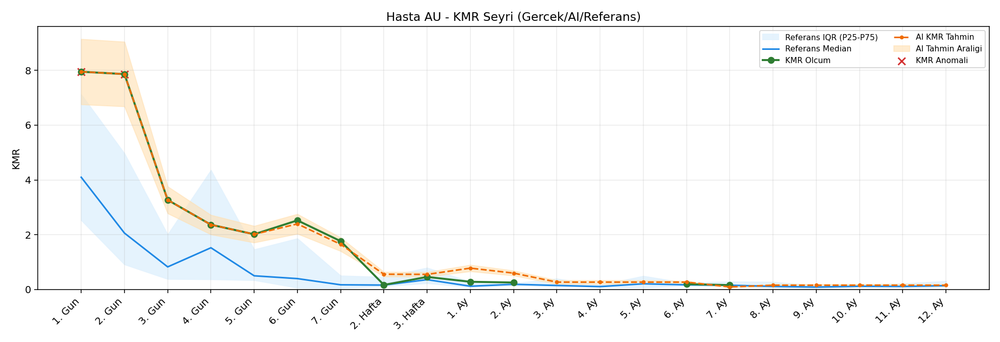
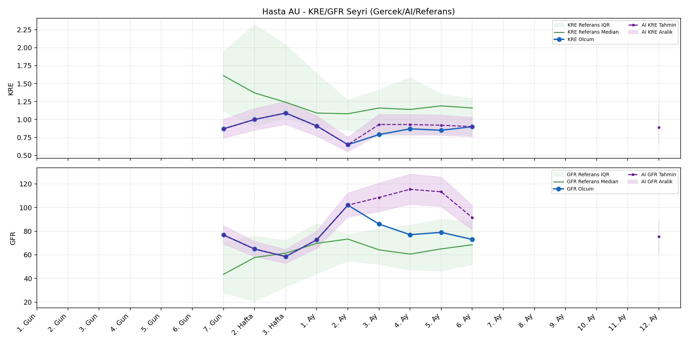
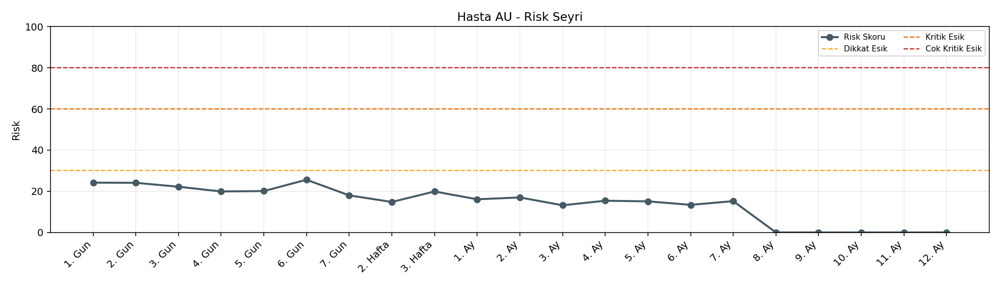

# Hasta AU

[Ana rapora don](../../Hasta_Raporları_Detay.md)

## Hasta Ozeti

| Alan | Deger |
|---|---|
| Yas | 52 |
| Cinsiyet | FEMALE |
| BMI | 26.6 |
| Vital Status | LIVING |
| Risk Skoru (Son) | 25.6 |
| Risk Seviyesi | Normal |
| Anomali Durumu | Var |
| Son KMR | 0.1580 (7. Ay) |
| Son KRE | 0.90 (6. Ay) |
| Son GFR | 73.0 (6. Ay) |

## Grafikler

## IQR ve Median Ozeti

| Metrik | Hasta (Median / IQR) | Referans (Median / IQR) | Son Olcum Zamani |
|---|---|---|---|
| KMR | 1.763 / 2.270 | 0.154 / 0.171 | 7. Ay |
| KRE | 0.870 / 0.060 | 1.160 / 0.510 | 6. Ay |
| GFR | 76.800 / 6.300 | 68.500 / 36.400 | 6. Ay |

## AI Performans (Hasta Bazli)

| Metrik | Eval Nokta | MAE | RMSE | MAPE | Aralik Kapsama | Son Hata |
|---|---:|---:|---:|---:|---:|---:|
| KMR | 8 | 0.2134 | 0.2659 | %82.46 | %25.0 | -0.0664 |
| KRE | 4 | 0.068 | 0.084 | %8.21 | %100.0 | 0.000 |
| GFR | 4 | 28.43 | 29.58 | %36.20 | %0.0 | 18.50 |

## Zaman Serisi Detay Tablosu

| Zaman | KMR | AI KMR | Durum | KRE | AI KRE | Durum | GFR | AI GFR | Durum | Risk | Seviye | Anomali |
|---|---:|---:|---|---:|---:|---|---:|---:|---|---:|---|---|
| 1. Gun | 7.9520 | 7.9520 | Olcum Kopyasi | - | - | Uygulanmaz | - | - | Uygulanmaz | 24.2 | Normal | KMR |
| 2. Gun | 7.8654 | 7.8654 | Olcum Kopyasi | - | - | Uygulanmaz | - | - | Uygulanmaz | 24.1 | Normal | KMR |
| 3. Gun | 3.2688 | 3.2688 | Olcum Kopyasi | - | - | Uygulanmaz | - | - | Uygulanmaz | 22.2 | Normal | - |
| 4. Gun | 2.3638 | 2.3638 | Olcum Kopyasi | - | - | Uygulanmaz | - | - | Uygulanmaz | 19.9 | Normal | - |
| 5. Gun | 2.0143 | 2.0143 | Olcum Kopyasi | - | - | Uygulanmaz | - | - | Uygulanmaz | 20.1 | Normal | - |
| 6. Gun | 2.5226 | 2.3937 | Model | - | - | Uygulanmaz | - | - | Uygulanmaz | 25.6 | Normal | - |
| 7. Gun | 1.7632 | 1.6476 | Model | 0.87 | 0.87 | Olcum Kopyasi | 76.8 | 76.8 | Olcum Kopyasi | 18.0 | Normal | - |
| 2. Hafta | 0.1658 | 0.5554 | Model | 1.00 | 1.00 | Olcum Kopyasi | 64.9 | 64.9 | Olcum Kopyasi | 14.8 | Normal | - |
| 3. Hafta | 0.4567 | 0.5498 | Model | 1.09 | 1.09 | Olcum Kopyasi | 58.5 | 58.5 | Olcum Kopyasi | 19.9 | Normal | - |
| 1. Ay | 0.2799 | 0.7779 | Model | 0.91 | 0.91 | Olcum Kopyasi | 72.7 | 72.7 | Olcum Kopyasi | 16.1 | Normal | - |
| 2. Ay | 0.2529 | 0.5958 | Model | 0.65 | 0.65 | Olcum Kopyasi | 102.0 | 102.0 | Olcum Kopyasi | 17.0 | Normal | - |
| 3. Ay | - | 0.2673 | Ongoru | 0.79 | 0.93 | Model | 86.0 | 108.5 | Model | 13.2 | Normal | - |
| 4. Ay | - | 0.2673 | Ongoru | 0.87 | 0.93 | Model | 77.0 | 115.4 | Model | 15.4 | Normal | - |
| 5. Ay | - | 0.2673 | Ongoru | 0.85 | 0.92 | Model | 79.0 | 113.3 | Model | 15.1 | Normal | - |
| 6. Ay | 0.1949 | 0.2673 | Model | 0.90 | 0.90 | Model | 73.0 | 91.5 | Model | 13.4 | Normal | - |
| 7. Ay | 0.1580 | 0.0916 | Model | - | - | Uygulanmaz | - | - | Uygulanmaz | 15.2 | Normal | - |
| 8. Ay | - | 0.1538 | Ongoru | - | - | Uygulanmaz | - | - | Uygulanmaz | 0.0 | Normal | - |
| 9. Ay | - | 0.1538 | Ongoru | - | - | Uygulanmaz | - | - | Uygulanmaz | 0.0 | Normal | - |
| 10. Ay | - | 0.1538 | Ongoru | - | - | Uygulanmaz | - | - | Uygulanmaz | 0.0 | Normal | - |
| 11. Ay | - | 0.1538 | Ongoru | - | - | Uygulanmaz | - | - | Uygulanmaz | 0.0 | Normal | - |
| 12. Ay | - | 0.1538 | Ongoru | - | 0.89 | Ongoru | - | 75.5 | Ongoru | 0.0 | Normal | - |

> Not: Bu dosya `python3 backend/run_all.py` ile otomatik uretilir.
