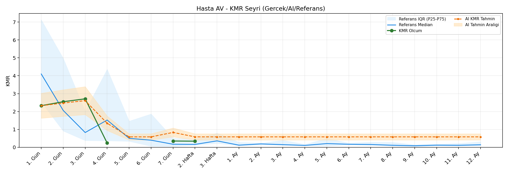
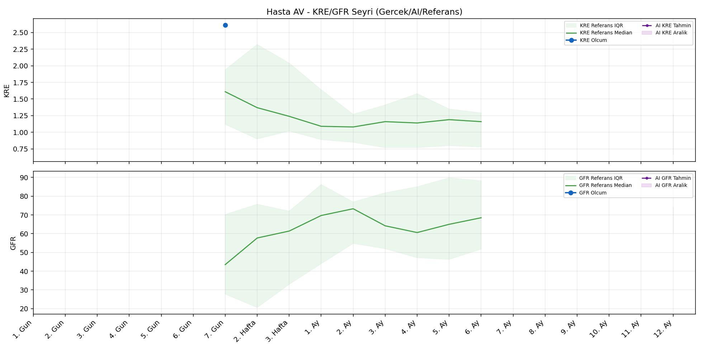
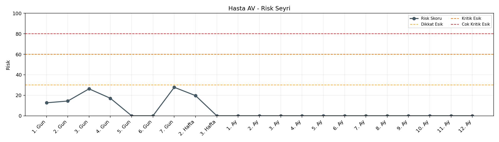

# Hasta AV

[Ana rapora don](../../Hasta_Raporları_Detay.md)

## Hasta Ozeti

| Alan | Deger |
|---|---|
| Yas | 13 |
| Cinsiyet | FEMALE |
| BMI | 20.5 |
| Vital Status | LIVING |
| Risk Skoru (Son) | 27.8 |
| Risk Seviyesi | Normal |
| Anomali Durumu | Yok |
| Son KMR | 0.3399 (2. Hafta) |
| Son KRE | 2.61 (7. Gun) |
| Son GFR | - (-) |

## Grafikler

## IQR ve Median Ozeti

| Metrik | Hasta (Median / IQR) | Referans (Median / IQR) | Son Olcum Zamani |
|---|---|---|---|
| KMR | 1.337 / 2.149 | 0.134 / 0.104 | 2. Hafta |
| KRE | 2.610 / 0.000 | 1.620 / 1.780 | 7. Gun |
| GFR | - / - | - / - | - |

## AI Performans (Hasta Bazli)

| Metrik | Eval Nokta | MAE | RMSE | MAPE | Aralik Kapsama | Son Hata |
|---|---:|---:|---:|---:|---:|---:|
| KMR | 0 | - | - | - | %0.0 | - |
| KRE | 0 | - | - | - | %0.0 | - |
| GFR | 0 | - | - | - | %0.0 | - |

## Zaman Serisi Detay Tablosu

| Zaman | KMR | AI KMR | Durum | KRE | AI KRE | Durum | GFR | AI GFR | Durum | Risk | Seviye | Anomali |
|---|---:|---:|---|---:|---:|---|---:|---:|---|---:|---|---|
| 1. Gun | 2.3244 | 2.3244 | EWMA Yedek | - | - | Uygulanmaz | - | - | Uygulanmaz | 12.7 | Normal | - |
| 2. Gun | 2.5464 | 2.4724 | EWMA Yedek | - | - | Uygulanmaz | - | - | Uygulanmaz | 14.4 | Normal | - |
| 3. Gun | 2.7081 | 2.6071 | EWMA Yedek | - | - | Uygulanmaz | - | - | Uygulanmaz | 26.3 | Normal | - |
| 4. Gun | 0.2365 | 1.3428 | EWMA Yedek | - | - | Uygulanmaz | - | - | Uygulanmaz | 17.1 | Normal | - |
| 5. Gun | - | 0.5811 | Yedek Ongoru | - | - | Uygulanmaz | - | - | Uygulanmaz | 0.0 | Normal | - |
| 6. Gun | - | 0.5811 | Yedek Ongoru | - | - | Uygulanmaz | - | - | Uygulanmaz | 0.0 | Normal | - |
| 7. Gun | 0.3496 | 0.8302 | EWMA Yedek | 2.61 | - | Yetersiz Veri | - | - | Yetersiz Veri | 27.8 | Normal | - |
| 2. Hafta | 0.3399 | 0.5811 | EWMA Yedek | - | - | Yetersiz Veri | - | - | Yetersiz Veri | 19.7 | Normal | - |
| 3. Hafta | - | 0.5811 | Yedek Ongoru | - | - | Yetersiz Veri | - | - | Yetersiz Veri | 0.0 | Normal | - |
| 1. Ay | - | 0.5811 | Yedek Ongoru | - | - | Yetersiz Veri | - | - | Yetersiz Veri | 0.0 | Normal | - |
| 2. Ay | - | 0.5811 | Yedek Ongoru | - | - | Yetersiz Veri | - | - | Yetersiz Veri | 0.0 | Normal | - |
| 3. Ay | - | 0.5811 | Yedek Ongoru | - | - | Yetersiz Veri | - | - | Yetersiz Veri | 0.0 | Normal | - |
| 4. Ay | - | 0.5811 | Yedek Ongoru | - | - | Yetersiz Veri | - | - | Yetersiz Veri | 0.0 | Normal | - |
| 5. Ay | - | 0.5811 | Yedek Ongoru | - | - | Yetersiz Veri | - | - | Yetersiz Veri | 0.0 | Normal | - |
| 6. Ay | - | 0.5811 | Yedek Ongoru | - | - | Yetersiz Veri | - | - | Yetersiz Veri | 0.0 | Normal | - |
| 7. Ay | - | 0.5811 | Yedek Ongoru | - | - | Uygulanmaz | - | - | Uygulanmaz | 0.0 | Normal | - |
| 8. Ay | - | 0.5811 | Yedek Ongoru | - | - | Uygulanmaz | - | - | Uygulanmaz | 0.0 | Normal | - |
| 9. Ay | - | 0.5811 | Yedek Ongoru | - | - | Uygulanmaz | - | - | Uygulanmaz | 0.0 | Normal | - |
| 10. Ay | - | 0.5811 | Yedek Ongoru | - | - | Uygulanmaz | - | - | Uygulanmaz | 0.0 | Normal | - |
| 11. Ay | - | 0.5811 | Yedek Ongoru | - | - | Uygulanmaz | - | - | Uygulanmaz | 0.0 | Normal | - |
| 12. Ay | - | 0.5811 | Yedek Ongoru | - | - | Yetersiz Veri | - | - | Yetersiz Veri | 0.0 | Normal | - |

> Not: Bu dosya `python3 backend/run_all.py` ile otomatik uretilir.
