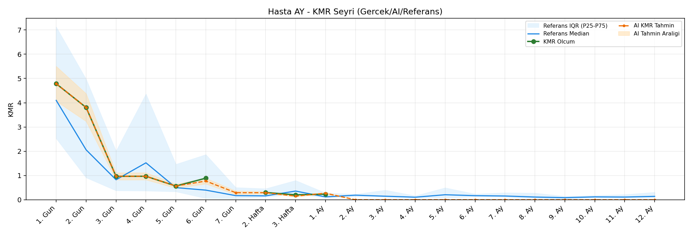
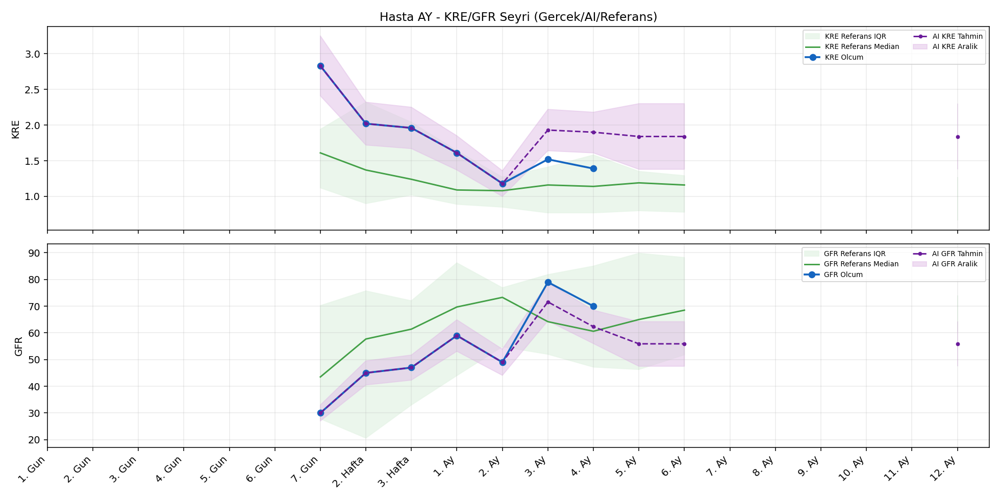

# Hasta AY

[Ana rapora don](../../Hasta_Raporları_Detay.md)

## Hasta Ozeti

| Alan | Deger |
|---|---|
| Yas | 23 |
| Cinsiyet | MALE |
| BMI | - |
| Vital Status | LIVING |
| Risk Skoru (Son) | 51.7 |
| Risk Seviyesi | Dikkat |
| Anomali Durumu | Yok |
| Son KMR | 0.2296 (1. Ay) |
| Son KRE | 1.39 (4. Ay) |
| Son GFR | 70.0 (4. Ay) |

## Grafikler

## IQR ve Median Ozeti

| Metrik | Hasta (Median / IQR) | Referans (Median / IQR) | Son Olcum Zamani |
|---|---|---|---|
| KMR | 0.889 / 0.669 | 0.198 / 0.131 | 1. Ay |
| KRE | 1.610 / 0.535 | 1.100 / 0.740 | 4. Ay |
| GFR | 49.000 / 18.500 | 56.000 / 36.100 | 4. Ay |

## AI Performans (Hasta Bazli)

| Metrik | Eval Nokta | MAE | RMSE | MAPE | Aralik Kapsama | Son Hata |
|---|---:|---:|---:|---:|---:|---:|
| KMR | 4 | 0.2811 | 0.3387 | %101.16 | %0.0 | 0.5863 |
| KRE | 2 | 0.250 | 0.269 | %17.52 | %50.0 | 0.350 |
| GFR | 2 | 10.05 | 10.50 | %13.29 | %50.0 | 7.00 |

## Zaman Serisi Detay Tablosu

| Zaman | KMR | AI KMR | Durum | KRE | AI KRE | Durum | GFR | AI GFR | Durum | Risk | Seviye | Anomali |
|---|---:|---:|---|---:|---:|---|---:|---:|---|---:|---|---|
| 1. Gun | 4.7837 | 4.7837 | Olcum Kopyasi | - | - | Uygulanmaz | - | - | Uygulanmaz | 21.4 | Normal | - |
| 2. Gun | 3.8039 | 3.8039 | Olcum Kopyasi | - | - | Uygulanmaz | - | - | Uygulanmaz | 18.8 | Normal | - |
| 3. Gun | 0.9662 | 0.9662 | Olcum Kopyasi | - | - | Uygulanmaz | - | - | Uygulanmaz | 14.3 | Normal | - |
| 4. Gun | 0.9679 | 0.9679 | Olcum Kopyasi | - | - | Uygulanmaz | - | - | Uygulanmaz | 18.4 | Normal | - |
| 5. Gun | 0.5644 | 0.5644 | Olcum Kopyasi | - | - | Uygulanmaz | - | - | Uygulanmaz | 16.4 | Normal | - |
| 6. Gun | 0.8895 | 1.0831 | Model | - | - | Uygulanmaz | - | - | Uygulanmaz | 22.1 | Normal | - |
| 7. Gun | - | 0.0306 | Ongoru | 2.83 | 2.83 | Olcum Kopyasi | 30.0 | 30.0 | Olcum Kopyasi | 51.7 | Dikkat | - |
| 2. Hafta | 0.2985 | 0.0306 | Model | 2.02 | 2.02 | Olcum Kopyasi | 45.0 | 45.0 | Olcum Kopyasi | 20.4 | Normal | - |
| 3. Hafta | 0.2026 | 0.1261 | Model | 1.96 | 1.96 | Olcum Kopyasi | 47.0 | 47.0 | Olcum Kopyasi | 18.3 | Normal | - |
| 1. Ay | 0.2296 | 0.8159 | Model | 1.61 | 1.61 | Olcum Kopyasi | 59.0 | 59.0 | Olcum Kopyasi | 20.4 | Normal | - |
| 2. Ay | - | 0.0000 | Ongoru | 1.18 | 1.18 | Olcum Kopyasi | 49.0 | 49.0 | Olcum Kopyasi | 23.4 | Normal | - |
| 3. Ay | - | 0.0000 | Ongoru | 1.52 | 1.67 | Model | 79.0 | 92.1 | Model | 17.5 | Normal | - |
| 4. Ay | - | 0.0000 | Ongoru | 1.39 | 1.74 | Model | 70.0 | 77.0 | Model | 19.5 | Normal | - |
| 5. Ay | - | 0.0000 | Ongoru | - | 1.84 | Ongoru | - | 60.6 | Ongoru | 0.0 | Normal | - |
| 6. Ay | - | 0.0000 | Ongoru | - | 1.84 | Ongoru | - | 60.6 | Ongoru | 0.0 | Normal | - |
| 7. Ay | - | 0.0000 | Ongoru | - | - | Uygulanmaz | - | - | Uygulanmaz | 0.0 | Normal | - |
| 8. Ay | - | 0.0000 | Ongoru | - | - | Uygulanmaz | - | - | Uygulanmaz | 0.0 | Normal | - |
| 9. Ay | - | 0.0000 | Ongoru | - | - | Uygulanmaz | - | - | Uygulanmaz | 0.0 | Normal | - |
| 10. Ay | - | 0.0000 | Ongoru | - | - | Uygulanmaz | - | - | Uygulanmaz | 0.0 | Normal | - |
| 11. Ay | - | 0.0000 | Ongoru | - | - | Uygulanmaz | - | - | Uygulanmaz | 0.0 | Normal | - |
| 12. Ay | - | 0.0000 | Ongoru | - | 1.84 | Ongoru | - | 60.6 | Ongoru | 0.0 | Normal | - |

> Not: Bu dosya `python3 backend/run_all.py` ile otomatik uretilir.
