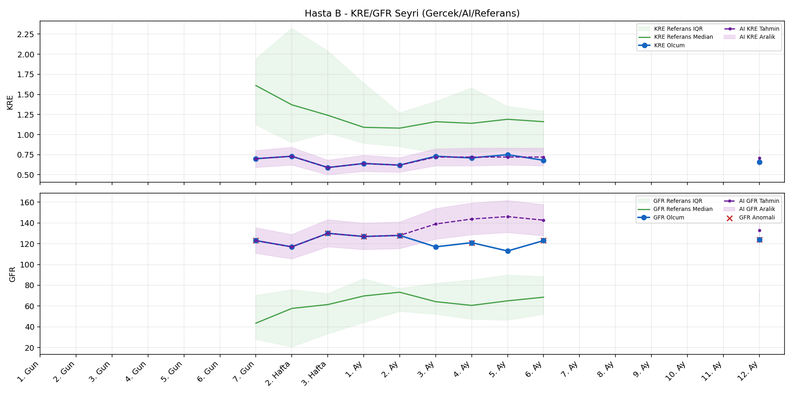
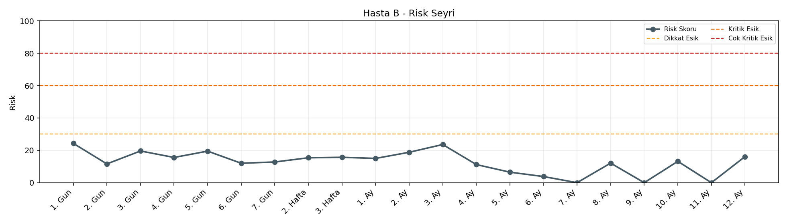

# Hasta B

[Ana rapora don](../../Hasta_Raporları_Detay.md)

## Hasta Ozeti

| Alan | Deger |
|---|---|
| Yas | 22 |
| Cinsiyet | FEMALE |
| BMI | 17.0 |
| Vital Status | LIVING |
| Risk Skoru (Son) | 24.3 |
| Risk Seviyesi | Normal |
| Anomali Durumu | Var |
| Son KMR | 0.4979 (12. Ay) |
| Son KRE | 0.66 (12. Ay) |
| Son GFR | 124.0 (12. Ay) |

## Grafikler

## IQR ve Median Ozeti

| Metrik | Hasta (Median / IQR) | Referans (Median / IQR) | Son Olcum Zamani |
|---|---|---|---|
| KMR | 0.335 / 0.375 | 0.227 / 0.318 | 12. Ay |
| KRE | 0.690 / 0.080 | 1.020 / 0.560 | 12. Ay |
| GFR | 123.000 / 8.250 | 64.000 / 15.000 | 12. Ay |

## AI Performans (Hasta Bazli)

| Metrik | Eval Nokta | MAE | RMSE | MAPE | Aralik Kapsama | Son Hata |
|---|---:|---:|---:|---:|---:|---:|
| KMR | 11 | 0.1794 | 0.2169 | %172.25 | %18.2 | -0.1229 |
| KRE | 5 | 0.026 | 0.031 | %3.75 | %100.0 | 0.050 |
| GFR | 5 | 5.62 | 6.91 | %4.81 | %100.0 | -3.30 |

## Zaman Serisi Detay Tablosu

| Zaman | KMR | AI KMR | Durum | KRE | AI KRE | Durum | GFR | AI GFR | Durum | Risk | Seviye | Anomali |
|---|---:|---:|---|---:|---:|---|---:|---:|---|---:|---|---|
| 1. Gun | 3.7469 | 3.7469 | Olcum Kopyasi | - | - | Uygulanmaz | - | - | Uygulanmaz | 24.3 | Normal | KMR |
| 2. Gun | 0.3399 | 0.3399 | Olcum Kopyasi | - | - | Uygulanmaz | - | - | Uygulanmaz | 11.6 | Normal | - |
| 3. Gun | 0.6330 | 0.6330 | Olcum Kopyasi | - | - | Uygulanmaz | - | - | Uygulanmaz | 19.6 | Normal | - |
| 4. Gun | 0.2891 | 0.2891 | Olcum Kopyasi | - | - | Uygulanmaz | - | - | Uygulanmaz | 15.6 | Normal | - |
| 5. Gun | 0.4395 | 0.4395 | Olcum Kopyasi | - | - | Uygulanmaz | - | - | Uygulanmaz | 19.5 | Normal | - |
| 6. Gun | 0.0169 | 0.2273 | Model | - | - | Uygulanmaz | - | - | Uygulanmaz | 12.0 | Normal | - |
| 7. Gun | 0.0622 | 0.2111 | Model | 0.70 | 0.70 | Olcum Kopyasi | 123.0 | 123.0 | Olcum Kopyasi | 12.8 | Normal | GFR |
| 2. Hafta | 0.1342 | 0.2204 | Model | 0.73 | 0.73 | Olcum Kopyasi | 117.0 | 117.0 | Olcum Kopyasi | 15.4 | Normal | - |
| 3. Hafta | 0.0907 | 0.3105 | Model | 0.59 | 0.59 | Olcum Kopyasi | 130.0 | 130.0 | Olcum Kopyasi | 15.7 | Normal | GFR |
| 1. Ay | 0.3293 | 0.3012 | Model | 0.64 | 0.64 | Olcum Kopyasi | 127.0 | 127.0 | Olcum Kopyasi | 15.0 | Normal | GFR |
| 2. Ay | 0.5004 | 0.2958 | Model | 0.62 | 0.62 | Olcum Kopyasi | 128.0 | 128.0 | Olcum Kopyasi | 18.8 | Normal | GFR |
| 3. Ay | 0.7529 | 0.3313 | Model | 0.73 | 0.71 | Model | 117.0 | 122.6 | Model | 23.6 | Normal | - |
| 4. Ay | 0.0358 | 0.4011 | Model | 0.71 | 0.71 | Model | 121.0 | 125.0 | Model | 11.2 | Normal | GFR |
| 5. Ay | - | 0.4067 | Ongoru | 0.75 | 0.72 | Model | 113.0 | 126.3 | Model | 6.5 | Normal | - |
| 6. Ay | - | 0.4067 | Ongoru | 0.68 | 0.71 | Model | 123.0 | 124.9 | Model | 3.8 | Normal | GFR |
| 7. Ay | - | 0.4067 | Ongoru | - | - | Uygulanmaz | - | - | Uygulanmaz | 0.0 | Normal | - |
| 8. Ay | 0.2442 | 0.4067 | Model | - | - | Uygulanmaz | - | - | Uygulanmaz | 12.1 | Normal | - |
| 9. Ay | - | 0.3900 | Ongoru | - | - | Uygulanmaz | - | - | Uygulanmaz | 0.0 | Normal | - |
| 10. Ay | 0.3931 | 0.3900 | Model | - | - | Uygulanmaz | - | - | Uygulanmaz | 13.2 | Normal | - |
| 11. Ay | - | 0.3750 | Ongoru | - | - | Uygulanmaz | - | - | Uygulanmaz | 0.0 | Normal | - |
| 12. Ay | 0.4979 | 0.3750 | Model | 0.66 | 0.71 | Model | 124.0 | 120.7 | Model | 16.1 | Normal | GFR |

> Not: Bu dosya `python3 backend/run_all.py` ile otomatik uretilir.
