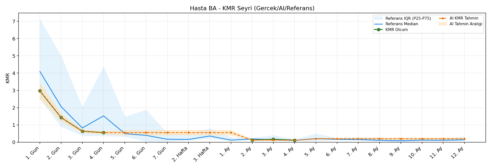
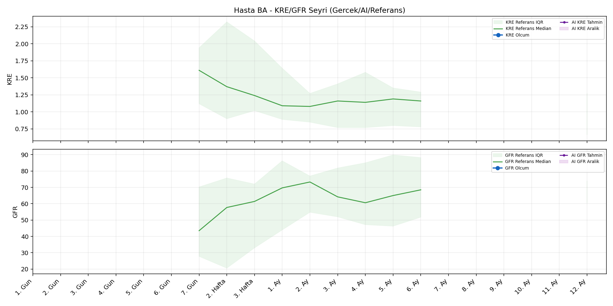
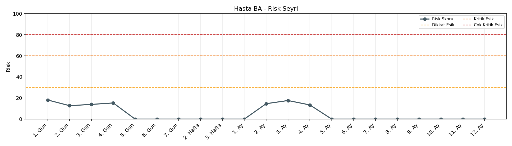

# Hasta BA

[Ana rapora don](../../Hasta_Raporları_Detay.md)

## Hasta Ozeti

| Alan | Deger |
|---|---|
| Yas | None |
| Cinsiyet | MALE |
| BMI | - |
| Vital Status | None |
| Risk Skoru (Son) | 18.1 |
| Risk Seviyesi | Normal |
| Anomali Durumu | Yok |
| Son KMR | 0.1180 (4. Ay) |
| Son KRE | - (-) |
| Son GFR | - (-) |

## Grafikler

## IQR ve Median Ozeti

| Metrik | Hasta (Median / IQR) | Referans (Median / IQR) | Son Olcum Zamani |
|---|---|---|---|
| KMR | 0.554 / 0.883 | 0.104 / 0.064 | 4. Ay |
| KRE | - / - | - / - | - |
| GFR | - / - | - / - | - |

## AI Performans (Hasta Bazli)

| Metrik | Eval Nokta | MAE | RMSE | MAPE | Aralik Kapsama | Son Hata |
|---|---:|---:|---:|---:|---:|---:|
| KMR | 2 | 0.0275 | 0.0352 | %16.90 | %50.0 | -0.0055 |
| KRE | 0 | - | - | - | %0.0 | - |
| GFR | 0 | - | - | - | %0.0 | - |

## Zaman Serisi Detay Tablosu

| Zaman | KMR | AI KMR | Durum | KRE | AI KRE | Durum | GFR | AI GFR | Durum | Risk | Seviye | Anomali |
|---|---:|---:|---|---:|---:|---|---:|---:|---|---:|---|---|
| 1. Gun | 2.9731 | 2.9731 | Olcum Kopyasi | - | - | Uygulanmaz | - | - | Uygulanmaz | 18.1 | Normal | - |
| 2. Gun | 1.4248 | 1.4248 | Olcum Kopyasi | - | - | Uygulanmaz | - | - | Uygulanmaz | 12.7 | Normal | - |
| 3. Gun | 0.6365 | 0.6365 | Olcum Kopyasi | - | - | Uygulanmaz | - | - | Uygulanmaz | 13.9 | Normal | - |
| 4. Gun | 0.5540 | 0.5540 | Olcum Kopyasi | - | - | Uygulanmaz | - | - | Uygulanmaz | 15.3 | Normal | - |
| 5. Gun | - | 0.5540 | Ongoru | - | - | Uygulanmaz | - | - | Uygulanmaz | 0.0 | Normal | - |
| 6. Gun | - | 0.5540 | Ongoru | - | - | Uygulanmaz | - | - | Uygulanmaz | 0.0 | Normal | - |
| 7. Gun | - | 0.5540 | Ongoru | - | - | Yetersiz Veri | - | - | Yetersiz Veri | 0.0 | Normal | - |
| 2. Hafta | - | 0.5540 | Ongoru | - | - | Yetersiz Veri | - | - | Yetersiz Veri | 0.0 | Normal | - |
| 3. Hafta | - | 0.5540 | Ongoru | - | - | Yetersiz Veri | - | - | Yetersiz Veri | 0.0 | Normal | - |
| 1. Ay | - | 0.5540 | Ongoru | - | - | Yetersiz Veri | - | - | Yetersiz Veri | 0.0 | Normal | - |
| 2. Ay | 0.1260 | 0.1260 | Olcum Kopyasi | - | - | Yetersiz Veri | - | - | Yetersiz Veri | 14.6 | Normal | - |
| 3. Ay | 0.1699 | 0.1204 | Model | - | - | Yetersiz Veri | - | - | Yetersiz Veri | 17.6 | Normal | - |
| 4. Ay | 0.1180 | 0.1125 | Model | - | - | Yetersiz Veri | - | - | Yetersiz Veri | 13.4 | Normal | - |
| 5. Ay | - | 0.2000 | Ongoru | - | - | Yetersiz Veri | - | - | Yetersiz Veri | 0.0 | Normal | - |
| 6. Ay | - | 0.2000 | Ongoru | - | - | Yetersiz Veri | - | - | Yetersiz Veri | 0.0 | Normal | - |
| 7. Ay | - | 0.2000 | Ongoru | - | - | Uygulanmaz | - | - | Uygulanmaz | 0.0 | Normal | - |
| 8. Ay | - | 0.2000 | Ongoru | - | - | Uygulanmaz | - | - | Uygulanmaz | 0.0 | Normal | - |
| 9. Ay | - | 0.2000 | Ongoru | - | - | Uygulanmaz | - | - | Uygulanmaz | 0.0 | Normal | - |
| 10. Ay | - | 0.2000 | Ongoru | - | - | Uygulanmaz | - | - | Uygulanmaz | 0.0 | Normal | - |
| 11. Ay | - | 0.2000 | Ongoru | - | - | Uygulanmaz | - | - | Uygulanmaz | 0.0 | Normal | - |
| 12. Ay | - | 0.2000 | Ongoru | - | - | Yetersiz Veri | - | - | Yetersiz Veri | 0.0 | Normal | - |

> Not: Bu dosya `python3 backend/run_all.py` ile otomatik uretilir.
