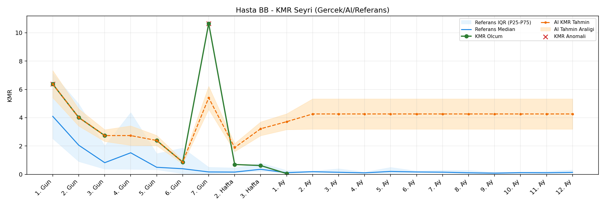
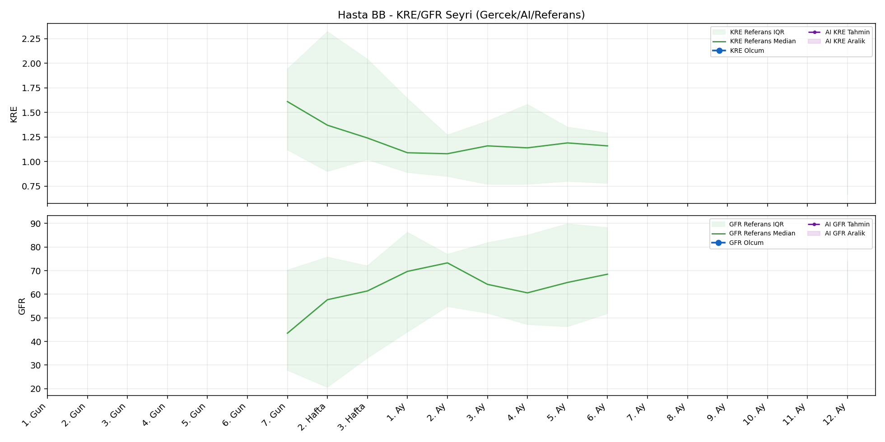
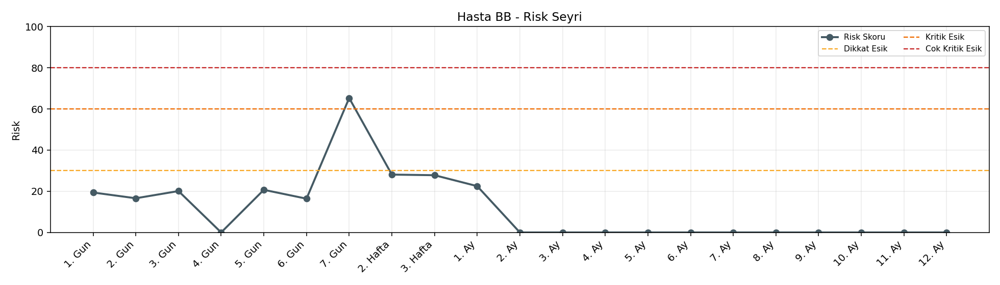

# Hasta BB

[Ana rapora don](../../Hasta_Raporları_Detay.md)

## Hasta Ozeti

| Alan | Deger |
|---|---|
| Yas | None |
| Cinsiyet | MALE |
| BMI | - |
| Vital Status | None |
| Risk Skoru (Son) | 65.3 |
| Risk Seviyesi | Kritik |
| Anomali Durumu | Var |
| Son KMR | 0.0529 (1. Ay) |
| Son KRE | - (-) |
| Son GFR | - (-) |

## Grafikler

## IQR ve Median Ozeti

| Metrik | Hasta (Median / IQR) | Referans (Median / IQR) | Son Olcum Zamani |
|---|---|---|---|
| KMR | 2.391 / 3.321 | 0.117 / 0.186 | 1. Ay |
| KRE | - / - | - / - | - |
| GFR | - / - | - / - | - |

## AI Performans (Hasta Bazli)

| Metrik | Eval Nokta | MAE | RMSE | MAPE | Aralik Kapsama | Son Hata |
|---|---:|---:|---:|---:|---:|---:|
| KMR | 4 | 3.1764 | 3.5050 | %1892.16 | %0.0 | 3.6662 |
| KRE | 0 | - | - | - | %0.0 | - |
| GFR | 0 | - | - | - | %0.0 | - |

## Zaman Serisi Detay Tablosu

| Zaman | KMR | AI KMR | Durum | KRE | AI KRE | Durum | GFR | AI GFR | Durum | Risk | Seviye | Anomali |
|---|---:|---:|---|---:|---:|---|---:|---:|---|---:|---|---|
| 1. Gun | 6.3729 | 6.3729 | Olcum Kopyasi | - | - | Uygulanmaz | - | - | Uygulanmaz | 19.4 | Normal | KMR |
| 2. Gun | 4.0166 | 4.0166 | Olcum Kopyasi | - | - | Uygulanmaz | - | - | Uygulanmaz | 16.6 | Normal | - |
| 3. Gun | 2.7392 | 2.7392 | Olcum Kopyasi | - | - | Uygulanmaz | - | - | Uygulanmaz | 20.1 | Normal | - |
| 4. Gun | - | 2.7392 | Ongoru | - | - | Uygulanmaz | - | - | Uygulanmaz | 0.0 | Normal | - |
| 5. Gun | 2.3912 | 2.3912 | Olcum Kopyasi | - | - | Uygulanmaz | - | - | Uygulanmaz | 20.7 | Normal | - |
| 6. Gun | 0.8680 | 0.8680 | Olcum Kopyasi | - | - | Uygulanmaz | - | - | Uygulanmaz | 16.4 | Normal | - |
| 7. Gun | 10.6523 | 5.4059 | Model | - | - | Yetersiz Veri | - | - | Yetersiz Veri | 65.3 | Kritik | KMR |
| 2. Hafta | 0.6958 | 1.8926 | Model | - | - | Yetersiz Veri | - | - | Yetersiz Veri | 28.1 | Normal | - |
| 3. Hafta | 0.6227 | 3.2191 | Model | - | - | Yetersiz Veri | - | - | Yetersiz Veri | 27.8 | Normal | - |
| 1. Ay | 0.0529 | 3.7191 | Model | - | - | Yetersiz Veri | - | - | Yetersiz Veri | 22.5 | Normal | - |
| 2. Ay | - | 4.2647 | Ongoru | - | - | Yetersiz Veri | - | - | Yetersiz Veri | 0.0 | Normal | - |
| 3. Ay | - | 4.2647 | Ongoru | - | - | Yetersiz Veri | - | - | Yetersiz Veri | 0.0 | Normal | - |
| 4. Ay | - | 4.2647 | Ongoru | - | - | Yetersiz Veri | - | - | Yetersiz Veri | 0.0 | Normal | - |
| 5. Ay | - | 4.2647 | Ongoru | - | - | Yetersiz Veri | - | - | Yetersiz Veri | 0.0 | Normal | - |
| 6. Ay | - | 4.2647 | Ongoru | - | - | Yetersiz Veri | - | - | Yetersiz Veri | 0.0 | Normal | - |
| 7. Ay | - | 4.2647 | Ongoru | - | - | Uygulanmaz | - | - | Uygulanmaz | 0.0 | Normal | - |
| 8. Ay | - | 4.2647 | Ongoru | - | - | Uygulanmaz | - | - | Uygulanmaz | 0.0 | Normal | - |
| 9. Ay | - | 4.2647 | Ongoru | - | - | Uygulanmaz | - | - | Uygulanmaz | 0.0 | Normal | - |
| 10. Ay | - | 4.2647 | Ongoru | - | - | Uygulanmaz | - | - | Uygulanmaz | 0.0 | Normal | - |
| 11. Ay | - | 4.2647 | Ongoru | - | - | Uygulanmaz | - | - | Uygulanmaz | 0.0 | Normal | - |
| 12. Ay | - | 4.2647 | Ongoru | - | - | Yetersiz Veri | - | - | Yetersiz Veri | 0.0 | Normal | - |

> Not: Bu dosya `python3 backend/run_all.py` ile otomatik uretilir.
