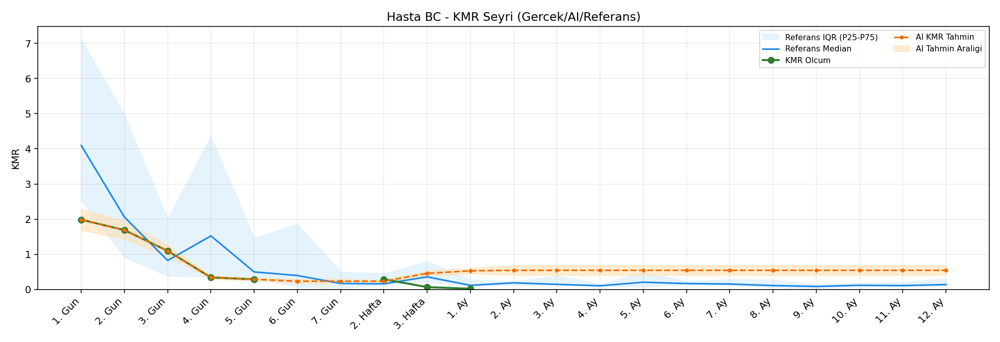
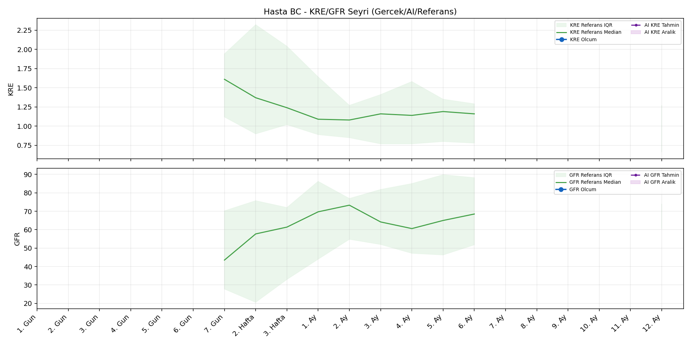
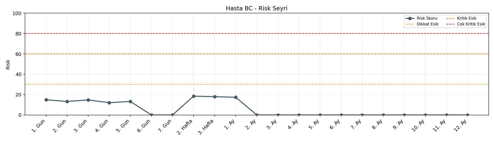

# Hasta BC

[Ana rapora don](../../Hasta_Raporları_Detay.md)

## Hasta Ozeti

| Alan | Deger |
|---|---|
| Yas | None |
| Cinsiyet | MALE |
| BMI | - |
| Vital Status | None |
| Risk Skoru (Son) | 18.5 |
| Risk Seviyesi | Normal |
| Anomali Durumu | Yok |
| Son KMR | 0.0198 (1. Ay) |
| Son KRE | - (-) |
| Son GFR | - (-) |

## Grafikler

## IQR ve Median Ozeti

| Metrik | Hasta (Median / IQR) | Referans (Median / IQR) | Son Olcum Zamani |
|---|---|---|---|
| KMR | 0.316 / 1.012 | 0.117 / 0.186 | 1. Ay |
| KRE | - / - | - / - | - |
| GFR | - / - | - / - | - |

## AI Performans (Hasta Bazli)

| Metrik | Eval Nokta | MAE | RMSE | MAPE | Aralik Kapsama | Son Hata |
|---|---:|---:|---:|---:|---:|---:|
| KMR | 3 | 0.3191 | 0.3725 | %543.74 | %0.0 | 0.5102 |
| KRE | 0 | - | - | - | %0.0 | - |
| GFR | 0 | - | - | - | %0.0 | - |

## Zaman Serisi Detay Tablosu

| Zaman | KMR | AI KMR | Durum | KRE | AI KRE | Durum | GFR | AI GFR | Durum | Risk | Seviye | Anomali |
|---|---:|---:|---|---:|---:|---|---:|---:|---|---:|---|---|
| 1. Gun | 1.9852 | 1.9852 | Olcum Kopyasi | - | - | Uygulanmaz | - | - | Uygulanmaz | 14.9 | Normal | - |
| 2. Gun | 1.6879 | 1.6879 | Olcum Kopyasi | - | - | Uygulanmaz | - | - | Uygulanmaz | 13.3 | Normal | - |
| 3. Gun | 1.0969 | 1.0969 | Olcum Kopyasi | - | - | Uygulanmaz | - | - | Uygulanmaz | 14.8 | Normal | - |
| 4. Gun | 0.3408 | 0.3408 | Olcum Kopyasi | - | - | Uygulanmaz | - | - | Uygulanmaz | 12.1 | Normal | - |
| 5. Gun | 0.2876 | 0.2876 | Olcum Kopyasi | - | - | Uygulanmaz | - | - | Uygulanmaz | 13.3 | Normal | - |
| 6. Gun | - | 0.2344 | Ongoru | - | - | Uygulanmaz | - | - | Uygulanmaz | 0.0 | Normal | - |
| 7. Gun | - | 0.2344 | Ongoru | - | - | Yetersiz Veri | - | - | Yetersiz Veri | 0.0 | Normal | - |
| 2. Hafta | 0.2904 | 0.2344 | Model | - | - | Yetersiz Veri | - | - | Yetersiz Veri | 18.5 | Normal | - |
| 3. Hafta | 0.0661 | 0.4571 | Model | - | - | Yetersiz Veri | - | - | Yetersiz Veri | 18.0 | Normal | - |
| 1. Ay | 0.0198 | 0.5300 | Model | - | - | Yetersiz Veri | - | - | Yetersiz Veri | 17.4 | Normal | - |
| 2. Ay | - | 0.5439 | Ongoru | - | - | Yetersiz Veri | - | - | Yetersiz Veri | 0.0 | Normal | - |
| 3. Ay | - | 0.5439 | Ongoru | - | - | Yetersiz Veri | - | - | Yetersiz Veri | 0.0 | Normal | - |
| 4. Ay | - | 0.5439 | Ongoru | - | - | Yetersiz Veri | - | - | Yetersiz Veri | 0.0 | Normal | - |
| 5. Ay | - | 0.5439 | Ongoru | - | - | Yetersiz Veri | - | - | Yetersiz Veri | 0.0 | Normal | - |
| 6. Ay | - | 0.5439 | Ongoru | - | - | Yetersiz Veri | - | - | Yetersiz Veri | 0.0 | Normal | - |
| 7. Ay | - | 0.5439 | Ongoru | - | - | Uygulanmaz | - | - | Uygulanmaz | 0.0 | Normal | - |
| 8. Ay | - | 0.5439 | Ongoru | - | - | Uygulanmaz | - | - | Uygulanmaz | 0.0 | Normal | - |
| 9. Ay | - | 0.5439 | Ongoru | - | - | Uygulanmaz | - | - | Uygulanmaz | 0.0 | Normal | - |
| 10. Ay | - | 0.5439 | Ongoru | - | - | Uygulanmaz | - | - | Uygulanmaz | 0.0 | Normal | - |
| 11. Ay | - | 0.5439 | Ongoru | - | - | Uygulanmaz | - | - | Uygulanmaz | 0.0 | Normal | - |
| 12. Ay | - | 0.5439 | Ongoru | - | - | Yetersiz Veri | - | - | Yetersiz Veri | 0.0 | Normal | - |

> Not: Bu dosya `python3 backend/run_all.py` ile otomatik uretilir.
