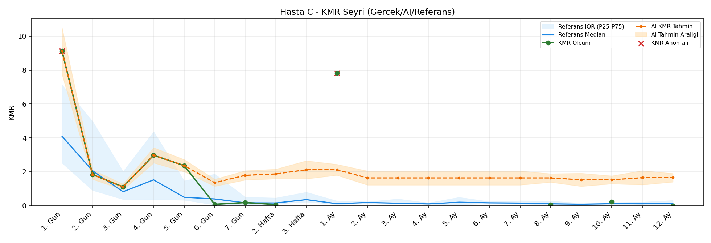
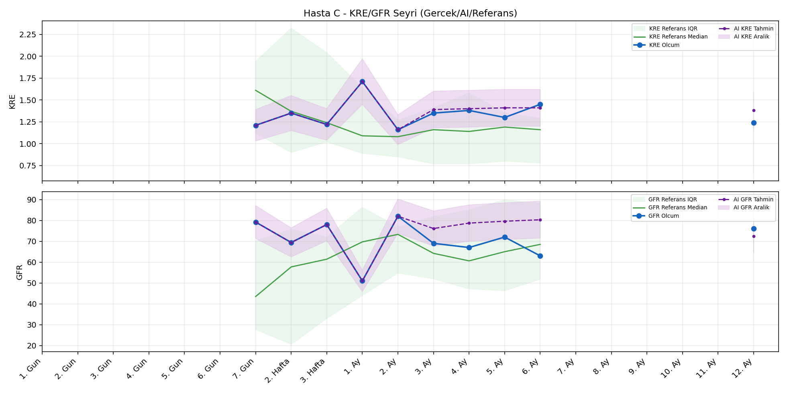
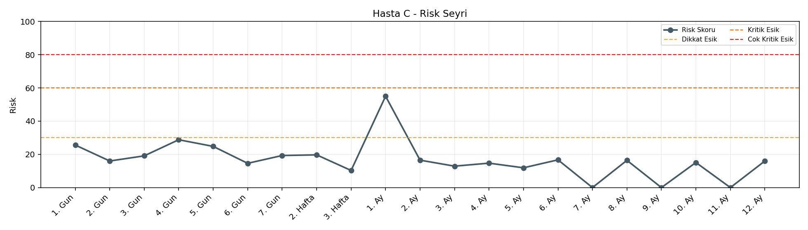

# Hasta C

[Ana rapora don](../../Hasta_Raporları_Detay.md)

## Hasta Ozeti

| Alan | Deger |
|---|---|
| Yas | 31 |
| Cinsiyet | MALE |
| BMI | 17.6 |
| Vital Status | LIVING |
| Risk Skoru (Son) | 55.0 |
| Risk Seviyesi | Dikkat |
| Anomali Durumu | Var |
| Son KMR | 0.0000 (12. Ay) |
| Son KRE | 1.24 (12. Ay) |
| Son GFR | 76.0 (12. Ay) |

## Grafikler

## IQR ve Median Ozeti

| Metrik | Hasta (Median / IQR) | Referans (Median / IQR) | Son Olcum Zamani |
|---|---|---|---|
| KMR | 0.674 / 2.437 | 0.227 / 0.318 | 12. Ay |
| KRE | 1.325 / 0.147 | 1.020 / 0.560 | 12. Ay |
| GFR | 70.700 / 10.000 | 64.000 / 15.000 | 12. Ay |

## AI Performans (Hasta Bazli)

| Metrik | Eval Nokta | MAE | RMSE | MAPE | Aralik Kapsama | Son Hata |
|---|---:|---:|---:|---:|---:|---:|
| KMR | 7 | 2.1281 | 2.5865 | %1661.64 | %0.0 | 1.6493 |
| KRE | 5 | 0.126 | 0.144 | %9.67 | %80.0 | 0.230 |
| GFR | 5 | 10.62 | 12.69 | %15.81 | %40.0 | 5.80 |

## Zaman Serisi Detay Tablosu

| Zaman | KMR | AI KMR | Durum | KRE | AI KRE | Durum | GFR | AI GFR | Durum | Risk | Seviye | Anomali |
|---|---:|---:|---|---:|---:|---|---:|---:|---|---:|---|---|
| 1. Gun | 9.1247 | 9.1247 | Olcum Kopyasi | - | - | Uygulanmaz | - | - | Uygulanmaz | 25.6 | Normal | KMR |
| 2. Gun | 1.8372 | 1.8372 | Olcum Kopyasi | - | - | Uygulanmaz | - | - | Uygulanmaz | 16.0 | Normal | - |
| 3. Gun | 1.1093 | 1.1093 | Olcum Kopyasi | - | - | Uygulanmaz | - | - | Uygulanmaz | 19.1 | Normal | - |
| 4. Gun | 2.9737 | 2.9737 | Olcum Kopyasi | - | - | Uygulanmaz | - | - | Uygulanmaz | 28.8 | Normal | - |
| 5. Gun | 2.3621 | 2.3621 | Olcum Kopyasi | - | - | Uygulanmaz | - | - | Uygulanmaz | 24.8 | Normal | - |
| 6. Gun | 0.0808 | 1.3529 | Model | - | - | Uygulanmaz | - | - | Uygulanmaz | 14.6 | Normal | - |
| 7. Gun | 0.1847 | 1.7898 | Model | 1.21 | 1.21 | Olcum Kopyasi | 79.2 | 79.2 | Olcum Kopyasi | 19.3 | Normal | - |
| 2. Hafta | 0.0677 | 1.8707 | Model | 1.35 | 1.35 | Olcum Kopyasi | 69.4 | 69.4 | Olcum Kopyasi | 19.7 | Normal | - |
| 3. Hafta | - | 2.1173 | Ongoru | 1.22 | 1.22 | Olcum Kopyasi | 78.0 | 78.0 | Olcum Kopyasi | 10.3 | Normal | - |
| 1. Ay | 7.8202 | 2.1173 | Model | 1.71 | 1.71 | Olcum Kopyasi | 51.0 | 51.0 | Olcum Kopyasi | 55.0 | Dikkat | KMR |
| 2. Ay | - | 1.6351 | Ongoru | 1.16 | 1.16 | Olcum Kopyasi | 82.0 | 82.0 | Olcum Kopyasi | 16.5 | Normal | - |
| 3. Ay | - | 1.6351 | Ongoru | 1.35 | 1.43 | Model | 69.0 | 70.8 | Model | 12.9 | Normal | - |
| 4. Ay | - | 1.6351 | Ongoru | 1.38 | 1.46 | Model | 67.0 | 78.5 | Model | 14.7 | Normal | - |
| 5. Ay | - | 1.6351 | Ongoru | 1.30 | 1.49 | Model | 72.0 | 83.6 | Model | 11.9 | Normal | - |
| 6. Ay | - | 1.6351 | Ongoru | 1.45 | 1.50 | Model | 63.0 | 85.4 | Model | 16.7 | Normal | - |
| 7. Ay | - | 1.6351 | Ongoru | - | - | Uygulanmaz | - | - | Uygulanmaz | 0.0 | Normal | - |
| 8. Ay | 0.0603 | 1.6351 | Model | - | - | Uygulanmaz | - | - | Uygulanmaz | 16.4 | Normal | - |
| 9. Ay | - | 1.5272 | Ongoru | - | - | Uygulanmaz | - | - | Uygulanmaz | 0.0 | Normal | - |
| 10. Ay | 0.2380 | 1.5272 | Model | - | - | Uygulanmaz | - | - | Uygulanmaz | 15.1 | Normal | - |
| 11. Ay | - | 1.6493 | Ongoru | - | - | Uygulanmaz | - | - | Uygulanmaz | 0.0 | Normal | - |
| 12. Ay | 0.0000 | 1.6493 | Model | 1.24 | 1.47 | Model | 76.0 | 81.8 | Model | 16.0 | Normal | - |

> Not: Bu dosya `python3 backend/run_all.py` ile otomatik uretilir.
