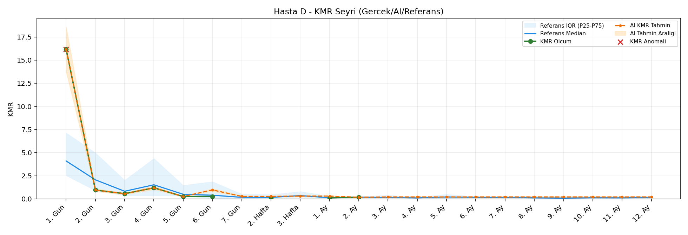
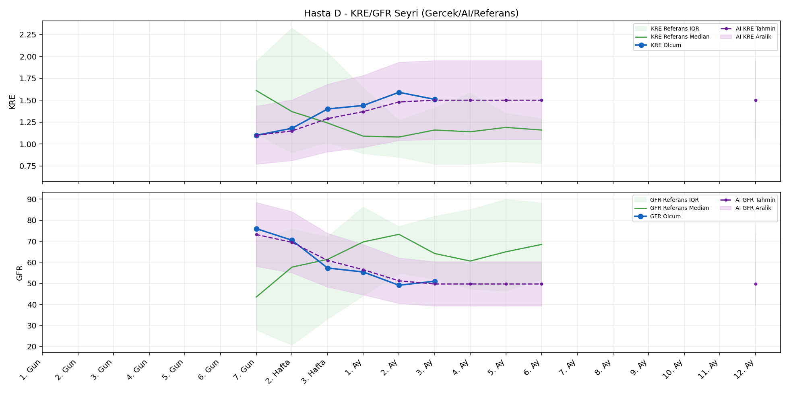
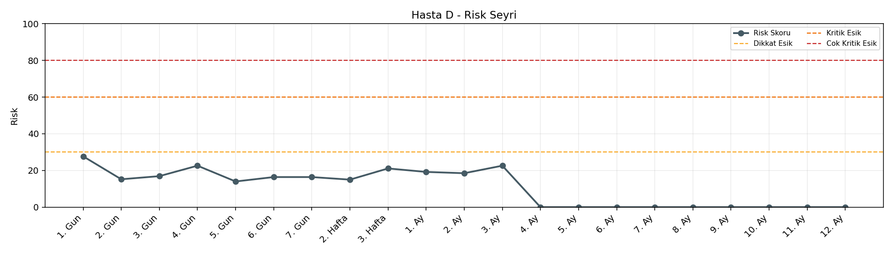

# Hasta D

[Ana rapora don](../../Hasta_Raporları_Detay.md)

## Hasta Ozeti

| Alan | Deger |
|---|---|
| Yas | 52 |
| Cinsiyet | MALE |
| BMI | 28.7 |
| Vital Status | LIVING |
| Risk Skoru (Son) | 27.7 |
| Risk Seviyesi | Normal |
| Anomali Durumu | Var |
| Son KMR | 0.1772 (2. Ay) |
| Son KRE | 1.51 (3. Ay) |
| Son GFR | 51.0 (3. Ay) |

## Grafikler

## IQR ve Median Ozeti

| Metrik | Hasta (Median / IQR) | Referans (Median / IQR) | Son Olcum Zamani |
|---|---|---|---|
| KMR | 0.270 / 0.777 | 0.364 / 0.137 | 2. Ay |
| KRE | 1.420 / 0.258 | 1.190 / 0.660 | 3. Ay |
| GFR | 56.350 / 15.100 | 62.100 / 22.300 | 3. Ay |

## AI Performans (Hasta Bazli)

| Metrik | Eval Nokta | MAE | RMSE | MAPE | Aralik Kapsama | Son Hata |
|---|---:|---:|---:|---:|---:|---:|
| KMR | 4 | 0.2671 | 0.3722 | %155.20 | %25.0 | 0.0011 |
| KRE | 0 | - | - | - | %0.0 | - |
| GFR | 0 | - | - | - | %0.0 | - |

## Zaman Serisi Detay Tablosu

| Zaman | KMR | AI KMR | Durum | KRE | AI KRE | Durum | GFR | AI GFR | Durum | Risk | Seviye | Anomali |
|---|---:|---:|---|---:|---:|---|---:|---:|---|---:|---|---|
| 1. Gun | 16.1642 | 16.1642 | Olcum Kopyasi | - | - | Uygulanmaz | - | - | Uygulanmaz | 27.7 | Normal | KMR |
| 2. Gun | 0.9546 | 0.9546 | Olcum Kopyasi | - | - | Uygulanmaz | - | - | Uygulanmaz | 15.2 | Normal | - |
| 3. Gun | 0.5632 | 0.5632 | Olcum Kopyasi | - | - | Uygulanmaz | - | - | Uygulanmaz | 16.9 | Normal | - |
| 4. Gun | 1.1939 | 1.1939 | Olcum Kopyasi | - | - | Uygulanmaz | - | - | Uygulanmaz | 22.6 | Normal | - |
| 5. Gun | 0.2559 | 0.2559 | Olcum Kopyasi | - | - | Uygulanmaz | - | - | Uygulanmaz | 14.0 | Normal | - |
| 6. Gun | 0.2698 | 0.9665 | Model | - | - | Uygulanmaz | - | - | Uygulanmaz | 16.4 | Normal | - |
| 7. Gun | - | 0.2740 | Ongoru | 1.10 | 1.10 | EWMA Yedek | 76.0 | 73.2 | EWMA Yedek | 16.4 | Normal | - |
| 2. Hafta | 0.0942 | 0.2740 | Model | 1.18 | 1.15 | EWMA Yedek | 70.5 | 69.5 | EWMA Yedek | 15.0 | Normal | - |
| 3. Hafta | - | 0.3020 | Ongoru | 1.40 | 1.29 | EWMA Yedek | 57.3 | 60.9 | EWMA Yedek | 21.1 | Normal | - |
| 1. Ay | 0.1114 | 0.3020 | Model | 1.44 | 1.37 | EWMA Yedek | 55.4 | 56.5 | EWMA Yedek | 19.2 | Normal | - |
| 2. Ay | 0.1772 | 0.1783 | Model | 1.59 | 1.48 | EWMA Yedek | 49.1 | 51.2 | EWMA Yedek | 18.5 | Normal | - |
| 3. Ay | - | 0.2084 | Ongoru | 1.51 | 1.50 | EWMA Yedek | 51.0 | 49.7 | EWMA Yedek | 22.6 | Normal | - |
| 4. Ay | - | 0.2084 | Ongoru | - | 1.50 | Yedek Ongoru | - | 49.7 | Yedek Ongoru | 0.0 | Normal | - |
| 5. Ay | - | 0.2084 | Ongoru | - | 1.50 | Yedek Ongoru | - | 49.7 | Yedek Ongoru | 0.0 | Normal | - |
| 6. Ay | - | 0.2084 | Ongoru | - | 1.50 | Yedek Ongoru | - | 49.7 | Yedek Ongoru | 0.0 | Normal | - |
| 7. Ay | - | 0.2084 | Ongoru | - | - | Uygulanmaz | - | - | Uygulanmaz | 0.0 | Normal | - |
| 8. Ay | - | 0.2084 | Ongoru | - | - | Uygulanmaz | - | - | Uygulanmaz | 0.0 | Normal | - |
| 9. Ay | - | 0.2084 | Ongoru | - | - | Uygulanmaz | - | - | Uygulanmaz | 0.0 | Normal | - |
| 10. Ay | - | 0.2084 | Ongoru | - | - | Uygulanmaz | - | - | Uygulanmaz | 0.0 | Normal | - |
| 11. Ay | - | 0.2084 | Ongoru | - | - | Uygulanmaz | - | - | Uygulanmaz | 0.0 | Normal | - |
| 12. Ay | - | 0.2084 | Ongoru | - | 1.50 | Yedek Ongoru | - | 49.7 | Yedek Ongoru | 0.0 | Normal | - |

> Not: Bu dosya `python3 backend/run_all.py` ile otomatik uretilir.
