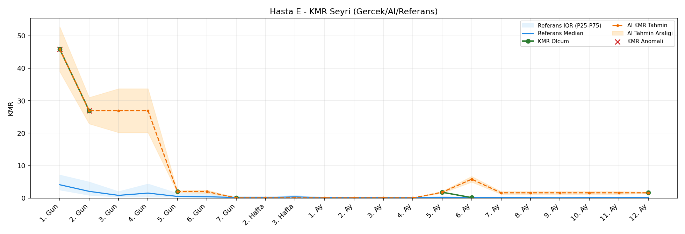
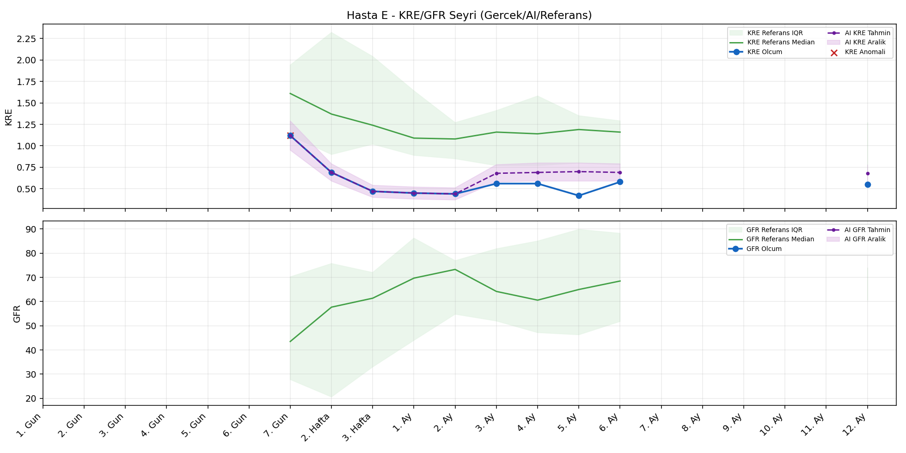
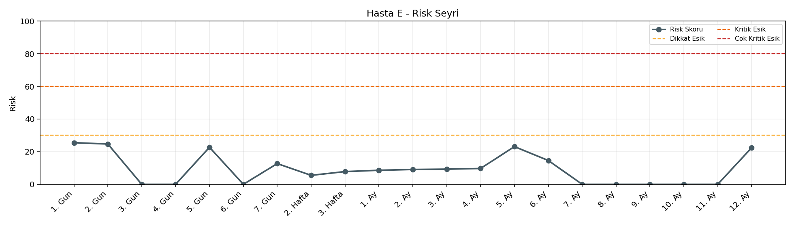

# Hasta E

[Ana rapora don](../../Hasta_Raporları_Detay.md)

## Hasta Ozeti

| Alan | Deger |
|---|---|
| Yas | 16 |
| Cinsiyet | MALE |
| BMI | 16.0 |
| Vital Status | LIVING |
| Risk Skoru (Son) | 25.5 |
| Risk Seviyesi | Normal |
| Anomali Durumu | Var |
| Son KMR | 1.6359 (12. Ay) |
| Son KRE | 0.55 (12. Ay) |
| Son GFR | - (-) |

## Grafikler

## IQR ve Median Ozeti

| Metrik | Hasta (Median / IQR) | Referans (Median / IQR) | Son Olcum Zamani |
|---|---|---|---|
| KMR | 1.783 / 13.574 | 0.227 / 0.318 | 12. Ay |
| KRE | 0.555 / 0.120 | 1.020 / 0.560 | 12. Ay |
| GFR | - / - | - / - | - |

## AI Performans (Hasta Bazli)

| Metrik | Eval Nokta | MAE | RMSE | MAPE | Aralik Kapsama | Son Hata |
|---|---:|---:|---:|---:|---:|---:|
| KMR | 2 | 2.8536 | 4.0130 | %2110.71 | %50.0 | -0.0319 |
| KRE | 5 | 0.144 | 0.161 | %29.00 | %40.0 | 0.090 |
| GFR | 0 | - | - | - | %0.0 | - |

## Zaman Serisi Detay Tablosu

| Zaman | KMR | AI KMR | Durum | KRE | AI KRE | Durum | GFR | AI GFR | Durum | Risk | Seviye | Anomali |
|---|---:|---:|---|---:|---:|---|---:|---:|---|---:|---|---|
| 1. Gun | 45.8905 | 45.8905 | Olcum Kopyasi | - | - | Uygulanmaz | - | - | Uygulanmaz | 25.5 | Normal | KMR |
| 2. Gun | 26.9414 | 26.9414 | Olcum Kopyasi | - | - | Uygulanmaz | - | - | Uygulanmaz | 24.7 | Normal | KMR |
| 3. Gun | - | 26.9414 | Ongoru | - | - | Uygulanmaz | - | - | Uygulanmaz | 0.0 | Normal | - |
| 4. Gun | - | 26.9414 | Ongoru | - | - | Uygulanmaz | - | - | Uygulanmaz | 0.0 | Normal | - |
| 5. Gun | 1.9778 | 1.9778 | Olcum Kopyasi | - | - | Uygulanmaz | - | - | Uygulanmaz | 22.7 | Normal | - |
| 6. Gun | - | 1.9778 | Ongoru | - | - | Uygulanmaz | - | - | Uygulanmaz | 0.0 | Normal | - |
| 7. Gun | 0.0490 | 0.0490 | Olcum Kopyasi | 1.12 | 1.12 | Olcum Kopyasi | - | - | Yetersiz Veri | 12.7 | Normal | KRE |
| 2. Hafta | - | 0.0490 | Ongoru | 0.69 | 0.69 | Olcum Kopyasi | - | - | Yetersiz Veri | 5.5 | Normal | - |
| 3. Hafta | - | 0.0490 | Ongoru | 0.47 | 0.47 | Olcum Kopyasi | - | - | Yetersiz Veri | 7.8 | Normal | - |
| 1. Ay | - | 0.0490 | Ongoru | 0.45 | 0.45 | Olcum Kopyasi | - | - | Yetersiz Veri | 8.6 | Normal | - |
| 2. Ay | - | 0.0490 | Ongoru | 0.44 | 0.44 | Olcum Kopyasi | - | - | Yetersiz Veri | 9.1 | Normal | - |
| 3. Ay | - | 0.0490 | Ongoru | 0.56 | 0.67 | Model | - | - | Yetersiz Veri | 9.3 | Normal | - |
| 4. Ay | - | 0.0490 | Ongoru | 0.56 | 0.71 | Model | - | - | Yetersiz Veri | 9.7 | Normal | - |
| 5. Ay | 1.7833 | 1.7833 | Olcum Kopyasi | 0.42 | 0.70 | Model | - | - | Yetersiz Veri | 23.1 | Normal | - |
| 6. Ay | 0.1345 | 5.8097 | Model | 0.58 | 0.67 | Model | - | - | Yetersiz Veri | 14.6 | Normal | - |
| 7. Ay | - | 1.6040 | Ongoru | - | - | Uygulanmaz | - | - | Uygulanmaz | 0.0 | Normal | - |
| 8. Ay | - | 1.6040 | Ongoru | - | - | Uygulanmaz | - | - | Uygulanmaz | 0.0 | Normal | - |
| 9. Ay | - | 1.6040 | Ongoru | - | - | Uygulanmaz | - | - | Uygulanmaz | 0.0 | Normal | - |
| 10. Ay | - | 1.6040 | Ongoru | - | - | Uygulanmaz | - | - | Uygulanmaz | 0.0 | Normal | - |
| 11. Ay | - | 1.6040 | Ongoru | - | - | Uygulanmaz | - | - | Uygulanmaz | 0.0 | Normal | - |
| 12. Ay | 1.6359 | 1.6040 | Model | 0.55 | 0.64 | Model | - | - | Yetersiz Veri | 22.4 | Normal | - |

> Not: Bu dosya `python3 backend/run_all.py` ile otomatik uretilir.
