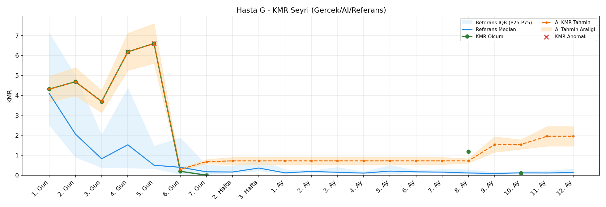
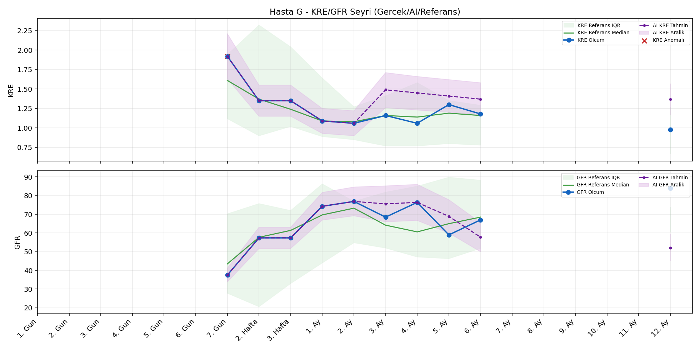
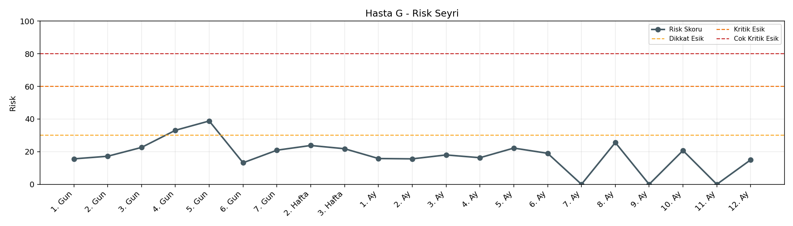

# Hasta G

[Ana rapora don](../../Hasta_Raporları_Detay.md)

## Hasta Ozeti

| Alan | Deger |
|---|---|
| Yas | 58 |
| Cinsiyet | MALE |
| BMI | 26.3 |
| Vital Status | LIVING |
| Risk Skoru (Son) | 38.8 |
| Risk Seviyesi | Dikkat |
| Anomali Durumu | Var |
| Son KMR | 0.1098 (10. Ay) |
| Son KRE | 0.98 (12. Ay) |
| Son GFR | 84.0 (12. Ay) |

## Grafikler

## IQR ve Median Ozeti

| Metrik | Hasta (Median / IQR) | Referans (Median / IQR) | Son Olcum Zamani |
|---|---|---|---|
| KMR | 3.691 / 4.489 | 0.173 / 0.175 | 10. Ay |
| KRE | 1.170 / 0.270 | 1.020 / 0.560 | 12. Ay |
| GFR | 67.750 / 18.075 | 64.000 / 15.000 | 12. Ay |

## AI Performans (Hasta Bazli)

| Metrik | Eval Nokta | MAE | RMSE | MAPE | Aralik Kapsama | Son Hata |
|---|---:|---:|---:|---:|---:|---:|
| KMR | 4 | 0.6671 | 0.8259 | %687.24 | %0.0 | 1.4308 |
| KRE | 5 | 0.246 | 0.272 | %22.63 | %40.0 | 0.310 |
| GFR | 5 | 21.16 | 22.93 | %30.24 | %20.0 | -22.80 |

## Zaman Serisi Detay Tablosu

| Zaman | KMR | AI KMR | Durum | KRE | AI KRE | Durum | GFR | AI GFR | Durum | Risk | Seviye | Anomali |
|---|---:|---:|---|---:|---:|---|---:|---:|---|---:|---|---|
| 1. Gun | 4.3100 | 4.3100 | Olcum Kopyasi | - | - | Uygulanmaz | - | - | Uygulanmaz | 15.6 | Normal | - |
| 2. Gun | 4.6841 | 4.6841 | Olcum Kopyasi | - | - | Uygulanmaz | - | - | Uygulanmaz | 17.2 | Normal | - |
| 3. Gun | 3.6909 | 3.6909 | Olcum Kopyasi | - | - | Uygulanmaz | - | - | Uygulanmaz | 22.6 | Normal | - |
| 4. Gun | 6.1801 | 6.1801 | Olcum Kopyasi | - | - | Uygulanmaz | - | - | Uygulanmaz | 33.1 | Dikkat | KMR |
| 5. Gun | 6.6007 | 6.6007 | Olcum Kopyasi | - | - | Uygulanmaz | - | - | Uygulanmaz | 38.8 | Dikkat | KMR |
| 6. Gun | 0.1946 | 0.2938 | Model | - | - | Uygulanmaz | - | - | Uygulanmaz | 13.2 | Normal | - |
| 7. Gun | 0.0000 | 0.6779 | Model | 1.92 | 1.92 | Olcum Kopyasi | 37.5 | 37.5 | Olcum Kopyasi | 20.9 | Normal | KRE |
| 2. Hafta | - | 0.7174 | Ongoru | 1.35 | 1.35 | Olcum Kopyasi | 57.4 | 57.4 | Olcum Kopyasi | 23.8 | Normal | - |
| 3. Hafta | - | 0.7174 | Ongoru | 1.35 | 1.35 | Olcum Kopyasi | 57.4 | 57.4 | Olcum Kopyasi | 21.8 | Normal | - |
| 1. Ay | - | 0.7174 | Ongoru | 1.09 | 1.09 | Olcum Kopyasi | 74.3 | 74.3 | Olcum Kopyasi | 15.8 | Normal | - |
| 2. Ay | - | 0.7174 | Ongoru | 1.06 | 1.06 | Olcum Kopyasi | 76.9 | 76.9 | Olcum Kopyasi | 15.6 | Normal | - |
| 3. Ay | - | 0.7174 | Ongoru | 1.16 | 1.47 | Model | 68.5 | 97.6 | Model | 18.0 | Normal | - |
| 4. Ay | - | 0.7174 | Ongoru | 1.06 | 1.45 | Model | 76.4 | 99.6 | Model | 16.3 | Normal | - |
| 5. Ay | - | 0.7174 | Ongoru | 1.30 | 1.38 | Model | 59.0 | 85.6 | Model | 22.2 | Normal | - |
| 6. Ay | - | 0.7174 | Ongoru | 1.18 | 1.32 | Model | 67.0 | 71.1 | Model | 19.0 | Normal | - |
| 7. Ay | - | 0.7174 | Ongoru | - | - | Uygulanmaz | - | - | Uygulanmaz | 0.0 | Normal | - |
| 8. Ay | 1.1778 | 0.7174 | Model | - | - | Uygulanmaz | - | - | Uygulanmaz | 25.6 | Normal | - |
| 9. Ay | - | 1.5406 | Ongoru | - | - | Uygulanmaz | - | - | Uygulanmaz | 0.0 | Normal | - |
| 10. Ay | 0.1098 | 1.5406 | Model | - | - | Uygulanmaz | - | - | Uygulanmaz | 20.7 | Normal | - |
| 11. Ay | - | 1.9504 | Ongoru | - | - | Uygulanmaz | - | - | Uygulanmaz | 0.0 | Normal | - |
| 12. Ay | - | 1.9504 | Ongoru | 0.98 | 1.29 | Model | 84.0 | 61.2 | Model | 15.0 | Normal | - |

> Not: Bu dosya `python3 backend/run_all.py` ile otomatik uretilir.
