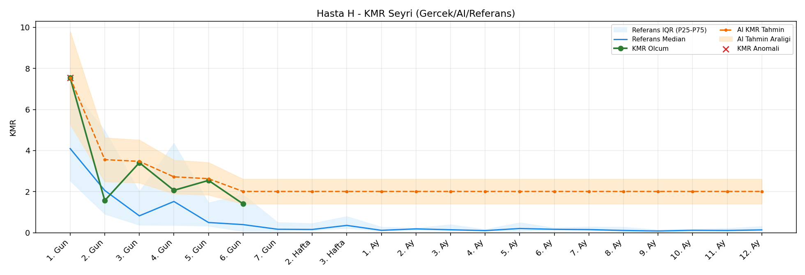
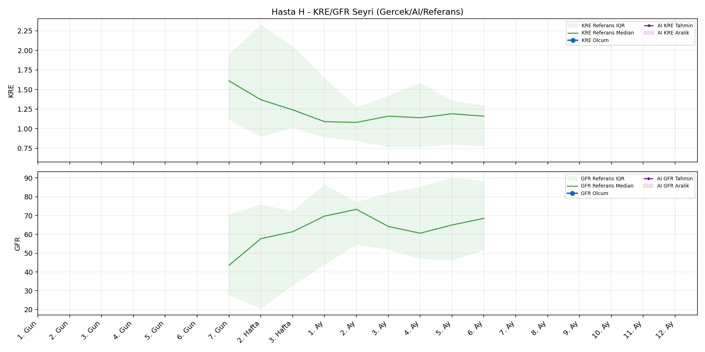
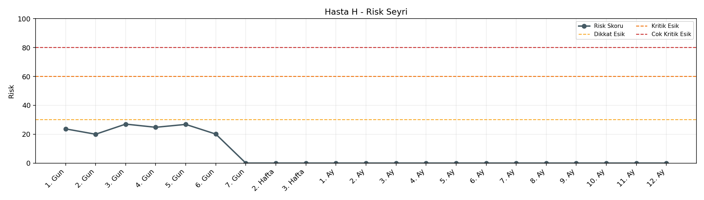

# Hasta H

[Ana rapora don](../../Hasta_Raporları_Detay.md)

## Hasta Ozeti

| Alan | Deger |
|---|---|
| Yas | 31 |
| Cinsiyet | MALE |
| BMI | - |
| Vital Status | DEAD |
| Risk Skoru (Son) | 27.0 |
| Risk Seviyesi | Normal |
| Anomali Durumu | Var |
| Son KMR | 1.4052 (6. Gun) |
| Son KRE | - (-) |
| Son GFR | - (-) |

## Grafikler

## IQR ve Median Ozeti

| Metrik | Hasta (Median / IQR) | Referans (Median / IQR) | Son Olcum Zamani |
|---|---|---|---|
| KMR | 2.306 / 1.503 | 0.129 / 1.647 | 6. Gun |
| KRE | - / - | - / - | - |
| GFR | - / - | - / - | - |

## AI Performans (Hasta Bazli)

| Metrik | Eval Nokta | MAE | RMSE | MAPE | Aralik Kapsama | Son Hata |
|---|---:|---:|---:|---:|---:|---:|
| KMR | 0 | - | - | - | %0.0 | - |
| KRE | 0 | - | - | - | %0.0 | - |
| GFR | 0 | - | - | - | %0.0 | - |

## Zaman Serisi Detay Tablosu

| Zaman | KMR | AI KMR | Durum | KRE | AI KRE | Durum | GFR | AI GFR | Durum | Risk | Seviye | Anomali |
|---|---:|---:|---|---:|---:|---|---:|---:|---|---:|---|---|
| 1. Gun | 7.5395 | 7.5395 | EWMA Yedek | - | - | Uygulanmaz | - | - | Uygulanmaz | 23.7 | Normal | KMR |
| 2. Gun | 1.5686 | 3.5589 | EWMA Yedek | - | - | Uygulanmaz | - | - | Uygulanmaz | 20.0 | Normal | - |
| 3. Gun | 3.4111 | 3.4745 | EWMA Yedek | - | - | Uygulanmaz | - | - | Uygulanmaz | 27.0 | Normal | - |
| 4. Gun | 2.0639 | 2.7222 | EWMA Yedek | - | - | Uygulanmaz | - | - | Uygulanmaz | 24.8 | Normal | - |
| 5. Gun | 2.5478 | 2.6321 | EWMA Yedek | - | - | Uygulanmaz | - | - | Uygulanmaz | 26.8 | Normal | - |
| 6. Gun | 1.4052 | 2.0089 | EWMA Yedek | - | - | Uygulanmaz | - | - | Uygulanmaz | 20.1 | Normal | - |
| 7. Gun | - | 2.0089 | Yedek Ongoru | - | - | Yetersiz Veri | - | - | Yetersiz Veri | 0.0 | Normal | - |
| 2. Hafta | - | 2.0089 | Yedek Ongoru | - | - | Yetersiz Veri | - | - | Yetersiz Veri | 0.0 | Normal | - |
| 3. Hafta | - | 2.0089 | Yedek Ongoru | - | - | Yetersiz Veri | - | - | Yetersiz Veri | 0.0 | Normal | - |
| 1. Ay | - | 2.0089 | Yedek Ongoru | - | - | Yetersiz Veri | - | - | Yetersiz Veri | 0.0 | Normal | - |
| 2. Ay | - | 2.0089 | Yedek Ongoru | - | - | Yetersiz Veri | - | - | Yetersiz Veri | 0.0 | Normal | - |
| 3. Ay | - | 2.0089 | Yedek Ongoru | - | - | Yetersiz Veri | - | - | Yetersiz Veri | 0.0 | Normal | - |
| 4. Ay | - | 2.0089 | Yedek Ongoru | - | - | Yetersiz Veri | - | - | Yetersiz Veri | 0.0 | Normal | - |
| 5. Ay | - | 2.0089 | Yedek Ongoru | - | - | Yetersiz Veri | - | - | Yetersiz Veri | 0.0 | Normal | - |
| 6. Ay | - | 2.0089 | Yedek Ongoru | - | - | Yetersiz Veri | - | - | Yetersiz Veri | 0.0 | Normal | - |
| 7. Ay | - | 2.0089 | Yedek Ongoru | - | - | Uygulanmaz | - | - | Uygulanmaz | 0.0 | Normal | - |
| 8. Ay | - | 2.0089 | Yedek Ongoru | - | - | Uygulanmaz | - | - | Uygulanmaz | 0.0 | Normal | - |
| 9. Ay | - | 2.0089 | Yedek Ongoru | - | - | Uygulanmaz | - | - | Uygulanmaz | 0.0 | Normal | - |
| 10. Ay | - | 2.0089 | Yedek Ongoru | - | - | Uygulanmaz | - | - | Uygulanmaz | 0.0 | Normal | - |
| 11. Ay | - | 2.0089 | Yedek Ongoru | - | - | Uygulanmaz | - | - | Uygulanmaz | 0.0 | Normal | - |
| 12. Ay | - | 2.0089 | Yedek Ongoru | - | - | Yetersiz Veri | - | - | Yetersiz Veri | 0.0 | Normal | - |

> Not: Bu dosya `python3 backend/run_all.py` ile otomatik uretilir.
