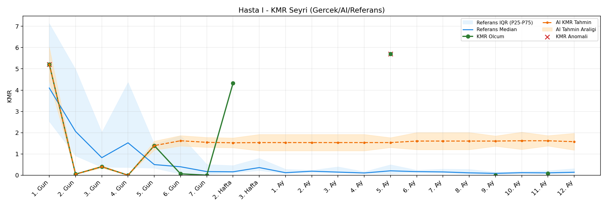
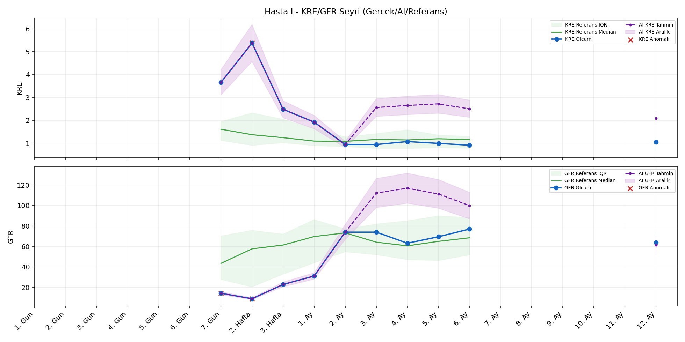
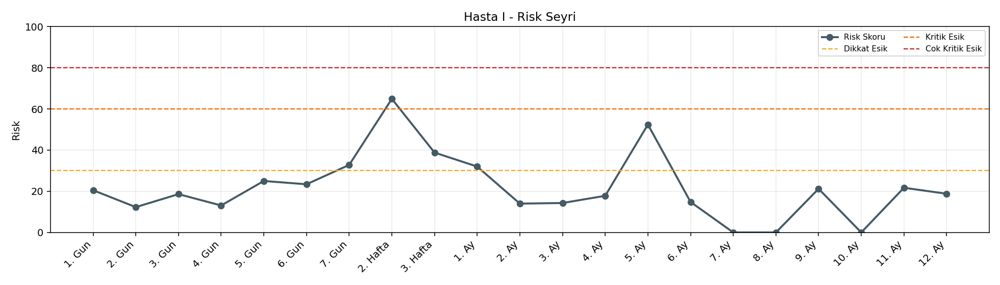

# Hasta I

[Ana rapora don](../../Hasta_Raporları_Detay.md)

## Hasta Ozeti

| Alan | Deger |
|---|---|
| Yas | 44 |
| Cinsiyet | FEMALE |
| BMI | - |
| Vital Status | LIVING |
| Risk Skoru (Son) | 66.0 |
| Risk Seviyesi | Kritik |
| Anomali Durumu | Var |
| Son KMR | 0.0821 (11. Ay) |
| Son KRE | 1.05 (12. Ay) |
| Son GFR | 64.0 (12. Ay) |

## Grafikler

## IQR ve Median Ozeti

| Metrik | Hasta (Median / IQR) | Referans (Median / IQR) | Son Olcum Zamani |
|---|---|---|---|
| KMR | 0.073 / 1.131 | 0.110 / 0.129 | 11. Ay |
| KRE | 1.060 / 1.387 | 1.020 / 0.560 | 12. Ay |
| GFR | 63.600 / 47.900 | 64.000 / 15.000 | 12. Ay |

## AI Performans (Hasta Bazli)

| Metrik | Eval Nokta | MAE | RMSE | MAPE | Aralik Kapsama | Son Hata |
|---|---:|---:|---:|---:|---:|---:|
| KMR | 5 | 1.4249 | 1.6376 | %1445.98 | %0.0 | 0.9835 |
| KRE | 5 | 0.764 | 0.783 | %77.60 | %0.0 | 1.000 |
| GFR | 5 | 9.82 | 12.23 | %14.59 | %40.0 | -18.50 |

## Zaman Serisi Detay Tablosu

| Zaman | KMR | AI KMR | Durum | KRE | AI KRE | Durum | GFR | AI GFR | Durum | Risk | Seviye | Anomali |
|---|---:|---:|---|---:|---:|---|---:|---:|---|---:|---|---|
| 1. Gun | 5.2143 | 5.2143 | Olcum Kopyasi | - | - | Uygulanmaz | - | - | Uygulanmaz | 22.1 | Normal | KMR |
| 2. Gun | 0.0488 | 0.0488 | Olcum Kopyasi | - | - | Uygulanmaz | - | - | Uygulanmaz | 12.0 | Normal | - |
| 3. Gun | 0.3987 | 0.3987 | Olcum Kopyasi | - | - | Uygulanmaz | - | - | Uygulanmaz | 18.2 | Normal | - |
| 4. Gun | 0.0000 | 0.0000 | Olcum Kopyasi | - | - | Uygulanmaz | - | - | Uygulanmaz | 12.8 | Normal | - |
| 5. Gun | 1.3909 | 1.3909 | Olcum Kopyasi | - | - | Uygulanmaz | - | - | Uygulanmaz | 25.2 | Normal | - |
| 6. Gun | 0.0642 | 0.7969 | Model | - | - | Uygulanmaz | - | - | Uygulanmaz | 17.9 | Normal | - |
| 7. Gun | 0.0000 | 1.2865 | Model | 3.66 | 3.66 | Olcum Kopyasi | 14.3 | 14.3 | Olcum Kopyasi | 30.7 | Dikkat | GFR |
| 2. Hafta | 4.3271 | 1.3296 | Model | 5.38 | 5.38 | Olcum Kopyasi | 9.0 | 9.0 | Olcum Kopyasi | 66.0 | Kritik | KRE,GFR |
| 3. Hafta | - | 1.1242 | Ongoru | 2.48 | 2.48 | Olcum Kopyasi | 22.9 | 22.9 | Olcum Kopyasi | 38.8 | Dikkat | - |
| 1. Ay | - | 1.1242 | Ongoru | 1.92 | 1.92 | Olcum Kopyasi | 31.2 | 31.2 | Olcum Kopyasi | 32.0 | Dikkat | - |
| 2. Ay | - | 1.1242 | Ongoru | 0.94 | 0.94 | Olcum Kopyasi | 74.0 | 74.0 | Olcum Kopyasi | 14.0 | Normal | - |
| 3. Ay | - | 1.1242 | Ongoru | 0.94 | 1.62 | Model | 74.0 | 74.0 | Model | 14.3 | Normal | - |
| 4. Ay | - | 1.1242 | Ongoru | 1.07 | 1.59 | Model | 63.2 | 77.2 | Model | 17.8 | Normal | - |
| 5. Ay | - | 1.1242 | Ongoru | 0.99 | 1.69 | Model | 69.5 | 71.8 | Model | 16.3 | Normal | - |
| 6. Ay | - | 1.1242 | Ongoru | 0.91 | 1.83 | Model | 77.0 | 62.7 | Model | 14.8 | Normal | - |
| 7. Ay | - | 1.1242 | Ongoru | - | - | Uygulanmaz | - | - | Uygulanmaz | 0.0 | Normal | - |
| 8. Ay | - | 1.1242 | Ongoru | - | - | Uygulanmaz | - | - | Uygulanmaz | 0.0 | Normal | - |
| 9. Ay | 0.0000 | 1.1242 | Model | - | - | Uygulanmaz | - | - | Uygulanmaz | 19.3 | Normal | - |
| 10. Ay | - | 1.0656 | Ongoru | - | - | Uygulanmaz | - | - | Uygulanmaz | 0.0 | Normal | - |
| 11. Ay | 0.0821 | 1.0656 | Model | - | - | Uygulanmaz | - | - | Uygulanmaz | 19.9 | Normal | - |
| 12. Ay | - | 1.1580 | Ongoru | 1.05 | 2.05 | Model | 64.0 | 45.5 | Model | 18.8 | Normal | - |

> Not: Bu dosya `python3 backend/run_all.py` ile otomatik uretilir.
