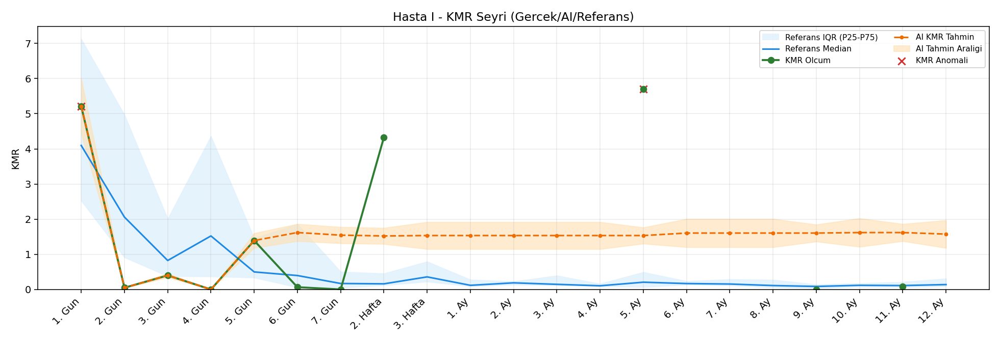
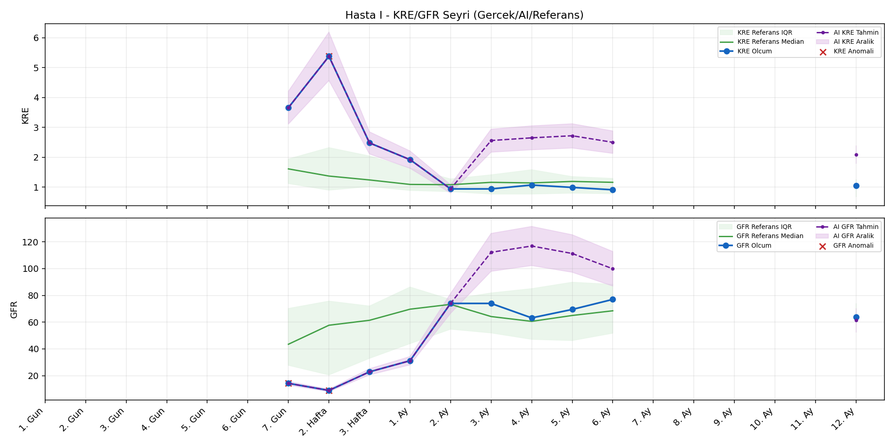
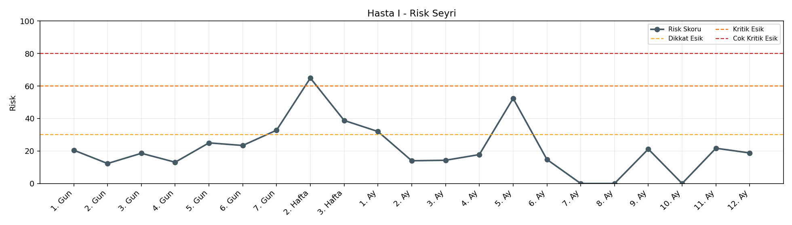

# Hasta I

[Ana rapora don](../../Hasta_Raporları_Detay.md)

## Hasta Ozeti

| Alan | Deger |
|---|---|
| Yas | 44 |
| Cinsiyet | FEMALE |
| BMI | - |
| Vital Status | LIVING |
| Risk Skoru (Son) | 64.9 |
| Risk Seviyesi | Kritik |
| Anomali Durumu | Var |
| Son KMR | 0.0821 (11. Ay) |
| Son KRE | 1.05 (12. Ay) |
| Son GFR | 64.0 (12. Ay) |

## Grafikler

## IQR ve Median Ozeti

| Metrik | Hasta (Median / IQR) | Referans (Median / IQR) | Son Olcum Zamani |
|---|---|---|---|
| KMR | 0.082 / 2.835 | 0.110 / 0.139 | 11. Ay |
| KRE | 1.060 / 1.387 | 1.050 / 0.610 | 12. Ay |
| GFR | 63.600 / 47.900 | 64.000 / 13.500 | 12. Ay |

## AI Performans (Hasta Bazli)

| Metrik | Eval Nokta | MAE | RMSE | MAPE | Aralik Kapsama | Son Hata |
|---|---:|---:|---:|---:|---:|---:|
| KMR | 6 | 2.2034 | 2.4166 | %1788.00 | %0.0 | 1.5362 |
| KRE | 5 | 1.512 | 1.531 | %153.70 | %0.0 | 1.040 |
| GFR | 5 | 31.86 | 36.39 | %46.14 | %20.0 | -2.70 |

## Zaman Serisi Detay Tablosu

| Zaman | KMR | AI KMR | Durum | KRE | AI KRE | Durum | GFR | AI GFR | Durum | Risk | Seviye | Anomali |
|---|---:|---:|---|---:|---:|---|---:|---:|---|---:|---|---|
| 1. Gun | 5.2143 | 5.2143 | Olcum Kopyasi | - | - | Uygulanmaz | - | - | Uygulanmaz | 20.5 | Normal | KMR |
| 2. Gun | 0.0488 | 0.0488 | Olcum Kopyasi | - | - | Uygulanmaz | - | - | Uygulanmaz | 12.3 | Normal | - |
| 3. Gun | 0.3987 | 0.3987 | Olcum Kopyasi | - | - | Uygulanmaz | - | - | Uygulanmaz | 18.6 | Normal | - |
| 4. Gun | 0.0000 | 0.0000 | Olcum Kopyasi | - | - | Uygulanmaz | - | - | Uygulanmaz | 13.1 | Normal | - |
| 5. Gun | 1.3909 | 1.3909 | Olcum Kopyasi | - | - | Uygulanmaz | - | - | Uygulanmaz | 25.0 | Normal | - |
| 6. Gun | 0.0642 | 1.6193 | Model | - | - | Uygulanmaz | - | - | Uygulanmaz | 23.4 | Normal | - |
| 7. Gun | 0.0000 | 1.5442 | Model | 3.66 | 3.66 | Olcum Kopyasi | 14.3 | 14.3 | Olcum Kopyasi | 32.8 | Dikkat | GFR |
| 2. Hafta | 4.3271 | 1.5223 | Model | 5.38 | 5.38 | Olcum Kopyasi | 9.0 | 9.0 | Olcum Kopyasi | 64.9 | Kritik | KRE,GFR |
| 3. Hafta | - | 1.5332 | Ongoru | 2.48 | 2.48 | Olcum Kopyasi | 22.9 | 22.9 | Olcum Kopyasi | 38.8 | Dikkat | - |
| 1. Ay | - | 1.5332 | Ongoru | 1.92 | 1.92 | Olcum Kopyasi | 31.2 | 31.2 | Olcum Kopyasi | 32.0 | Dikkat | - |
| 2. Ay | - | 1.5332 | Ongoru | 0.94 | 0.94 | Olcum Kopyasi | 74.0 | 74.0 | Olcum Kopyasi | 14.0 | Normal | - |
| 3. Ay | - | 1.5332 | Ongoru | 0.94 | 2.56 | Model | 74.0 | 112.2 | Model | 14.3 | Normal | - |
| 4. Ay | - | 1.5332 | Ongoru | 1.07 | 2.65 | Model | 63.2 | 116.9 | Model | 17.8 | Normal | - |
| 5. Ay | 5.7091 | 1.5332 | Model | 0.99 | 2.72 | Model | 69.5 | 111.3 | Model | 52.4 | Dikkat | KMR |
| 6. Ay | - | 1.6041 | Ongoru | 0.91 | 2.50 | Model | 77.0 | 99.9 | Model | 14.8 | Normal | - |
| 7. Ay | - | 1.6041 | Ongoru | - | - | Uygulanmaz | - | - | Uygulanmaz | 0.0 | Normal | - |
| 8. Ay | - | 1.6041 | Ongoru | - | - | Uygulanmaz | - | - | Uygulanmaz | 0.0 | Normal | - |
| 9. Ay | 0.0000 | 1.6041 | Model | - | - | Uygulanmaz | - | - | Uygulanmaz | 21.2 | Normal | - |
| 10. Ay | - | 1.6183 | Ongoru | - | - | Uygulanmaz | - | - | Uygulanmaz | 0.0 | Normal | - |
| 11. Ay | 0.0821 | 1.6183 | Model | - | - | Uygulanmaz | - | - | Uygulanmaz | 21.7 | Normal | - |
| 12. Ay | - | 1.5746 | Ongoru | 1.05 | 2.09 | Model | 64.0 | 61.3 | Model | 18.8 | Normal | - |

> Not: Bu dosya `python3 backend/run_all.py` ile otomatik uretilir.
