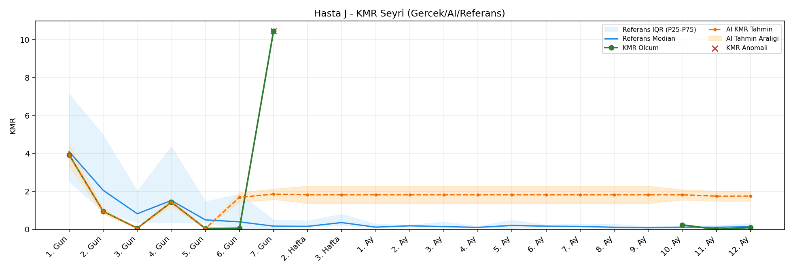
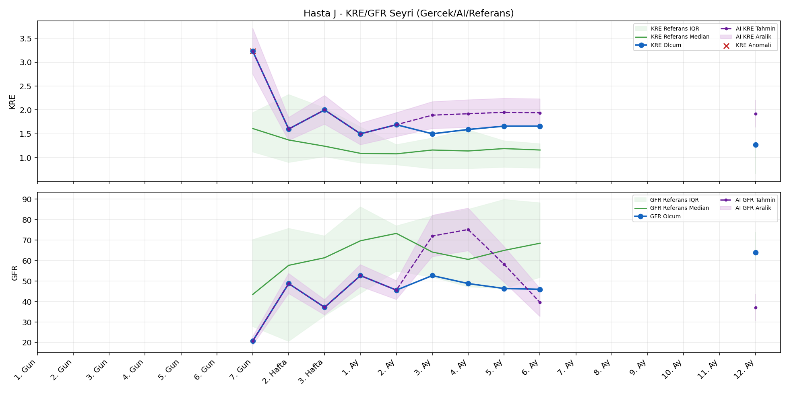
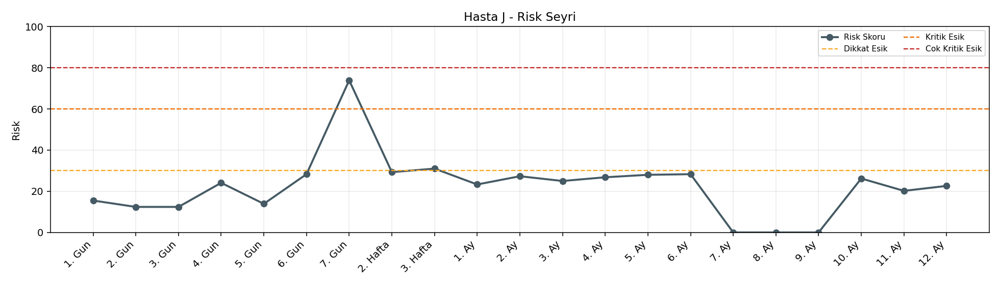

# Hasta J

[Ana rapora don](../../Hasta_Raporları_Detay.md)

## Hasta Ozeti

| Alan | Deger |
|---|---|
| Yas | 52 |
| Cinsiyet | MALE |
| BMI | 20.6 |
| Vital Status | LIVING |
| Risk Skoru (Son) | 73.9 |
| Risk Seviyesi | Kritik |
| Anomali Durumu | Var |
| Son KMR | 0.0964 (12. Ay) |
| Son KRE | 1.27 (12. Ay) |
| Son GFR | 64.0 (12. Ay) |

## Grafikler

## IQR ve Median Ozeti

| Metrik | Hasta (Median / IQR) | Referans (Median / IQR) | Son Olcum Zamani |
|---|---|---|---|
| KMR | 0.167 / 1.252 | 0.227 / 0.318 | 12. Ay |
| KRE | 1.630 / 0.160 | 1.020 / 0.560 | 12. Ay |
| GFR | 47.600 / 6.025 | 64.000 / 15.000 | 12. Ay |

## AI Performans (Hasta Bazli)

| Metrik | Eval Nokta | MAE | RMSE | MAPE | Aralik Kapsama | Son Hata |
|---|---:|---:|---:|---:|---:|---:|
| KMR | 5 | 3.0457 | 4.1224 | %1767.52 | %0.0 | 1.6589 |
| KRE | 5 | 0.490 | 0.532 | %33.02 | %20.0 | 0.600 |
| GFR | 5 | 12.50 | 15.81 | %22.70 | %20.0 | -29.90 |

## Zaman Serisi Detay Tablosu

| Zaman | KMR | AI KMR | Durum | KRE | AI KRE | Durum | GFR | AI GFR | Durum | Risk | Seviye | Anomali |
|---|---:|---:|---|---:|---:|---|---:|---:|---|---:|---|---|
| 1. Gun | 3.9301 | 3.9301 | Olcum Kopyasi | - | - | Uygulanmaz | - | - | Uygulanmaz | 15.5 | Normal | - |
| 2. Gun | 0.9461 | 0.9461 | Olcum Kopyasi | - | - | Uygulanmaz | - | - | Uygulanmaz | 12.4 | Normal | - |
| 3. Gun | 0.0644 | 0.0644 | Olcum Kopyasi | - | - | Uygulanmaz | - | - | Uygulanmaz | 12.4 | Normal | - |
| 4. Gun | 1.4319 | 1.4319 | Olcum Kopyasi | - | - | Uygulanmaz | - | - | Uygulanmaz | 24.1 | Normal | - |
| 5. Gun | 0.0465 | 0.0465 | Olcum Kopyasi | - | - | Uygulanmaz | - | - | Uygulanmaz | 13.9 | Normal | - |
| 6. Gun | 0.0570 | 1.6896 | Model | - | - | Uygulanmaz | - | - | Uygulanmaz | 28.3 | Normal | - |
| 7. Gun | 10.4579 | 1.8571 | Model | 3.23 | 3.23 | Olcum Kopyasi | 20.8 | 20.8 | Olcum Kopyasi | 73.9 | Kritik | KMR,KRE |
| 2. Hafta | - | 1.8227 | Ongoru | 1.60 | 1.60 | Olcum Kopyasi | 48.8 | 48.8 | Olcum Kopyasi | 29.3 | Normal | - |
| 3. Hafta | - | 1.8227 | Ongoru | 2.00 | 2.00 | Olcum Kopyasi | 37.2 | 37.2 | Olcum Kopyasi | 31.0 | Dikkat | - |
| 1. Ay | - | 1.8227 | Ongoru | 1.50 | 1.50 | Olcum Kopyasi | 52.7 | 52.7 | Olcum Kopyasi | 23.3 | Normal | - |
| 2. Ay | - | 1.8227 | Ongoru | 1.69 | 1.69 | Olcum Kopyasi | 45.6 | 45.6 | Olcum Kopyasi | 27.3 | Normal | - |
| 3. Ay | - | 1.8227 | Ongoru | 1.50 | 2.25 | Model | 52.7 | 62.7 | Model | 25.0 | Normal | - |
| 4. Ay | - | 1.8227 | Ongoru | 1.59 | 2.19 | Model | 48.8 | 59.6 | Model | 26.8 | Normal | - |
| 5. Ay | - | 1.8227 | Ongoru | 1.66 | 1.98 | Model | 46.4 | 46.4 | Model | 28.0 | Normal | - |
| 6. Ay | - | 1.8227 | Ongoru | 1.66 | 1.84 | Model | 46.0 | 34.2 | Model | 28.3 | Normal | - |
| 7. Ay | - | 1.8227 | Ongoru | - | - | Uygulanmaz | - | - | Uygulanmaz | 0.0 | Normal | - |
| 8. Ay | - | 1.8227 | Ongoru | - | - | Uygulanmaz | - | - | Uygulanmaz | 0.0 | Normal | - |
| 9. Ay | - | 1.8227 | Ongoru | - | - | Uygulanmaz | - | - | Uygulanmaz | 0.0 | Normal | - |
| 10. Ay | 0.2370 | 1.8227 | Model | - | - | Uygulanmaz | - | - | Uygulanmaz | 26.2 | Normal | - |
| 11. Ay | 0.0000 | 1.7506 | Model | - | - | Uygulanmaz | - | - | Uygulanmaz | 20.2 | Normal | - |
| 12. Ay | 0.0964 | 1.7553 | Model | 1.27 | 1.87 | Model | 64.0 | 34.1 | Model | 22.6 | Normal | - |

> Not: Bu dosya `python3 backend/run_all.py` ile otomatik uretilir.
